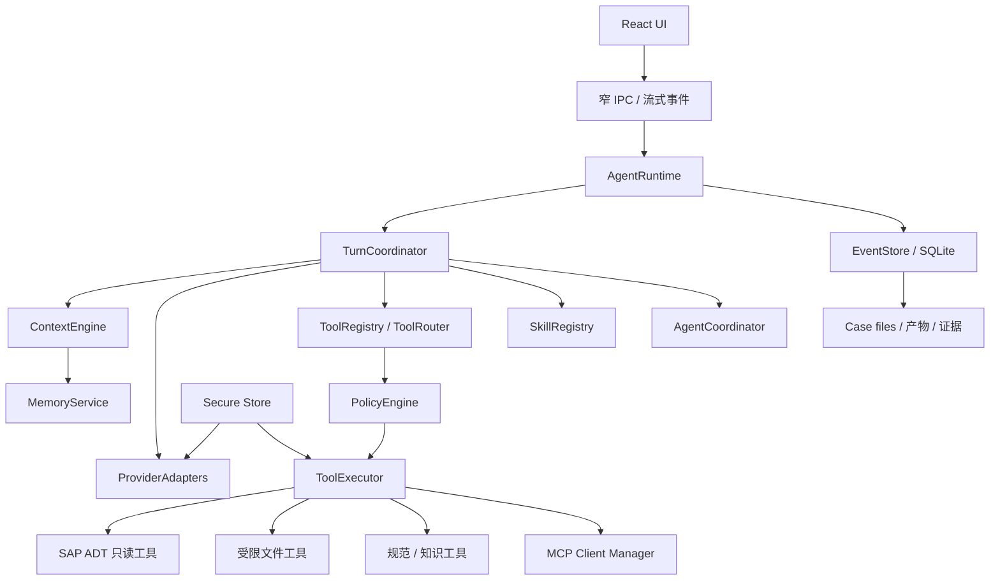
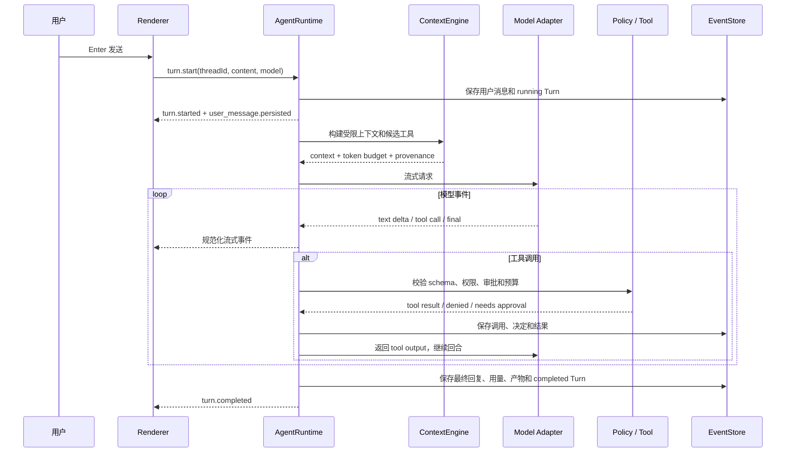

# 独立 Agent Runtime 总体架构

日期：2026-07-15
状态：Phase 50-56 首个可运行基线（2026-07-16 更新）
适用范围：个人本地版 SAP AI 顾问工作台

## 1. 结论

本产品不需要把 Codex 当作核心中转，也不应该重新实现一个通用 Codex。

真正需要的是一个面向 SAP 顾问工作的轻量 Agent Runtime：它能持续保存任务、流式调用不同模型、按需选择受控工具、管理上下文和记忆、执行 Skill、连接 MCP，并在复杂任务中调度少量子 Agent；所有能力都必须服从本产品的本地优先、SAP 只读、知识人工确认和成果落盘边界。

当前代码已经具备产品自有的 Thread/Turn/Item 事件账本、Work/Chat 流式回合、Work 只读工具循环、上下文预算、确定性自动 checkpoint、分层提示词与记忆、Skill/声明式 Plugin 包，以及受控 HTTPS Streamable HTTP MCP Client。Codex CLI 不参与这些核心链路。

仍未开放的是任意 Skill 脚本、STDIO MCP、OpenAI Responses API 专用适配器和产品内受限子 Agent。当前版本是面向 SAP 顾问工作流的轻量运行时，不等于复刻完整 Codex App。

## 2. 对 Codex 公开源码的判断

### 2.1 已确认

- `openai/codex` 不只是一个命令行界面；公开仓库包含 Rust Agent 核心、app-server、协议类型、工具路由、审批与沙箱、会话持久化、压缩、MCP、Skills、记忆和多 Agent 相关实现。
- Codex app-server 使用 `Thread -> Turn -> Item` 作为主要交互对象，并通过持续事件向客户端报告文本增量、工具状态、审批和回合结束。
- `@openai/codex-sdk` 通过启动 Codex CLI 并交换 JSONL 事件工作，本质仍然依赖 Codex 运行时，不是独立 Agent 引擎库。
- Codex Skills 使用渐进式披露：初始只把名称、描述和路径放入上下文，选中后才读取完整 `SKILL.md`。
- Codex MCP 支持 STDIO 与 Streamable HTTP，并把认证、超时、工具允许/拒绝和审批纳入宿主配置。
- Codex 子 Agent 用独立线程承载探索或执行噪声，再把摘要返回主线程，避免主上下文被日志和中间过程淹没。

### 2.2 未公开或不能据此确认

- 公开仓库不能证明包含完整 Codex App 桌面 UI、全部 ChatGPT 托管服务、账号权益、模型目录、远程任务和私有后台实现。
- 不能根据公开 CLI/app-server 源码假设 ChatGPT/Codex 产品内部所有调度策略、记忆策略和系统提示都已公开。
- 不能直接复制 Codex 的默认工具集合、权限含义或面向软件开发的工作区假设到 SAP 顾问产品。

因此，本项目只借鉴公开架构模式和开放协议，不把 Codex 二进制或 SDK 作为产品核心。

## 3. 第一性原理边界

| 根问题 | 本项目的回答 |
|---|---|
| 谁保存会话真相 | 本地事件账本，不是 provider 会话 ID，也不是 Codex rollout。 |
| 谁决定能调用什么 | 本产品 `PolicyEngine`，不是模型、Skill 或 MCP Server。 |
| 谁能接触密钥 | Electron main process 的安全存储和连接器；renderer、Skill 文本、模型上下文均不能读取。 |
| 谁控制 SAP | 固定 SAP 只读连接器；Agent 只能请求允许的只读工具。 |
| 长对话如何继续 | 完整事件永远保留，工作上下文按预算重建，必要时生成可追溯压缩摘要。 |
| 记忆能否自动成为知识 | 不能。记忆用于恢复工作，正式知识仍必须人工确认。 |
| 子 Agent 是否越多越好 | 不是。只有可独立、可验证、噪声较大的任务才分派。 |
| MCP 是否天然可信 | 不是。MCP 只是能力协议，每个 Server 和 Tool 都要过本产品策略。 |

## 4. 目标架构



所有有权限或本地系统能力的模块都留在 main process。Renderer 只发送用户意图、展示事件和发起明确确认。

## 5. 核心领域模型

### 5.1 Thread、Turn、Item

| 对象 | 含义 | 关键字段 |
|---|---|---|
| `AgentThread` | 一个可恢复的 Work 或 Chat 会话 | `id`、`scope`、`projectId?`、`caseId?`、`status`、`activeSummaryId?` |
| `AgentTurn` | 一次用户输入到最终回复/中断/失败的完整运行 | `id`、`threadId`、`status`、`provider`、`model`、`startedAt`、`completedAt` |
| `AgentItem` | 回合中的持久化事实 | 用户消息、助手增量/最终消息、工具调用、工具结果、审批、产物、错误、压缩摘要、子任务引用 |
| `RuntimeEvent` | 给 UI 的实时事件 | `sequence`、`threadId`、`turnId`、`itemId`、`type`、`payload` |

事件必须具有单调 `sequence` 和稳定 ID，UI 重连后可以从最后序号补播，不依赖“前端当时有没有收到”。

### 5.2 事件账本

- 用户消息先持久化，再请求模型。
- 工具调用、审批决定和工具结果都持久化，不能只出现在日志里。
- 助手文本增量可以批量落盘，最终消息必须有完整快照。
- 中断、超时和失败是可恢复状态，不把失败回合伪装成成功回复。
- Case 的 `conversation.md`、`timeline.md` 和产物文件是面向用户的投影；事件账本才是运行时事实源。
- 现有 `WorkThread`、`DailyChatThread` 和 `CaseMessage` 先保留，通过迁移器投影到新模型，避免一次性重写。

## 6. 用户发送消息后的完整链路



运行规则：

1. 输入框发送后立即清空；UI 用本地已确认事件显示用户消息。
2. 同一 Thread 默认只允许一个 active Turn；用户可取消或 steer，不允许重复点击产生并发副作用。
3. 单回合默认最多 8 轮模型/工具循环；达到上限时用中文说明，并保留可继续状态。
4. 只读工具可以有限并行，默认最多 4 个；写文件、外部发布和其他有副作用工具串行执行。
5. 每个工具调用有 `callId`、幂等键、超时和取消信号。未经声明为幂等的副作用调用不得自动重试。
6. Provider 断流时，只在尚未产生可见输出且请求可安全重试时重试；否则保留已生成内容并提示继续。

## 7. Provider Adapter

内部统一接口只表达：

- `startTurn()`：开始流式生成。
- `NormalizedModelEvent`：文本增量、推理摘要、工具调用、用量、完成、错误。
- `ProviderCapabilities`：上下文窗口、工具调用、并行工具、图片、结构化输出、原生压缩等能力。
- `ContinuationHandle`：可选 provider response ID，只作优化，不作为本地会话主键。

第一批适配器：

1. OpenAI Responses API：优先使用原生流式事件、工具调用和可选 server-side compaction。
2. OpenAI Compatible：兼容 `/chat/completions`；只在渠道真实支持时启用工具调用。
3. Anthropic Compatible：适配 `/messages` 和其工具事件。

所有适配器必须输出同一内部事件。前端和 Tool Runtime 不得直接理解某个 provider 的 SSE 格式。

## 8. 上下文预算与自动压缩

### 8.1 不按字符数冒充 token

现有安全上下文的字符上限继续作为泄露防护。当前 `ContextEngine` 使用固定 32,768 token 保守窗口和本地估算，并为输出、工具结果和安全边界留余量；按 Provider/模型元数据动态调整仍是后续能力。

默认预算顺序：

1. 系统安全规则和 SAP 只读硬边界。
2. 当前用户请求和当前 Turn 状态。
3. 最近必要对话。
4. 当前 Case 目标、已确认事实、证据引用和项目规范。
5. 检索到的已发布知识与用户确认记忆。
6. 本轮相关 Skill 正文和工具 schema。

Skill 和工具只按需加载，禁止把全部 Skill、全部 MCP 工具和全部知识塞进每次请求。

### 8.2 阈值

- 软阈值：预计上下文达到可用窗口 75% 时，先裁剪低价值历史和大工具结果。
- 硬阈值：预计达到 88% 时，必须在下一次模型调用前压缩或拒绝继续堆入。
- 当前所有渠道使用同一保守窗口；只有在模型目录具备可信上下文元数据并通过回归后，才按 provider/model 单独调整。

### 8.3 可移植压缩摘要

本地压缩摘要至少保存：

- 当前目标与用户明确要求。
- 已确认事实及其来源。
- 已做决定和理由。
- SAP 系统/Client/对象范围，但不含密码和原始敏感数据。
- 已完成产物和文件引用。
- 未决问题、失败状态和下一步。
- 当前工具/子任务状态。

完整事件永不因压缩删除。当前 checkpoint 保存覆盖范围、来源引用和受限消息摘录，由本地确定性算法生成，不是模型提炼的长期知识；查看、重建和手动重新生成界面尚未开放。Provider 原生 opaque compaction 未来只能作为同一 provider 的加速数据，不能替代本地 checkpoint。

## 9. 记忆模型

记忆不能和聊天历史、知识库混为一谈。

| 层级 | 用途 | 写入方式 | 是否给模型 |
|---|---|---|---|
| 事件账本 | 完整、可恢复运行事实 | 确定性自动保存 | 按 ContextEngine 选择 |
| Working memory | 当前 Turn 的短期状态 | 运行时生成 | 是 |
| Episodic summary | 当前是长会话的确定性 checkpoint；后续可扩展为阶段结论 | 自动生成，当前无独立编辑界面 | 按相关性 |
| Project memory | 项目长期约定、术语、偏好 | 用户确认或明确保存 | 按 Project 隔离 |
| User preference | 个人表达和工作偏好 | 显式 opt-in，可删除 | 跨 Project 时最小化 |
| Published knowledge | 经审核的 SAP 经验 | 现有人工审核流程 | 检索后引用 |
| SAP evidence | 某次只读取证事实 | 工具生成并带来源 | 仅当前 Case/明确复用 |

Phase 50 不做“自动扫描全部历史并全局提炼记忆”。第一版只生成 Thread/Case 摘要候选，并要求 Project memory 明确确认。原始 SAP evidence、源码、密钥、终端日志和未确认知识不得自动进入长期记忆。

检索必须返回来源和适用范围，按 Project、Case、对象、时间和类型过滤，再取 Top-K；不能只按向量相似度把跨客户内容混入上下文。

## 10. Skill Runtime

### 10.1 兼容格式

第一版支持 Agent Skills 的最小兼容子集：

```text
skill-name/
  SKILL.md
  references/     # 可选
  assets/         # 可选
  scripts/        # 可选，第一阶段不开放通用执行
```

`SKILL.md` 至少包含 `name`、`description` 和正文说明。发现阶段只读取名称、描述、路径、版本和信任来源；只有用户明确选择或匹配到当前案件动作时才读取正文。

### 10.2 权限

- Skill 只能建议流程、请求工具和引用资源，不能自行获得文件、网络、SAP 或命令权限。
- 导入 Skill 先静态校验和用户确认；来源、内容摘要和 hash 要保存。
- `scripts/` 第一阶段只展示，不执行。后续只允许经过签名/白名单、固定解释器和受限输入输出的脚本。
- 内置“开发说明书、流程图、候选知识”先实现为声明式 Skill + 已注册工具，不允许任意 shell。

## 11. MCP

### 11.1 当前稳定范围

- 只做 MCP Client，不对外提供 MCP Server。
- 稳定版只开放远程 HTTPS Streamable HTTP；STDIO 会启动本机未知进程，待独立沙箱和进程治理完成后再评估。
- 支持 tools、resources、prompts 发现；Server instructions 只记录“已忽略”，不能进入系统提示词。
- main process 已预留安全 Header 引用边界，但当前能力中心只开放匿名 HTTPS 地址；Bearer/OAuth 配置界面和登录流程尚未开放。

### 11.2 运行边界

每个 MCP Server 配置启用状态、连接/发现超时和 Project 作用域。远程 Server 默认不可信；当前稳定版只保存脱敏的能力清单，不把 Server 输出加入模型上下文。认证引用属于后续受控配置能力。

Server 的 `readOnlyHint` 只作为展示信号，不会自行提升权限。当前稳定版不允许任何外部 MCP 工具进入 Work 自动工具目录，页面和 main process 都会拒绝启用或调用；SAP 写入、激活、传输、过账和破坏性名称继续硬拒绝。后续若开放执行，必须另行完成来源信任、逐工具策略、结果限长/脱敏、审批和真实外部回测，不能沿用 Server 自报只读作为授权。

MCP 返回的文字、资源和 instructions 都属于外部输入，可能包含 prompt injection。它们不能修改系统规则、越过 SAP 只读、索取密钥或自动批准后续工具。

## 12. 子 Agent

第一版不是让模型自由递归生成 Agent，而是由 `AgentCoordinator` 执行受限任务图。

默认角色：

| 角色 | 适合任务 | 默认能力 |
|---|---|---|
| Explorer | 读取大量本地材料并整理缺口 | 只读文件、搜索 |
| SAP Evidence Reader | 对明确对象做跨系统只读取证 | 固定 ADT GET 工具 |
| Document Builder | 基于已确认上下文生成开发说明书/流程图 | 当前 Case 写文件 |
| Reviewer | 对产物做事实、规范和安全审查 | 只读产物与证据 |

约束：默认并发 3、最大深度 1、每个子任务有 token/时间/工具预算、继承父任务硬边界、写入范围互斥。父任务只接收结构化结果：结论、证据引用、产物、未决项和状态；不自动合并原始日志。

## 13. 权限与安全

`PolicyEngine` 判定顺序：

```text
产品硬边界
  -> 工具固有风险级别
  -> Project / Case 权限模式
  -> Skill / MCP 来源信任
  -> 本次用户明确授权
  -> 路径、网络、SAP 连接和数据范围校验
```

任何模式都不能绕过：SAP 写入/激活/传输/过账、批量删除、外部正式发布、密钥导出和系统安全策略修改的明确确认。MVP 继续不提供 SAP 写工具。

必须对抗：prompt injection、工具参数注入、重复副作用、失败重试导致二次写入、跨 Project 记忆污染、子 Agent 越权、恶意 Skill 脚本、MCP instructions 提权、工具结果泄密和 renderer 伪造审批。

## 14. 迁移路径

| 阶段 | 交付 | 不做 |
|---|---|---|
| Phase 50 | 已实现事件类型、SQLite EventStore、Turn 编排和最小只读 Tool Runtime | 自动压缩、Skills、MCP |
| Phase 51 | 已实现 PromptCompiler、ContextEngine、checkpoint 与分层 Memory 存储 | 自动确认长期记忆 |
| Phase 52 | 已实现能力中心外壳、Agent Skills 兼容导入和渐进加载 | 导入脚本直接执行 |
| Phase 53 | 已实现 HTTPS Streamable HTTP MCP Client、发现、分页/响应上限、超时、取消和执行硬阻断 | 外部工具执行、STDIO、MCP Server、自动安装未知 Server |
| Phase 54 | 已实现声明式 Plugin、能力组合和五页签管理体验 | 第三方 UI 代码、公开插件市场 |
| Phase 55 | 已实现 OpenAI/Anthropic Compatible 多轮工具循环和降级 | 子 Agent |
| Phase 56 | 已实现 Work/Chat 历史预算、自动 checkpoint 和显式记忆候选 | 模型自动提炼全局记忆 |
| 后续 | 评估受限子 Agent、OpenAI Responses 适配器和更完整恢复 | 递归自治、多层组织系统 |

每一阶段都必须保持现有直接模型对话可回退，数据迁移可重复执行，旧会话可读。

能力中心的页面、领域模型、导入边界和发布门禁见 [能力中心、Skills、MCP、提示词与分层记忆完整设计](../superpowers/specs/2026-07-15-capability-center-skills-mcp-prompt-memory-design.md)。

## 15. 当前实现与验收状态

当前基线不是“界面上出现 Agent/MCP 按钮”，而是已经满足：

1. Work 和 Chat 的每条消息都对应稳定 Thread/Turn/Item；重启时未完成 Turn 会被标记中断，并在仍存在的原会话显示中文提示，但不会自动续跑或重放工具。
2. OpenAI/Anthropic/Compatible 渠道通过统一事件流工作，前端不依赖 provider 私有格式。
3. 本地内置只读工具已接入真实 Provider 调用代码路径，调用、策略决定、结果和失败可追溯；专项探针使用确定性模拟 Provider，尚未用用户私密凭据完成外部模型工具调用回测，这也不等同于外部 MCP 已执行。
4. ContextEngine 能按预算选择 recent history、Case 安全摘要、已发布知识和工具 schema，并记录不含敏感正文的 ContextAudit。
5. 同一 Thread 的并发、取消、断流、重复 callId、超时和应用重启中断都有确定性状态；跨进程自动续跑尚未开放。
6. 所有新增错误中文可读；所有敏感边界、安全预检和 SAP 只读探针继续通过。

专项探针 `phase50` 到 `phase56` 覆盖事件恢复、工具策略、提示词/记忆、Skill 包、MCP 安全、Plugin 上下文、模型工具循环和长会话 checkpoint。子 Agent 不在当前完成范围内；没有真实外部 MCP/SAP 环境证据时，也不能把模拟探针描述成外部系统已联通。

## 16. 资料来源

- [本项目 Codex 公开运行时官方源码研究](../research/2026-07-15-codex-runtime-primary-source-study.md)
- [openai/codex](https://github.com/openai/codex)，本次源码研究固定在 commit [`3f74f00295dcb1346340686bb09c5bfd4f0237c4`](https://github.com/openai/codex/tree/3f74f00295dcb1346340686bb09c5bfd4f0237c4)。
- [Codex app-server](https://learn.chatgpt.com/docs/app-server)
- [Codex Skills](https://developers.openai.com/codex/skills)
- [Codex MCP](https://developers.openai.com/codex/mcp)
- [Codex Subagents](https://developers.openai.com/codex/subagents)
- [OpenAI Function calling](https://developers.openai.com/api/docs/guides/function-calling)
- [OpenAI Conversation state](https://developers.openai.com/api/docs/guides/conversation-state)
- [OpenAI Compaction](https://developers.openai.com/api/docs/guides/compaction)
- [Model Context Protocol specification](https://modelcontextprotocol.io/specification)
- [Agent Skills specification](https://agentskills.io/specification)
