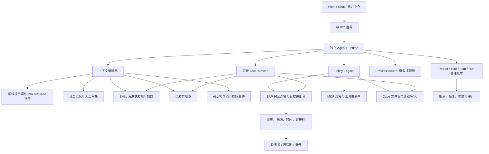

# 商业化与前沿 Agent 能力就绪审查

> 审查日期：2026-07-31  
> 审查范围：SAP AI 顾问工作台当前源码、自动化探针、桌面 UAT、产品信息架构、Agent Runtime、Skills、MCP、记忆、上下文、SAP 只读能力和 Windows 分发  
> 对标对象：OpenAI Codex、Anthropic Claude Code、OpenClaw、Nous Research Hermes Agent  
> 详细一手资料：[前沿 Agent 产品技术对标研究](../../research/2026-07-31-frontier-agent-benchmark.md)

## 1. 结论

当前产品已经不是 Demo：它具备可运行的本地桌面应用、Project/Case 隔离、Work/Chat、流式模型调用、事件账本、受控工具循环、Skills/Plugin/MCP 管理、分层提示词与记忆、SAP ADT 只读连接、规范、知识和案件文件。

但“可以融资演示”和“可以向客户承诺全面生产稳定”是两条不同的线：

- **融资演示：可以。** 应使用经过预演的本地脱敏数据、已验证模型渠道和只读 SAP 对象证据，展示完整工作闭环。
- **小范围付费试用：有条件可以。** 必须使用已知限制、备份、回退和人工复核机制。
- **无人监督的 SAP 自主 Agent：现在不应宣称。** 当前 ADT 能力不是通用业务数据查询层，开发说明书和流程图仍需顾问复核；崩溃后也只会续接没有任何外部副作用或部分输出的安全 Turn。

商业化前最重要的不是继续增加页面和工具数量，而是补齐三条可信链：

1. **输入可信链**：用户问题、附件、SAP 证据、知识和记忆都有来源、范围与脱敏记录。
2. **执行可信链**：每次模型、Skill 和工具调用都有权限、预算、取消、超时、幂等与事件记录。
3. **交付可信链**：开发说明书、流程图和分析报告能回溯到证据，并明确“模型生成、待复核、已确认”的状态。

## 2. 第一性原理

SAP 顾问真正购买的不是“更会聊天的模型”，而是一个能减少重复劳动、避免串项目、保留证据并稳定产出专业成果的工作台。

因此能力优先级必须是：

1. 不串客户、不泄露密钥、不误写 SAP。
2. 长任务可停止、可恢复、可审计。
3. 能读取正确的 SAP 连接、Case 文件和已审核知识。
4. 产物可复核、可版本化、可继续修改。
5. Skills、MCP 和子 Agent 只在上述基础稳定后扩展。

## 3. 目标架构

运行时必须独立于 Codex、Claude Code 或其他外部 Agent。它们可以是研究对象或可选增强，不能成为产品核心中转。

## 4. 当前能力成熟度

| 能力 | 当前状态 | 商业判断 |
| --- | --- | --- |
| Work/Chat 流式对话 | 已实现并有自动探针 | 可演示，真实渠道需逐一 UAT |
| Thread/Turn/Item 事件账本 | 已实现 | 安全 Turn 可原子认领续接；外部副作用不自动重放 |
| SAP ADT 只读 | 多连接、T000/对象证据可验证 | 可演示只读对象证据，不等于 MB52 等业务数据接口 |
| 模型工具循环 | Work 已实现 | 当前工具少但边界清楚，优于开放式任意执行 |
| Skills | 导入、发现、校验、启停、自动命中、按需搜索/加载 | 脚本禁用正确；需继续提高路由可解释性 |
| MCP | HTTPS 连接、测试、能力发现 | 外部工具执行未开放，适合作为受控预览 |
| 记忆 | personal/project/case、候选/确认/撤回、冲突/有效期 | 已有真实基础；仍需更好的用户可见命中解释 |
| 上下文压缩 | 模型元数据预算、检查点、原始会话保留 | 渠道缺失窗口元数据时使用 32,768 token 保守值 |
| 开发说明书 | Case 产物、版本历史、模型草稿 | 可演示草稿生成，正式交付必须人工复核 |
| 流程图 | Mermaid 源文件、受限静态预览、SVG/PNG/PDF 导出 | 可演示；复杂 Mermaid 语法保留源码，不执行主动内容 |
| Case 附件 | PDF/DOCX/XLSX/CSV/TXT/MD 本机解析、原件与脱敏摘录分离 | 可用于当前 Case 证据；扫描 PDF 暂无 OCR |
| 知识库 | 候选、审核、发布、关联 | 正式知识导入仍只接受安全文本；Case 附件不会自动发布为知识 |
| Feishu/Lark | CLI 检测和本地交接草稿 | 不是真实云端发布 |
| Windows 分发 | Setup、Portable、独立图标 | 可分发；自动更新和签名属于增强项 |

## 5. 本轮已落地改进

### 5.1 Skills 从“模糊自动命中”升级为渐进式加载

Work 模型工具目录新增两个只读能力：

- 搜索当前 Project 已启用且校验通过的 Skills。
- 按名称加载 Skill 指令和资源清单。

Skill 脚本仍然不会执行，`allowedTools` 仍只是建议，不能提升 Tool Runtime 权限。这样吸收了 Codex、Claude Code 和 Hermes 的渐进披露优点，同时保留 SAP 产品需要的最小权限。

### 5.2 长会话检查点不再永久遗漏中段

旧检查点可能把未写入摘录的消息标记为“已覆盖”。新格式最多覆盖当前保留的 240 条标准化消息，并为每条覆盖消息保留一条确定性原文短摘录；旧格式不会继续作为覆盖依据，会在达到阈值后重建。

原始会话仍保存在事件账本中，检查点不是长期知识，也不能替代原始证据。

### 5.3 记忆按问题相关性进入上下文

已确认记忆不再无上限全部进入模型：

- constraint 优先；
- Case 记忆优先于 Project，Project 优先于 personal；
- 当前问题命中的 topic/content 得分更高；
- 每回合最多选择 12 条；
- 未命中和超过 Top-K 的原因写入 ContextAudit。

自动提取内容仍只进入候选区，必须由用户确认后才能成为正式记忆。

### 5.4 密钥用途与 Project 绑定

安全引用增加 Project 和用途校验：

- 其他 Project 不能解析当前 Project 的密钥；
- SAP password 不能当作 API Key 使用；
- 全局 MCP 暂不允许引用 Project 密钥；
- MCP Header 只能使用当前 Project 的 API Key 安全引用。

### 5.5 Renderer 增加 CSP

页面增加 Content Security Policy，禁止对象、frame、表单提交和非必要资源来源，降低 renderer 内容注入后的影响范围。

## 6. 仍需优先解决的缺陷

### P0：商业承诺前必须完成

1. **真实外部系统验收矩阵**
   - 至少一个真实 OpenAI Compatible 渠道、一个 Anthropic Compatible 渠道。
   - 至少一套 DEV/QAS/PRD 多连接只读 SAP 环境。
   - 覆盖网络断开、401/403/429/5xx、超时、流中断和重启恢复。
   - 真实凭据只在用户授权下测试，结果不得进入 Git。

2. **完成工具结果与退出收尾**
   - 取消只阻止新动作，已完成工具结果必须先写入事件账本。
   - 应用退出前等待持久化队列完成，或明确记录未完成边界。

3. **SAP 业务数据适配层**
   - ADT 适合 ABAP 开发对象和服务元数据，不应伪装成 MB52、采购订单、库存或财务业务数据接口。
   - 需要独立只读适配器：优先企业批准的 OData/API；其次受控 RFC；最后才是用户导出的报表文件。
   - 每条数据必须带 SID、Client、连接 ID、读取时间、查询对象和过滤条件。

4. **交付物证据门禁**
   - 说明书和流程图中的事实、字段和 SAP 对象必须能追溯到证据或明确标记为“建议/待确认”。
   - 没有证据时不能输出“已验证”“已读取生产数据”等结论。

### P1：首批付费客户前完成

1. 已完成：模型目录保留 `contextWindowTokens` 和 `maxOutputTokens`，未知模型使用保守值。
2. 75% 预算开始裁剪低价值工具结果，不等待 88% 才处理。
3. Skills 路由增加显式 `@Skill`、命中原因、失败原因和用户可见审计。
4. 已完成：支持安全附件和 Office/PDF/Excel 解析，保留页码、sheet、行/单元格和来源；原件不直接进入模型。
5. 已完成：受限 Mermaid flowchart 在应用内静态渲染，并支持 SVG/PNG/PDF 导出。
6. 统一错误结构：发生了什么、影响什么、如何修复、是否可重试。
7. 已完成运行时安全续接与原会话提示；独立“恢复中心”界面、复制诊断和手工放弃仍待建设。
8. 建立签名或可信发布流程、版本迁移测试和可回滚升级。

### P2：产品稳定后建设

1. 受限子 Agent：
   - 只提供“SAP 证据研究”“说明书/流程图生成”“交叉审查”固定角色。
   - 独立上下文、最小工具权限、并发上限 3、禁止递归创建。
2. MCP 外部工具：
   - 先开放明确只读工具；
   - 逐工具 allowlist、超时、审批、结果脱敏和进程回收；
   - 不建设公开市场。
3. Skills 资源按需读取和可信来源等级。
4. 评估语义检索，但 SQLite FTS/词法检索能够满足时不要先引入向量数据库。

## 7. 记忆设计

推荐保留六层，不做“模型想记什么就记什么”的黑盒自动记忆：

| 层 | 内容 | 写入方式 | 是否自动进入上下文 |
| --- | --- | --- | --- |
| Policy | SAP 只读、密钥、Project 隔离 | 产品代码/系统提示词 | 始终 |
| Personal | 用户表达偏好、常用交付格式 | 用户确认 | 相关时 |
| Project | 客户术语、系统景观、项目规范 | 用户确认 | 当前 Project 相关时 |
| Case | 当前问题决定、约束、未决项 | 用户确认或 Case 文件 | 当前 Case 优先 |
| Thread checkpoint | 长会话确定性摘录 | 系统自动 | 当前 Thread |
| Knowledge | 可复用经验与事实 | 人工审核发布 | 检索命中时 |

记忆必须记录来源、作用域、状态、有效期、冲突和命中原因。安全规则不能依赖记忆，客户数据不能跨 Project 召回。

## 8. Skills 调用逻辑

推荐顺序：

1. 用户显式指定 `@Skill` 时优先。
2. Runtime 根据动作类型、Project 范围、名称和描述给出候选。
3. 模型只看到候选目录，不先加载全部正文。
4. 模型按需调用 `skills.load_instructions`。
5. Tool Runtime 独立判断真正可执行的工具，Skill 不能提升权限。
6. Skill 命中、加载失败、hash 变化和脚本禁用都写入审计。

Skills 是“可复用工作方法”，不是插件权限，也不是本机任意脚本入口。

## 9. 融资演示建议

演示只走一条高价值闭环，避免展示尚未成熟的广度：

1. 选择一个脱敏 S/4HANA Project，展示 DEV/QAS/PRD 和 Client 的连接景观。
2. 新建 Case：“分析某库存异常并生成处理说明”。
3. 模型选择已验证渠道，展示流式回复。
4. Agent 按需加载库存分析 Skill。
5. 读取一条真实但脱敏的 SAP 只读证据，或导入经授权的报表。
6. 关联已审核知识与项目规范。
7. 生成开发/处理说明书和流程图。
8. 展示证据来源、版本历史、待确认项和知识候选审核。
9. 重启应用，恢复同一任务和文件。

不要现场依赖不稳定公网、临时模型、未经预热的生产 SAP 或未审核的 MCP Server。融资演示应证明产品闭环和专业边界，不应赌第三方服务当天的可用性。

## 10. 发布门禁

满足以下条件后才能从“受控试用”升级为“可推广版本”：

- `npm run verify` 全绿，且工作树与 GitHub 提交一致。
- Setup、Portable 在干净 Windows 用户环境完成安装、启动、升级、卸载和数据保留验证。
- 真实模型流式 UAT 通过，包含中断和失败重试。
- 真实 SAP 只读 UAT 通过，明确测试对象和连接范围。
- 备份/恢复演练通过，密钥迁移后要求重新输入。
- 20 回合以上长会话、立即取消、退出重启和 checkpoint 测试通过。
- 对抗式检查确认无跨 Project 记忆、密钥、知识和 SAP 证据泄露。
- 演示数据、截图和安装包不含客户秘密或真实凭据。

## 11. 最终产品判断

最合理的定位不是“另一个 Codex”，而是：

> 一个以本地证据、Project 隔离、SAP 只读和可审核交付为核心的 SAP 顾问个人 Agent 工作台。

这条路线有真实差异化。继续堆通用工具会稀释优势；把证据链、记忆、Skills、恢复和交付质量做深，才会形成“越用越顺手、越用越专业”的产品壁垒。

## 12. 本轮验证记录

2026-08-01 已完成以下代码级验证：

- `npm run verify` 全部通过，覆盖 TypeScript、生产构建、Phase 27-58 回归、Agent Runtime、工具循环、记忆、Skills、MCP、上下文生命周期、附件解析、流程图导出、安全预检和 `git diff --check`。
- 桌面发布 UAT 在成果动作竞态加固后连续三次直接通过，最新证据目录为 `output/phase43-release-uat/2026-07-30T18-26-41-298Z`。
- 新增立即取消竞态、跨 Project/跨用途密钥拒绝、Skill 搜索与按需加载、长会话中段约束保留等专项回归。
- 已确认的工作约束不参与普通记忆 Top-K；MCP Header 密钥按 Project、连接和 Header 名称隔离；开发/生产 CSP 已分别验证。
- UAT 已在选择成果类型后等待 React 界面确认目标文件，再触发生成，避免高负载下误用上一次动作；失败时会记录动作、目标、按钮和文件预览状态。

## 13. 2026-08-01 对抗式复审补充

本轮不是只验证“能构建”，而是按崩溃、竞态、输入污染、Renderer 主动内容和文件边界逐项攻击。已发现并修复：

1. 业务消息已提交但 Turn 状态未落盘时可能重复自动执行；现先对业务投影分类，已提交项只确认、不重放。
2. 旧 Turn 的恢复确认与新 Turn 创建之间存在崩溃窗口；现由同一 SQLite 事务完成替代 Turn、恢复输入、初始事件和旧 Turn 认领。
3. 超过 500 条事件时活动 Turn 可能不在首屏快照，且游标可能跳过事件；现强制补入活动 Turn 并使用最后已返回序号。
4. 模型目录规范化曾丢失上下文窗口元数据；现保留合法窗口与输出上限，非法或缺失值使用保守回退。
5. 流式 HTTP 响应的 `aborted`、`error` 和提前 `close` 未完整收口；现统一转为安全、可重试错误，不留下未处理事件。
6. 附件路径可能泄露到 renderer 或模型；现文件选择和绝对路径只存在于 main process，模型只能通过当前 Case 的只读检索读取脱敏摘录。
7. Mermaid 第三方运行时在真实 Electron UAT 中出现不可接受的卡顿；现改为受限 flowchart 语法解析和静态 SVG，拒绝配置、HTML、链接、外部资源和事件属性。
8. 流程图导出最初对 trim 后源码计算 SHA，而主进程校验原文件，导致安全导出失败；现哈希绑定原始文件内容，并由真实 SVG/PNG/PDF UAT 验证。

专项验证覆盖真实构造的 PDF、DOCX、XLSX、CSV、TXT，公式只记录不执行，伪装扩展名和符号链接被拒绝；桌面 UAT 实际挂载静态 SVG，并在 Case 中生成可识别的 SVG、PNG、PDF 文件。

仍需明确的残余风险：真实企业 SAP 业务数据接口、真实模型渠道矩阵、Windows 代码签名、自动更新、扫描 PDF OCR、复杂 Mermaid 图表和带外部副作用的工具恢复，均没有因本轮加固而被虚假宣称为完成。

上述结论证明当前代码基线适合受控演示和内部试用，但不替代以下外部 UAT：

- 使用用户授权的真实模型渠道验证首字节、连续流式输出、中止和限流恢复。
- 使用企业授权的真实 SAP 只读接口验证指定业务对象；ADT 通过不能替代 MB52 等业务数据读取验证。
- 在干净 Windows 账户验证 Setup、Portable、数据迁移、卸载和异常退出恢复。
- 使用脱敏演示数据完整走通“提问、取证、生成说明书、生成流程图、审核、归档和恢复”。
