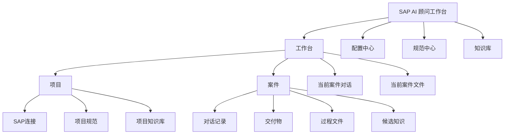

# SAP AI 顾问工作台开发说明书

版本：MVP v0.1
日期：2026-07-01
适用范围：个人本地版

## 1. 产品定位

SAP AI 顾问工作台是一个面向 SAP 顾问的本地个人工作台。它不是通用 AI 聊天工具，也不是通用知识库平台，而是围绕 SAP 顾问日常处理问题、开发 ABAP、生成文档、画逻辑图、沉淀经验而设计的案件型工作台。

产品的一句话目标：

> 让 SAP 顾问比直接使用 Codex / ChatGPT 更快、更稳、更少重复劳动地完成 SAP 问题分析、ABAP 开发、文档交付和历史追溯。

## 2. 用户和使用场景

### 2.1 目标用户

MVP 只面向单个 SAP 顾问个人使用，默认用户具备以下特征：

- 熟悉 SAP 业务和 ABAP 基础逻辑。
- 日常需要处理多个 SAP 项目或多个客户系统。
- 经常使用 AI 辅助分析问题、写 ABAP、生成文档和画逻辑图。
- 不希望每次重复描述 ABAP 规范、注释规范、文档模板和图示风格。
- 希望后续能快速找回历史案件、交付物、逻辑图和经验结论。

### 2.2 核心场景

| 场景 | 用户目标 | MVP 必须支持 |
|---|---|---|
| SAP 问题分析 | 输入自然语言问题，自动读取必要 SAP 信息并输出结论 | 是 |
| ABAP 开发 | 按项目规范生成或修改 ABAP 代码、说明和请求描述 | 是 |
| 文档生成 | 基于案件上下文生成开发说明书、技术说明、飞书文档 | 是 |
| 画流程图 | 基于业务逻辑生成逻辑说明图、流程图、飞书画布素材 | 是 |
| 历史追溯 | 找回某个对象、问题、Excel、文档、逻辑图和处理过程 | 是 |
| 多项目管理 | 不同客户、不同 SAP 版本、不同规范分别管理 | 是 |
| 知识沉淀 | 从案件中整理候选知识，人工确认后入库 | 是 |

## 3. MVP 范围

### 3.1 MVP 必须包含

1. 本地桌面工作台主界面。
2. 统一左侧栏：新案件、搜索、配置中心、规范中心、知识库、项目和案件列表、个人信息。
3. 多项目管理：添加项目、切换项目、同时显示多个项目、从可见列表移除项目。
4. 案件管理：一个问题或需求对应一个案件文件夹。
5. 当前案件对话：Codex 风格连续文本流，用户消息靠右，AI 回复靠左，不使用大卡片隔断。
6. 任务模式：问题分析、ABAP 开发、文档生成、画流程图。
7. 当前案件文件面板：右侧可折叠文件树，展示当前案件目录文件。
8. 配置中心：ADT、飞书 CLI、API 渠道和模型、Codex 能力、本地存储的配置、测试、验证和状态显示。
9. 规范中心：项目级规范副本、模板迁移、差异查看、版本保存。
10. 知识库：文档上传、QA 导入、候选知识、人工确认、冲突检测、时间线元数据。
11. 模型选择器：按 API 渠道分组选择模型，如 Fengsha API 中转、DeepSeek、智谱开放平台。
12. 本地文件沉淀：所有中间产物和最终产物都保存到案件目录。
13. 全局搜索：检索案件、SAP 对象、文档、逻辑图、知识卡片和 QA。

### 3.2 MVP 暂不包含

| 不做内容 | 原因 |
|---|---|
| 团队协作和成员权限 | 当前只做个人版，避免权限系统过早复杂化。 |
| 注册登录、组织管理、付费订阅 | 个人本地版不需要。 |
| 云端 SaaS 知识库 | SAP 源码和客户资料敏感，先做本地优先。 |
| 自动写入 SAP 生产系统 | 风险过高，MVP 默认只读。 |
| 自动释放传输请求 | 高风险不可逆操作，不进入 MVP。 |
| 无确认自动入库知识 | 会污染知识库。 |
| 完全本地大模型推理 | 成本和效果不稳定，先支持 API 接入。 |

## 4. 核心设计原则

### 4.1 界面原则

1. 参考 Codex App，而不是传统 SaaS Dashboard。
2. 左侧负责入口、项目和案件。
3. 中间负责对话和工作推进。
4. 右侧负责当前案件文件，不负责固定展示技术过程。
5. 底部负责输入、任务模式和模型选择。
6. 能作为文件保存的内容，不做成固定 UI 模块。
7. 技术过程默认隐藏，只有用户打开文件或搜索时才查看。
8. 所有按钮必须有明确用途，不允许出现无法解释的小按钮。

### 4.2 数据原则

1. SAP 系统是事实源。
2. 本地案件目录是工作沉淀源。
3. 知识库是人工确认后的长期经验源。
4. 对话记录不是知识库，必须经过整理确认后才能正式入库。
5. 时间线记录处理过程，版本记录成果变化。
6. 项目规范复制后成为当前项目独立副本，不再被来源模板自动覆盖。

### 4.3 安全原则

1. 默认只读 SAP。
2. 密码、API Key、Token 不明文展示。
3. 生产系统写入、删除、传输释放等高风险动作不进入 MVP。
4. AI 输出结论必须能追溯来源文件、案件或 SAP 读取记录。
5. 连接失败必须给出明确原因和修复建议。

## 5. 信息架构



## 6. 主工作台页面

对应原型：[01-main-workbench.png](images/01-main-workbench.png)

### 6.1 顶部应用栏

顶部栏只承担桌面应用基础操作和产品标识，不承载业务配置。

必须包含：

- 侧边栏折叠按钮。
- 后退、前进按钮。
- 菜单：文件、编辑、视图、帮助。
- 产品名：SAP AI 顾问工作台。
- 版本标识：个人版 MVP。
- 标准窗口控制按钮。

不允许放置：

- 模型选择。
- 用户头像。
- 项目迁移。
- SAP 系统状态大面积标签。
- 无明确用途的功能按钮。

### 6.2 左侧统一侧边栏

左侧只有一个统一侧边栏，不再拆成两个独立区域。

顶部固定入口：

- 新案件。
- 搜索。
- 配置中心。
- 规范中心。
- 知识库。

项目区域：

- 显示当前可见项目列表。
- 每个项目行显示项目名称、SAP 版本或系统标签、连接状态。
- 每个可见项目允许：
  - 切换项目。
  - 打开项目配置。
  - 从当前可见列表移除。
- 左侧项目不是所有项目的全集，只是当前用户选择显示的项目集合。

案件区域：

- 每个项目下显示该项目最近案件。
- 案件过多时侧边栏内部滚动。
- 案件行显示标题、状态和最近时间。
- 不在案件列表中展示技术对象清单。

底部个人信息：

- 用户头像。
- 用户名称。
- 本地个人版标识。
- 编辑按钮。

MVP 不做注册、登录、组织、权限和订阅信息。

### 6.3 项目添加和连接配置

用户点击「+ 添加项目」后，显示添加项目 / 配置连接弹层。

弹层必须包含：

| 分区 | 字段和动作 |
|---|---|
| 项目信息 | 项目名称、SAP 版本 S4/ECC、项目备注 |
| ADT 连接 | URL、Client、用户、SSL 设置、测试 ADT、读取 T000 验证 |
| 飞书 CLI | Profile、验证登录 |
| API 渠道 | Fengsha API 中转、DeepSeek、获取模型 |
| 规范模板 | 从现有项目复制、使用 S4 模板、使用 ECC 模板 |

保存前必须显示各项状态：

- 未配置。
- 已保存。
- 已验证。
- 失败。

失败时必须显示用户可理解的原因，例如：

- ADT 账号或密码错误。
- Client 不正确。
- ADT 服务不可用。
- 飞书 CLI 未登录。
- API Key 无效。
- 无法获取模型列表。

### 6.4 中间对话区域

中间区域是主工作区，必须保持最大空间。

交互规则：

1. 用户消息靠右。
2. AI 回复靠左。
3. 用户和 AI 消息都不显示头像。
4. AI 回复不使用大边框卡片。
5. AI 回复采用连续文本流，类似 Codex。
6. 文件产物以小型文件链接或 chip 展示。
7. 详细技术过程不默认展示。

AI 回复结构建议：

```text
已处理 2m 58s >

已确认：问题来自演示BOM筛选口径与当前业务范围不一致。

- 原因：...
- 建议：...
- 已生成文件：演示BOM核对.xlsx、逻辑说明图.png、开发说明书.md
```

### 6.5 底部输入框

输入框包含：

- 任务模式选择。
- 输入区域。
- 模型选择。
- 附件按钮。
- 麦克风按钮。
- 发送按钮。

任务模式包括：

| 模式 | 作用 |
|---|---|
| 问题分析 | 读取必要 SAP 信息，分析问题，输出结论和文件。 |
| ABAP 开发 | 读取最新源码，建立必要快照，按项目规范生成代码和说明。 |
| 文档生成 | 基于当前案件生成开发说明、技术说明、飞书文档。 |
| 画流程图 | 基于案件逻辑生成 Mermaid、图片或飞书画布素材。 |

任务模式不是简单提示词标签，而是工作流选择。不同模式会加载不同规范、工具权限和输出模板。

### 6.6 模型选择

模型选择只放在输入框内，不放顶部。

模型按 API 渠道分组：

- Fengsha API 中转。
- DeepSeek。
- 智谱开放平台。
- 后续可扩展其他 OpenAI 兼容渠道。

模型选择器必须支持：

- 搜索模型。
- 按能力筛选：视觉、推理、工具、联网、免费。
- 显示当前选中模型。
- 获取模型列表失败时显示明确错误。

### 6.7 右侧当前案件文件

右侧是可折叠文件面板，不是固定分析面板。

默认显示：

```text
当前案件文件
  README.md
  conversation.md
  outputs/
    演示BOM核对.xlsx
    逻辑说明图.png
    开发说明书.md
  knowledge_candidates/
    演示BOM筛选规则.md
  technical/
```

右侧面板规则：

1. 可隐藏。
2. 可拖拽调整宽度。
3. 不显示无意义按钮。
4. 不默认展示 SAP 读取对象、源码快照和技术证据。
5. 技术材料进入 technical 目录，用户需要时打开。
6. 底部只显示文件数量，不显示无意义视图按钮。

## 7. 配置中心

对应原型：[02-config-center.png](images/02-config-center.png)

配置中心按当前项目管理，不是全局一次配置所有项目。

### 7.1 配置类别

- 项目概览。
- ADT 连接。
- 飞书 CLI。
- API 与模型。
- Codex 能力。
- 本地存储。

### 7.2 ADT 连接

必须支持：

- 系统别名。
- SAP URL。
- Client。
- 用户。
- 语言。
- SSL 设置。
- 只读模式显示。
- 保存配置。
- 测试连接。
- 读取 T000 验证。

验证结果必须显示：

- 配置状态。
- 连接测试结果。
- 读取验证结果。
- 写入模式是否禁用。
- 最后验证时间。

### 7.3 飞书 CLI

必须支持：

- 检测 lark-cli 是否存在。
- 显示当前 Profile。
- 验证登录状态。
- 验证文档创建或更新能力。
- 登录失败时提示用户重新授权。

### 7.4 API 与模型

必须支持：

- Fengsha API 中转配置。
- DeepSeek API 配置。
- OpenAI 兼容 Base URL。
- API Key 安全保存。
- 获取模型列表。
- 测试 Chat Completion。
- 显示模型能力标签。

### 7.5 Codex 能力

必须支持：

- 检测 Codex SDK 或 CLI 是否可用。
- 显示版本。
- 显示登录状态。
- 测试启动一个只读任务。
- 说明本工具保存自己的案件和对话，不依赖 Codex App 聊天记录展示。

### 7.6 本地存储

必须显示：

- 工作区根目录。
- 项目目录。
- 案件目录。
- 数据库位置。
- 索引位置。
- 日志位置。

## 8. 规范中心

对应原型：[03-standards-center.png](images/03-standards-center.png)

### 8.1 规范管理原则

规范不是全局唯一，而是分层管理：

```text
全局基础模板
  -> S4 模板
  -> ECC 模板
    -> 项目规范副本
      -> 案件临时规则
```

项目规范从模板或其他项目复制后，成为当前项目的独立副本。

### 8.2 规范类别

- ABAP 开发规范。
- 注释规范。
- 请求号描述。
- ALV 报表规范。
- 接口开发规范。
- 文档模板。
- 流程图规范。
- Excel 导出模板。

### 8.3 必须支持的动作

- 从模板迁移。
- 从其他项目复制。
- 导入规范。
- 手工编辑。
- 保存当前项目版本。
- 查看差异。
- 测试生成示例。
- 查看底层提示词，高级选项默认折叠。

### 8.4 差异和版本

右侧显示：

- 来源模板。
- 当前项目规范版本。
- 哪些规则已修改。
- 哪些规则和来源相同。
- 哪些规则不适用于当前 SAP 版本。

版本只在规范内容发生变化时生成，不按日期自动生成。

## 9. 知识库

对应原型：[04-knowledge-center.png](images/04-knowledge-center.png)

### 9.1 知识库定位

知识库不是简单上传文档后切片向量化，而是项目知识资产库。

它包括：

- 文档库。
- QA 问答。
- SAP 对象说明。
- 案件经验卡片。
- 时间线事实。
- 冲突和失效知识。

### 9.2 入库原则

1. 日常对话全部保存到案件，但不自动进入正式知识库。
2. 系统可以自动生成候选知识。
3. 候选知识必须由用户确认后才能正式入库。
4. 新知识和旧知识冲突时不能直接覆盖。
5. 所有知识必须有项目、来源、时间和状态。

### 9.3 知识状态

| 状态 | 含义 |
|---|---|
| 待确认 | AI 或系统生成的候选知识，等待人工审核。 |
| 已发布 | 已确认进入正式知识库。 |
| 有冲突 | 与已有知识存在适用范围或结论冲突。 |
| 已失效 | 被新知识替代，但保留历史记录。 |
| 草稿 | 用户手工编辑中，未发布。 |

### 9.4 文档上传和解析

支持上传：

- Word。
- Excel。
- PDF。
- Markdown。
- TXT。
- ABAP 源码。
- 飞书文档链接。
- QA 表格。

解析规则：

1. 先结构化，再切片。
2. 表格必须尽量作为完整表格保存，不按页面机械切断。
3. 跨页表格需要记录所属文档、页码范围、标题和上下文。
4. 时间线事实需要抽取实体、时间、角色和关系。
5. 解析结果进入待确认或文档库，不直接生成不可追溯答案。

## 10. 案件和文件规则

每个案件是一个真实文件夹。

推荐目录：

```text
case-folder/
  README.md
  conversation.md
  timeline.md
  context_pack.md
  outputs/
  knowledge_candidates/
  snapshots/
  evidence/
  technical/
  metadata.json
```

### 10.1 README.md

保存案件摘要：

- 案件标题。
- 当前结论。
- 影响范围。
- 处理建议。
- 交付物清单。
- 关联 SAP 对象。
- 知识沉淀状态。

### 10.2 conversation.md

保存整理后的对话，不要求逐字保存所有模型中间过程。

### 10.3 timeline.md

记录案件处理过程：

- 何时创建。
- 何时继续处理。
- 何时生成文件。
- 何时确认结论。
- 何时生成候选知识。

时间线不等于版本。

### 10.4 context_pack.md

用于未来恢复上下文，只保存最重要的信息：

- 当前案件目标。
- 已确认事实。
- 关键结论。
- 相关文件。
- 相关 SAP 对象。
- 待办事项。

### 10.5 technical/

保存过程材料：

- SAP 读取日志。
- 源码快照。
- 表结构快照。
- 差异分析。
- 工具调用记录。

这些不在主界面固定展示。

## 11. 时间线和版本规则

### 11.1 案件识别

以下情况属于同一个案件：

- 用户在同一个聊天窗口继续处理。
- 用户从案件列表打开旧案件继续处理。
- 用户明确说继续某个历史问题。

以下情况需要用户确认是否关联旧案件：

- 新建对话但提到相同 SAP 对象。
- 问题描述和历史案件相似。

### 11.2 时间线

时间线记录处理过程。

跨天继续处理仍然是同一个案件，只追加时间线节点，不自动生成新版本。

### 11.3 版本

版本只在成果发生关键变化时生成：

- 结论变化。
- 文档重新生成。
- Excel 重新导出。
- 逻辑图重新生成。
- ABAP 源码快照变化。
- 知识卡片被确认、修改或失效。

## 12. 搜索

搜索必须覆盖：

- 项目。
- 案件。
- SAP 对象。
- 文件名。
- 文件内容。
- 知识卡片。
- QA。
- 逻辑图标题。
- 飞书文档记录。

搜索结果必须显示来源和类型，避免用户不知道结果来自哪里。

## 13. 验收标准

MVP 可用的最低标准：

1. 能创建项目并完成 ADT 配置验证。
2. 能新建案件并保存到本地目录。
3. 能在案件中选择任务模式并发起对话。
4. 能把生成的 Excel、文档、图片保存到当前案件文件夹。
5. 能在右侧文件面板看到当前案件文件。
6. 能用全局搜索找回历史案件和交付物。
7. 能编辑项目规范并在 ABAP 开发任务中生效。
8. 能上传文档并生成待确认知识。
9. 知识入库必须经过人工确认。
10. 配置失败必须显示明确原因，不允许只显示失败。

## 14. 关键风险

| 风险 | 处理 |
|---|---|
| 功能过多导致主界面混乱 | 主界面只保留对话和文件，配置进配置中心。 |
| 知识库污染 | 候选知识必须人工确认。 |
| SAP 数据过期 | SAP 是事实源，必要时重新读取并提示新鲜度。 |
| 项目规范混用 | 规范按项目独立副本管理。 |
| 密钥泄露 | 使用系统安全存储，不明文展示。 |
| AI 结论不可追溯 | 所有结论关联案件、文件和来源。 |
