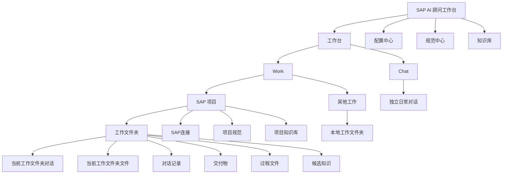

# SAP AI 顾问工作台开发说明书

版本：MVP v0.1
日期：2026-07-01
适用范围：个人本地版

## 1. 产品定位

SAP AI 顾问工作台是一个面向 SAP 顾问的本地个人工作台。它不是通用 AI 聊天工具，也不是通用知识库平台，而是围绕 SAP 顾问日常处理问题、开发 ABAP、生成文档、画逻辑图、沉淀经验而设计的案件型工作台。

产品的一句话目标：

> 让 SAP 顾问比直接使用 Codex / ChatGPT 更快、更稳、更少重复劳动地完成 SAP 问题分析、ABAP 开发、文档交付和历史追溯。

## 2. 用户和使用场景

### 2.1 目标用户

MVP 只面向单个 SAP 顾问个人使用，默认用户具备以下特征：

- 熟悉 SAP 业务和 ABAP 基础逻辑。
- 日常需要处理多个 SAP 项目或多个客户系统。
- 经常使用 AI 辅助分析问题、写 ABAP、生成文档和画逻辑图。
- 不希望每次重复描述 ABAP 规范、注释规范、文档模板和图示风格。
- 希望后续能快速找回历史案件、交付物、逻辑图和经验结论。

### 2.2 核心场景

| 场景 | 用户目标 | MVP 必须支持 |
|---|---|---|
| SAP 问题分析 | 输入自然语言问题，自动读取必要 SAP 信息并输出结论 | 是 |
| ABAP 开发 | 按项目规范生成或修改 ABAP 代码、说明和请求描述 | 是 |
| 文档生成 | 基于案件上下文生成开发说明书、技术说明、飞书文档 | 是 |
| 画流程图 | 基于业务逻辑生成逻辑说明图、流程图、飞书画布素材 | 是 |
| 历史追溯 | 找回某个对象、问题、Excel、文档、逻辑图和处理过程 | 是 |
| 多项目管理 | 不同客户、不同 SAP 版本、不同规范分别管理 | 是 |
| 知识沉淀 | 从案件中整理候选知识，人工确认后入库 | 是 |

## 3. MVP 范围

### 3.1 MVP 必须包含

1. 本地桌面工作台主界面。
2. 统一左侧栏：Work / Chat 分区、搜索、配置中心、规范中心、知识库、SAP 项目和工作文件夹列表、个人信息。
3. 多项目管理：添加 SAP 项目、切换 SAP 项目、同时显示多个 SAP 项目、从可见列表移除项目。
4. 工作文件夹管理：一个正式问题、需求或交付事项对应一个工作文件夹；当前实现中工作文件夹对应底层 Case。
5. 当前案件对话：Codex 风格连续文本流，用户消息靠右，AI 回复靠左，不使用大卡片隔断。
6. 案件动作：在当前对话下提供梳理资料、沉淀笔记、生成开发说明书、画流程图、整理候选知识、整理交付物等固定动作。
7. 案件执行偏好：记录「每步确认」「低风险自动」「尽量自动」三种偏好；当前版本不把它伪装成真正权限门禁，SAP 只读、外部发布和破坏性操作仍由主进程硬边界控制。
8. 当前案件文件面板：右侧可折叠文件树，展示当前案件目录文件。
9. 配置中心：ADT、飞书 CLI、API 渠道和模型、Codex 能力、本地存储、动作与 Skill 管理的配置、测试、验证和状态显示。
10. 规范中心：项目级规范副本、模板迁移、差异查看、版本保存。
11. 知识库：文档上传、QA 导入、候选知识、人工确认、冲突检测、时间线元数据。
12. 模型选择器：按 API 渠道分组选择模型，如 Fengsha API 中转、DeepSeek、智谱开放平台。
13. 本地文件沉淀：所有中间产物和最终产物都保存到案件目录。
14. 全局搜索：检索案件、SAP 对象、文档、逻辑图、知识卡片和 QA。

### 3.2 MVP 暂不包含

| 不做内容 | 原因 |
|---|---|
| 团队协作和成员权限 | 当前只做个人版，避免权限系统过早复杂化。 |
| 注册登录、组织管理、付费订阅 | 个人本地版不需要。 |
| 云端 SaaS 知识库 | SAP 源码和客户资料敏感，先做本地优先。 |
| 自动写入 SAP 生产系统 | 风险过高，MVP 默认只读。 |
| 自动释放传输请求 | 高风险不可逆操作，不进入 MVP。 |
| 无确认自动入库知识 | 会污染知识库。 |
| 内置 Skill 创建器 | 用户可以从本地导入已有 Skill，MVP 不负责从零创建或编辑复杂 Skill。 |
| 按单个 Skill 配置权限 | 权限按项目和案件管理，避免用户逐个理解并授权每个 Skill。 |
| 完全本地大模型推理 | 成本和效果不稳定，先支持 API 接入。 |

## 4. 核心设计原则

### 4.1 界面原则

1. 参考 Codex App，而不是传统 SaaS Dashboard。
2. 左侧负责入口、项目和案件。
3. 中间负责对话和工作推进。
4. 右侧负责当前案件文件，不负责固定展示技术过程。
5. 底部负责自由输入、固定案件动作、权限模式入口和模型选择。
6. 能作为文件保存的内容，不做成固定 UI 模块。
7. 技术过程默认隐藏，只有用户打开文件或搜索时才查看。
8. 所有按钮必须有明确用途，不允许出现无法解释的小按钮。

### 4.2 数据原则

1. SAP 系统是事实源。
2. 本地案件目录是工作沉淀源。
3. 知识库是人工确认后的长期经验源。
4. 对话记录不是知识库，必须经过整理确认后才能正式入库。
5. 时间线记录处理过程，版本记录成果变化。
6. 项目规范复制后成为当前项目独立副本，不再被来源模板自动覆盖。

### 4.3 安全原则

1. 默认只读 SAP。
2. 密码、API Key、Token 不明文展示。
3. 生产系统写入、删除、传输释放等高风险动作不进入 MVP。
4. AI 输出结论必须能追溯来源文件、案件或 SAP 读取记录。
5. 连接失败必须给出明确原因和修复建议。

## 5. 信息架构



### 5.1 已确认的主上下文布局

主工作台采用单一上下文布局，但必须把 `Work` 和 `Chat` 分清楚。

| 区域 | 定位 | 是否绑定文件夹 | 是否读取 SAP | 右侧默认内容 |
|---|---|---:|---:|---|
| Work | 正式工作、交付、SAP 分析、ABAP、文档和图示 | 是 | 只有 SAP 项目下才允许 | 当前工作文件夹文件 |
| Chat | 临时日常对话、想法记录、普通问答 | 否 | 否 | 不显示文件面板 |
| SAP 项目 | SAP 连接、Client、规范、知识和模型配置的父级 | 不直接绑定文件夹 | 可配置只读读取 | 点击配置时显示项目配置 |
| 工作文件夹 | Work 下的具体任务文件夹 | 是 | 继承所属 SAP 项目 | 文件、输出、候选知识、技术材料 |
| 其他工作 | 非 SAP 或暂不归属已配置 SAP 项目的本地工作 | 是 | 否 | 本地文件夹文件 |

用户必须能一眼看清：某个工作文件夹属于哪个 SAP 项目；如果属于“其他工作”，则不会读取任何 SAP 配置。

## 6. 主工作台页面

对应原型：[01-main-workbench-actions-permissions.png](images/01-main-workbench-actions-permissions.png)

### 6.1 顶部应用栏

顶部栏只承担桌面应用基础操作和产品标识，不承载业务配置。

必须包含：

- 侧边栏折叠按钮。
- 后退、前进按钮。
- 菜单：文件、编辑、视图、帮助。
- 产品名：SAP AI 顾问工作台。
- 版本标识：个人版 MVP。
- 标准窗口控制按钮。

不允许放置：

- 模型选择。
- 用户头像。
- 项目迁移。
- SAP 系统状态大面积标签。
- 无明确用途的功能按钮。

### 6.2 左侧统一侧边栏

左侧只有一个统一侧边栏，不再拆成两个独立区域。

顶部固定入口：

- Work / Chat 分段切换。
- Work 下显示：新工作文件夹、搜索、配置中心、规范中心、知识库。
- Chat 下显示：新对话和历史对话，不显示项目选择和文件夹选择。

SAP 项目区域：

- 显示当前可见项目列表。
- 每个 SAP 项目行显示项目名称、SAP 版本或系统标签，例如 `S4 · DEV/100`、`ECC · QAS/200`。
- 每个可见项目允许：
  - 切换项目。
  - 打开项目配置。
  - 在该项目下点击 `+ 文件夹` 新建工作文件夹。
  - 从当前可见列表移除。
- 左侧 SAP 项目不是所有项目的全集，只是当前用户选择显示的项目集合。
- 不在 SAP 项目标题上显示“只读”标签；只读是安全规则，不作为占空间的项目标题 chip。系统/Client 标签保留。

工作文件夹区域：

- 每个 SAP 项目下显示该项目最近工作文件夹。
- 工作文件夹过多时侧边栏内部滚动。
- 工作文件夹行显示标题、状态和最近时间。
- 不在工作文件夹列表中展示技术对象清单。

其他工作区域：

- 用于非 SAP 工作，或 SAP 相关但暂不绑定已配置 SAP 项目的工作。
- 允许创建本地工作文件夹。
- 不显示 ADT、Client、SAP 只读取证入口。
- 后续如用户需要，可以把“其他工作”迁移或重新归档到某个 SAP 项目下。

底部个人信息：

- 用户头像。
- 用户名称。
- 本地个人版标识。
- 编辑按钮。

MVP 不做注册、登录、组织、权限和订阅信息。

### 6.3 项目添加和连接配置

用户点击「+ 添加项目」后，显示添加项目 / 配置连接弹层。

弹层必须包含：

| 分区 | 字段和动作 |
|---|---|
| 项目信息 | 项目名称、SAP 版本 S4/ECC、项目备注 |
| ADT 连接 | URL、Client、用户、SSL 设置、测试 ADT、读取 T000 验证 |
| 飞书 CLI | Profile、验证登录 |
| API 渠道 | Fengsha API 中转、DeepSeek、获取模型 |
| 规范模板 | 从现有项目复制、使用 S4 模板、使用 ECC 模板 |

保存前必须显示各项状态：

- 未配置。
- 已保存。
- 已验证。
- 失败。

失败时必须显示用户可理解的原因，例如：

- ADT 账号或密码错误。
- Client 不正确。
- ADT 服务不可用。
- 飞书 CLI 未登录。
- API Key 无效。
- 无法获取模型列表。

### 6.4 中间对话区域

中间区域是主工作区，必须保持最大空间。

交互规则：

1. 用户消息靠右。
2. AI 回复靠左。
3. 用户和 AI 消息都不显示头像。
4. AI 回复不使用大边框卡片。
5. AI 回复采用连续文本流，类似 Codex。
6. 文件产物以小型文件链接或 chip 展示。
7. 详细技术过程不默认展示。

AI 回复结构建议：

```text
已处理 2m 58s >

已确认：问题来自演示BOM筛选口径与当前业务范围不一致。

- 原因：...
- 建议：...
- 已生成文件：演示BOM核对.xlsx、逻辑说明图.png、开发说明书.md
```

### 6.5 底部输入框和案件动作

输入框包含：

- 固定案件动作选择器。
- 项目 / 案件权限模式入口。
- 输入区域。
- 模型选择。
- 附件按钮。
- 麦克风按钮。
- 发送按钮。

底部默认工作方式是自由对话。用户不需要在发起对话前判断自己属于问题分析、ABAP 开发、文档生成还是画流程图。正式工作先通过自然语言沟通、补充信息和读取证据推进；需要沉淀成果时，再从紧凑的固定案件动作选择器中选择动作并点击生成。

案件动作选项包括：

| 动作 | 作用 | 默认保存位置 |
|---|---|
| 梳理资料 | 梳理当前对话、工作文件夹、项目规范和已保存只读证据，列出资料缺口。 | `evidence/资料梳理与缺口清单.md` |
| 沉淀笔记 | 把当前讨论整理成后续可重新打开学习的案件笔记和待办。 | `outputs/案件沉淀笔记.md` |
| 生成开发说明书 | 基于当前对话、文件、规范和证据生成开发说明书。 | `outputs/开发说明书.md` |
| 画流程图 | 基于当前案件逻辑生成 Mermaid 源文件。 | `outputs/逻辑说明图.mmd` |
| 整理候选知识 | 从当前案件提炼可复用经验，进入待确认区。 | `knowledge_candidates/问题处理经验候选.md` |
| 整理交付物 | 汇总当前案件已有输出，形成交付清单和交接说明。 | `outputs/交付物清单与交接说明.md` |

案件动作不是切换整个对话模式，而是在当前对话和当前工作文件夹基础上执行一次沉淀动作。按钮固定显示，不根据上下文动态消失。信息不足时，点击动作后应明确提示缺少哪些信息，而不是隐藏按钮。

每个动作背后可以绑定内置 Skill 或用户导入的 Skill。用户界面只展示动作名称、用途、实际读取范围、输出位置和执行偏好；`SKILL.md`、脚本和模板细节放在高级信息中。

点击案件动作后，必须先出现轻量确认面板：

```text
即将执行：生成开发说明书
使用范围：当前对话摘要 + 当前工作文件夹 + 项目规范 + 已读取证据
保存位置：outputs/开发说明书.md
执行偏好：低风险自动（仅作记录，不替代安全门禁）

[开始生成] [取消]
```

确认后，执行过程在对话区以流式方式显示，但详细过程默认折叠。执行完成后，AI 回复只突出最终结果、保存文件和需要用户确认的事项。

### 6.6 案件执行偏好与安全门禁

当前可见下拉是案件成果的“执行偏好记录”，不是已完成的权限系统。Skill 负责定义动作能力；真正的执行边界仍由 Electron main process、窄 IPC、工作区路径校验、SAP 只读和外部发布确认共同控制。

偏好记录在案件消息和成果文件中，便于未来接入真实权限门禁；当前不得根据该字段放宽任何安全检查。

当前提供三种偏好：

| 模式 | 用户理解 | 行为 |
|---|---|---|
| 每步确认 | 希望每一步都看清楚 | 作为成果审计信息记录；不会改变主进程安全门禁。 |
| 低风险自动 | 希望本地低风险步骤连贯完成 | 作为成果审计信息记录；风险操作仍按系统规则确认。 |
| 尽量自动 | 希望在案件内减少打断 | 作为成果审计信息记录；不能绕过 SAP 只读、外部发布与破坏性操作确认。 |

任何执行偏好都不是授权。以下操作始终必须再次确认：

- SAP 写入、激活、过账、传输、批量修改。
- 批量删除文件或目录。
- 发布到 Feishu/Lark、GitHub、CSDN 等外部平台。
- 读取或导出密码、Token、API Key。
- 修改系统级安全配置或产生不可逆生产影响的操作。

### 6.7 模型选择

模型选择只放在输入框内，不放顶部。

模型按 API 渠道分组：

- Fengsha API 中转。
- DeepSeek。
- 智谱开放平台。
- 后续可扩展其他 OpenAI 兼容渠道。

模型选择器必须支持：

- 搜索模型。
- 按能力筛选：视觉、推理、工具、联网、免费。
- 显示当前选中模型。
- 获取模型列表失败时显示明确错误。

### 6.8 右侧上下文面板

右侧是可折叠上下文面板，不是固定 SAP 配置信息面板。

默认显示当前工作文件夹文件。只有以下情况才显示项目配置：

- 用户在右侧切换到「项目配置」页签。
- 用户点击左侧某个 SAP 项目的「配置」按钮。
- 用户进入配置中心。

默认显示：

```text
当前工作文件夹文件
  README.md
  conversation.md
  outputs/
    演示BOM核对.xlsx
    逻辑说明图.png
    开发说明书.md
  knowledge_candidates/
    演示BOM筛选规则.md
  technical/
```

右侧面板规则：

1. 可隐藏。
2. 可拖拽调整宽度。
3. 不显示无意义按钮。
4. 不默认展示 SAP 读取对象、源码快照和技术证据。
5. 技术材料进入 technical 目录，用户需要时打开。
6. 底部只显示文件数量，不显示无意义视图按钮。
7. 「文件」和「项目配置」是明确页签；默认选中「文件」。
8. 项目配置摘要必须紧凑，可折叠；完整编辑进入配置中心。

## 7. 配置中心

对应原型：[02-config-center.png](images/02-config-center.png)

配置中心按当前项目管理，不是全局一次配置所有项目。界面使用小页签切换配置类别，每次只展示一个类别；同类别存在多个连接时纵向排列，禁止把 SAP、模型等大表单左右并排。

### 7.1 配置类别

- 项目概览。
- ADT 连接。
- 飞书 CLI。
- API 与模型。
- Codex 能力。
- 本地存储。

### 7.2 ADT 连接

必须支持：

- 系统别名。
- SAP URL。
- Client。
- 用户。
- 语言。
- SSL 设置。
- 只读模式显示。
- 同一 Project 可保存多套 SAP 连接，并明确选择当前 Work 使用的连接。
- 保存配置。
- 测试连接。
- 读取 T000 验证。

验证结果必须显示：

- 配置状态。
- 连接测试结果。
- 读取验证结果。
- 写入模式是否禁用。
- 最后验证时间。

每套 SAP 连接的配置、验证状态和密码引用必须独立；自动识别 SAP GUI 主机时只生成 HTTPS ADT 候选，不得携带密码自动回退到 HTTP。

### 7.3 飞书 CLI

必须支持：

- 检测 lark-cli 是否存在。
- 显示当前 Profile。
- 验证登录状态。
- 验证文档创建或更新能力。
- 登录失败时提示用户重新授权。

### 7.4 API 与模型

必须支持：

- Fengsha API 中转配置。
- DeepSeek API 配置。
- OpenAI 兼容 Base URL。
- Anthropic Compatible Base URL。
- API Key 安全保存。
- 远程获取模型列表，或手动维护模型 ID。
- 由用户指定测试模型并执行最小对话测试。
- 显示模型能力标签。

### 7.5 Codex 能力

必须支持：

- 自动扫描 Codex CLI 是否可用。
- 显示版本。
- 显示登录状态。
- 测试启动一个只读任务。
- 未安装时只能在用户明确确认后执行固定官方安装命令。
- 明确标识 Codex 是可选工程增强，不是核心 AI 对话的前置依赖。
- 说明本工具保存自己的案件和对话，不依赖 Codex App 聊天记录展示。

### 7.6 本地存储

必须显示：

- 工作区根目录。
- 项目目录。
- 案件目录。
- 数据库位置。
- 索引位置。
- 日志位置。

### 7.7 动作与 Skill 管理

动作与 Skill 管理用于统一管理主工作台里的案件动作按钮，以及这些按钮背后绑定的内置或导入 Skill。

必须支持两类 Skill：

| 类型 | 说明 | MVP 操作 |
|---|---|---|
| 内置 Skill | 随系统提供的稳定动作能力，例如开发说明书、流程图、候选知识整理。 | 启用、停用、查看、绑定动作。 |
| 导入 Skill | 用户从本地文件夹或 zip 导入的 Skill。用户可以用外部工具创建或复制 Skill，本工具不负责创建器。 | 导入、校验、查看、绑定动作、移除。 |

导入 Skill 的流程：

```text
点击「导入 Skill」
  -> 选择本地 Skill 文件夹或 zip
  -> 检查是否包含 SKILL.md
  -> 读取 Skill 名称、描述、脚本和资源摘要
  -> 显示导入确认
  -> 加入 Skill 库
  -> 绑定到一个或多个案件动作
```

MVP 不提供从零创建 Skill 的编辑器。用户如果需要自定义 Skill，可以在外部复制文件夹、使用 create skills 或其他工具创建后，再导入本工具。

动作按钮管理必须支持：

- 设置按钮名称和排序。
- 启用或停用按钮。
- 绑定一个默认 Skill。
- 设置默认读取范围：当前对话摘要、当前工作文件夹、项目规范、已读取证据、候选知识。
- 设置默认输出位置。
- 设置轻量确认面板文案。
- 查看最近一次执行结果。

权限模式不在单个 Skill 上配置。所有 Skill 执行都遵守当前项目 / 当前案件的权限模式。

## 8. 规范中心

对应原型：[03-standards-center.png](images/03-standards-center.png)

### 8.1 规范管理原则

规范不是全局唯一，而是分层管理：

```text
全局基础模板
  -> S4 模板
  -> ECC 模板
    -> 项目规范副本
      -> 案件临时规则
```

项目规范从模板或其他项目复制后，成为当前项目的独立副本。

### 8.2 规范类别

- ABAP 开发规范。
- 注释规范。
- 请求号描述。
- ALV 报表规范。
- 接口开发规范。
- 文档模板。
- 流程图规范。
- Excel 导出模板。

### 8.3 必须支持的动作

- 从模板迁移。
- 从其他项目复制。
- 导入规范。
- 手工编辑。
- 保存当前项目版本。
- 查看差异。
- 测试生成示例。
- 查看底层提示词，高级选项默认折叠。

### 8.4 差异和版本

右侧显示：

- 来源模板。
- 当前项目规范版本。
- 哪些规则已修改。
- 哪些规则和来源相同。
- 哪些规则不适用于当前 SAP 版本。

版本只在规范内容发生变化时生成，不按日期自动生成。

## 9. 知识库

对应原型：[04-knowledge-center.png](images/04-knowledge-center.png)

### 9.1 知识库定位

知识库不是简单上传文档后切片向量化，而是项目知识资产库。

它包括：

- 文档库。
- QA 问答。
- SAP 对象说明。
- 案件经验卡片。
- 时间线事实。
- 冲突和失效知识。

### 9.2 入库原则

1. 日常对话全部保存到案件，但不自动进入正式知识库。
2. 系统可以自动生成候选知识。
3. 候选知识必须由用户确认后才能正式入库。
4. 新知识和旧知识冲突时不能直接覆盖。
5. 所有知识必须有项目、来源、时间和状态。

### 9.3 知识状态

| 状态 | 含义 |
|---|---|
| 待确认 | AI 或系统生成的候选知识，等待人工审核。 |
| 已发布 | 已确认进入正式知识库。 |
| 有冲突 | 与已有知识存在适用范围或结论冲突。 |
| 已失效 | 被新知识替代，但保留历史记录。 |
| 草稿 | 用户手工编辑中，未发布。 |

### 9.4 文档上传和解析

支持上传：

- Word。
- Excel。
- PDF。
- Markdown。
- TXT。
- ABAP 源码。
- 飞书文档链接。
- QA 表格。

解析规则：

1. 先结构化，再切片。
2. 表格必须尽量作为完整表格保存，不按页面机械切断。
3. 跨页表格需要记录所属文档、页码范围、标题和上下文。
4. 时间线事实需要抽取实体、时间、角色和关系。
5. 解析结果进入待确认或文档库，不直接生成不可追溯答案。

## 10. 案件和文件规则

每个案件是一个真实文件夹。

推荐目录：

```text
case-folder/
  README.md
  conversation.md
  timeline.md
  context_pack.md
  outputs/
  knowledge_candidates/
  snapshots/
  evidence/
  technical/
  metadata.json
```

### 10.1 README.md

保存案件摘要：

- 案件标题。
- 当前结论。
- 影响范围。
- 处理建议。
- 交付物清单。
- 关联 SAP 对象。
- 知识沉淀状态。

### 10.2 conversation.md

保存整理后的对话，不要求逐字保存所有模型中间过程。

### 10.3 timeline.md

记录案件处理过程：

- 何时创建。
- 何时继续处理。
- 何时生成文件。
- 何时确认结论。
- 何时生成候选知识。

时间线不等于版本。

### 10.4 context_pack.md

用于未来恢复上下文，只保存最重要的信息：

- 当前案件目标。
- 已确认事实。
- 关键结论。
- 相关文件。
- 相关 SAP 对象。
- 待办事项。

### 10.5 technical/

保存过程材料：

- SAP 读取日志。
- 源码快照。
- 表结构快照。
- 差异分析。
- 工具调用记录。

这些不在主界面固定展示。

## 11. 时间线和版本规则

### 11.1 案件识别

以下情况属于同一个案件：

- 用户在同一个聊天窗口继续处理。
- 用户从案件列表打开旧案件继续处理。
- 用户明确说继续某个历史问题。

以下情况需要用户确认是否关联旧案件：

- 新建对话但提到相同 SAP 对象。
- 问题描述和历史案件相似。

### 11.2 时间线

时间线记录处理过程。

跨天继续处理仍然是同一个案件，只追加时间线节点，不自动生成新版本。

### 11.3 版本

版本只在成果发生关键变化时生成：

- 结论变化。
- 文档重新生成。
- Excel 重新导出。
- 逻辑图重新生成。
- ABAP 源码快照变化。
- 知识卡片被确认、修改或失效。

## 12. 搜索

搜索必须覆盖：

- 项目。
- 案件。
- SAP 对象。
- 文件名。
- 文件内容。
- 知识卡片。
- QA。
- 逻辑图标题。
- 飞书文档记录。

搜索结果必须显示来源和类型，避免用户不知道结果来自哪里。

## 13. 验收标准

MVP 可用的最低标准：

1. 能创建项目并完成 ADT 配置验证。
2. 能新建案件并保存到本地目录。
3. 能在案件中自由对话，不要求先选择任务模式。
4. 能从固定案件动作选择器生成产物，把当前对话沉淀成笔记、开发说明书、流程图、候选知识或交付物。
5. 案件动作执行前必须显示轻量确认面板，说明读取范围、保存位置和当前权限模式。
6. 案件动作执行过程可流式显示，详细过程默认折叠。
7. 能把生成的 Excel、文档、图片保存到当前案件文件夹。
8. 能在右侧文件面板看到当前案件文件。
9. 能用全局搜索找回历史案件和交付物。
10. 能编辑项目规范，并被案件动作读取使用。
11. 能导入 Skill，校验 `SKILL.md`，并绑定到案件动作。
12. 权限模式按项目 / 案件生效，不要求用户逐个 Skill 授权。
13. 能上传文档并生成待确认知识。
14. 知识入库必须经过人工确认。
15. 配置失败必须显示明确原因，不允许只显示失败。
16. 主界面必须清楚区分 Work 和 Chat；Chat 下不出现项目、文件夹选择、案件动作按钮或案件文件面板。
17. Work 下新建工作必须绑定到某个 SAP 项目或“其他工作”本地项目。
18. 右侧默认展示当前工作文件夹文件，而不是固定 SAP 配置信息。

## 14. 关键风险

| 风险 | 处理 |
|---|---|
| 功能过多导致主界面混乱 | 主界面只保留对话和文件，配置进配置中心。 |
| 知识库污染 | 候选知识必须人工确认。 |
| SAP 数据过期 | SAP 是事实源，必要时重新读取并提示新鲜度。 |
| 项目规范混用 | 规范按项目独立副本管理。 |
| 密钥泄露 | 使用系统安全存储，不明文展示。 |
| AI 结论不可追溯 | 所有结论关联案件、文件和来源。 |
| 导入 Skill 执行风险 | Skill 可导入和执行，但必须受项目 / 案件权限模式、目录边界和高风险硬确认约束。 |
| 完全访问被误解为无限授权 | 明确限定为当前项目 / 案件范围；SAP 写入、批量删除、外部发布和密钥导出仍需确认。 |
