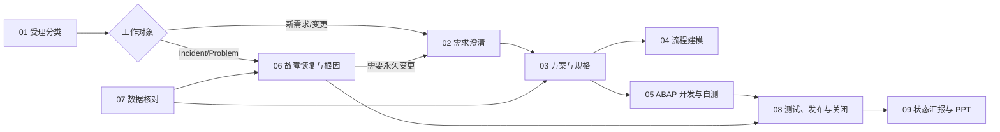

# SAP 运维 Skills 产品体系

## 结论

工作台把 SAP 工作方法拆为两个工作域：

- **SAP 运维**：当前随应用内置但默认停用，覆盖日常需求、故障、开发、发布、对账和汇报；用户在能力中心明确启用后才生效。
- **SAP 实施**：预留 `sap-implementation` 命名与配置层，当前不内置完整流程，避免把一次性项目方法强塞给运维用户。

旧 `SAP ABAP` 工作区只用于发现高频场景和反例。产品默认方法来自 SAP 官方资料，完整证据见 [官方方法论研究](../research/2026-08-01-sap-operations-official-methodology.md)。

## 运维生命周期

## 内置 Skills

| 阶段 | UI 名称 | Skill ID | 主要产物 |
|---|---|---|---|
| 01 | 受理分类与路由 | `sap-ops-intake-router` | 受理摘要、分类、优先级、资料缺口、下一步 |
| 02 | 新需求澄清 | `sap-ops-demand-intake` | Requirement 基线、Fit-to-Standard 决策、验收标准 |
| 03 | 解决方案与开发说明书 | `sap-development-spec` | Functional Specification、Technical Design、追溯矩阵 |
| 04 | 流程与系统链路 | `sap-ops-process-design` | 流程图、节点词典、角色/系统映射、差异表 |
| 05 | ABAP 变更交付 | `sap-abap-safe-change` | 候选改动、ATC/Unit、review、Transport 与回退材料 |
| 06 | Incident 与 Problem 分析 | `sap-evidence-first-analysis` | 复现、证据矩阵、RCA、workaround、Change 建议 |
| 07 | 数据与接口对账 | `sap-data-reconciliation` | 对账合同、汇总、差异明细、复核清单 |
| 08 | 测试、发布与关闭 | `sap-ops-release-closure` | Go/No-Go、发布清单、生产验证、关闭和知识候选 |
| 09 | 汇报与 PPT | `sap-ops-presentation` | 页序、逐页内容、讲稿、图表来源台账 |

早期 `sap-incident-closure` 保留为第 10 个兼容入口，只负责转交 `sap-ops-release-closure`，不维护第二套流程；其余旧 Skill ID 通过清晰中文标题和 `canonical-id` 保留兼容。能力中心会把兼容入口单独分组，不计入 9 个正式运维工作流。

## 统一质量契约

所有 Skills 都必须：

1. 建立 Project/Case/Ticket/Requirement/Change、SID/Client/环境、owner 和证据身份。
2. 区分已确认、推断、假设、未确认、决策和风险。
3. 保持 Requirement—spec—对象—测试—Release—生产验证—Knowledge 的追溯。
4. 未真实执行的 ATC、Unit、测试、审批、Transport 或生产验证必须标为“未执行”。
5. SAP 写入、激活、传输、过账、批量修改、对外发送和知识发布必须得到明确确认。

## 用户自定义契约

规则优先级从高到低：

1. 平台硬边界：只读、安全、凭据和高风险确认，不可覆盖。
2. 组织规范：SLA、角色、审批、模板、编码、ATC、发布和保密规则。
3. Project profile：客户版本、系统路线、模块、术语、接口和模板选择。
4. Case override：当前事项的范围、日期、格式和已批准例外。
5. 产品默认：没有更具体规则时使用的通用基线。

自定义规则至少记录稳定 ID、来源类型、来源文件/URL、owner、批准人、版本、生效日期、适用 Skill/系统/环境和覆盖层级。Skill 产物应注明关键规则来自 SAP 官方、产品默认、组织规范还是 Case 决策。

## “PA 资料”边界

历史中文语境中的 PA 很可能指 Partner Academy，也可能被用户泛指 Activate accelerators；SAP 当前官方公开资料没有统一展开这个缩写。Partner Academy 教材可补充模块知识，但不是运维方法论；Activate accelerators 才是 roadmap task 的模板/指南类别。工作台不复制来源不明或受限教材，只关联用户合法持有的资料，并优先使用当前 SAP Help、SAP Learning 和 Road Map Viewer。
