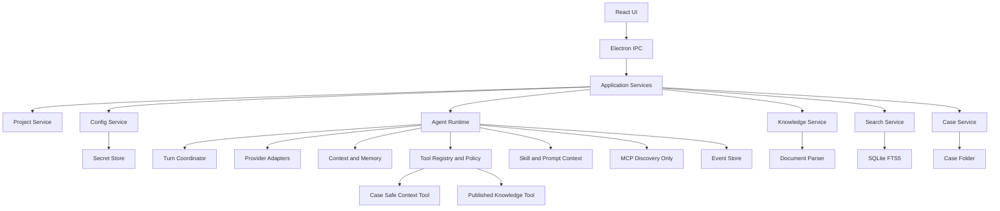
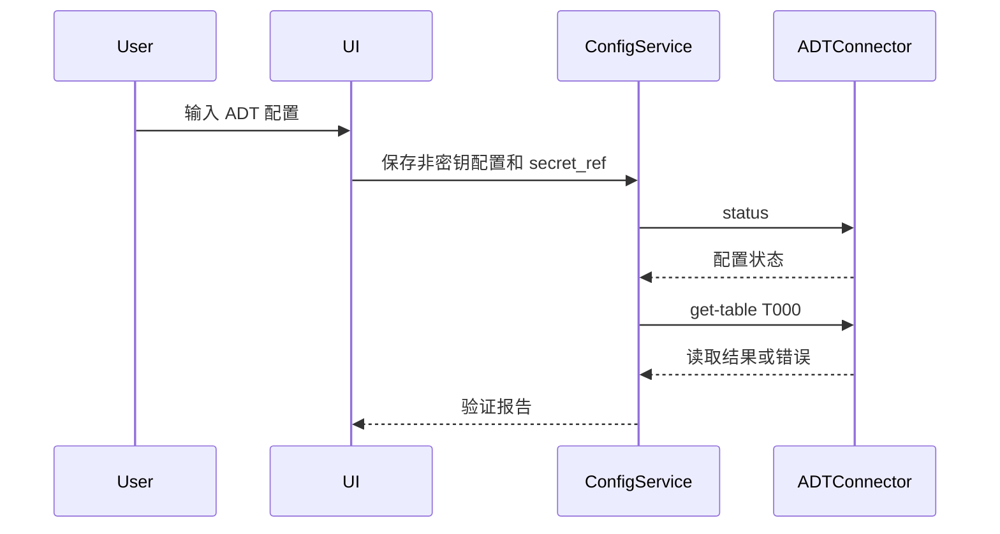
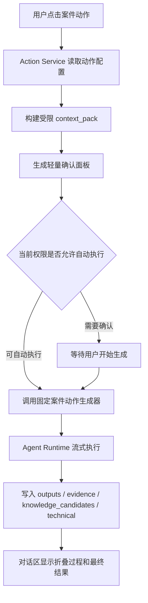

# SAP AI 顾问工作台技术实现文档

版本：MVP v0.1 / Phase 56 当前基线
日期：2026-07-16
适用范围：个人本地版

当前应用已经具备桌面壳、Work/Chat、项目与多 SAP 连接、模型渠道、规范、知识、案件文件、本地任务目录和产品自有 Agent Runtime。Phase 50-57 已把事件账本、Work 本地只读工具循环、上下文预算、checkpoint、分层提示词/记忆、Skills、本机 Skills 白名单发现、声明式 Plugin 与 MCP 连接/发现接入真实运行链路；Codex CLI 不再是核心中转。外部 MCP 工具执行、受限子 Agent 和任意脚本执行继续后置。

> 图例约定：下面“当前架构”只画已接通链路；带“目标”的模块属于后续设计。当前 Agent Tool Runtime 的案件安全上下文、附件摘录、已发布知识、SAP ADT 对象证据和 SAP ADT 通用数据读取均默认关闭，只有用户在当前 Project 明确授权后才注册；Feishu 只生成本地交接草稿。

## 1. 技术目标

MVP 的技术目标是实现一个本地优先的桌面工作台，能稳定完成：

1. 管理多个 SAP 项目。
2. 配置和验证 ADT、飞书 CLI、API 模型与可选本机增强能力。
3. 通过自由对话处理 SAP 问题、ABAP 开发、文档生成、流程图生成，并通过案件动作沉淀正式产物。
4. 将所有过程文件和交付物保存到案件目录。
5. 将知识候选进入待确认区，人工确认后入库。
6. 支持案件动作与执行偏好审计；真实 Skill 执行权限门禁尚未完成前，不把偏好字段当作授权。
7. 支持全局搜索和案件上下文恢复。
8. 核心 AI 对话由产品内置 Agent Runtime 驱动，不依赖 Codex App 或 Codex CLI 才能运行。

## 2. 推荐技术路线

### 2.1 桌面壳

推荐使用 Electron + React + TypeScript。

原因：

- Windows 本地桌面集成成熟。
- 调用本地 CLI、文件系统和子进程方便。
- 适合集成现有 Python ADT CLI、lark-cli、模型 HTTP API 和产品内置 Agent Runtime。
- 前端生态适合实现 Codex 风格界面。

备选方案是 Tauri，但 MVP 阶段不推荐作为首选，因为 Rust 命令层和 Node/Python 工具链整合成本更高。

### 2.2 本地存储

推荐：

- SQLite：项目、案件、文件索引、知识元数据、搜索索引。
- 本地文件系统：案件文件、输出文件、快照、日志。
- OS 安全存储：API Key、SAP 密码、飞书 Token。

SQLite 必须开启 FTS5，用于本地全文搜索。

### 2.3 前端技术

推荐：

- React。
- TypeScript。
- Zustand 或 Jotai 管理前端状态。
- TanStack Query 管理异步请求状态。
- CSS Modules、Tailwind 或 UnoCSS 任选一种，但必须保持设计系统一致。
- Lucide 图标库。

### 2.4 后端技术

Electron 主进程负责：

- 文件系统读写。
- SQLite 访问。
- 子进程调用。
- 连接器调度。
- 安全存储访问。
- IPC 接口。

可选增加 Node 本地服务层，但 MVP 不建议一开始拆成独立服务，避免部署复杂。

## 3. 当前总体架构



SAP ADT Connector 既可由受控页面动作调用，也可在用户启用 Project 级授权后进入模型工具循环，并固定到当前 Project、Case 和 Thread。对象证据能力读取明确命名的 ABAP/DDIC 定义；通用数据能力根据用户意图选择 Project 内对应 SID/Client 和 DDIC table、view 或 CDS，先发现字段，再由 main process 根据结构化字段、筛选和行数上限生成只读查询。模型不能提交原始 SQL，完整明细落入 Case folder，本轮模型只收到有上限的分析行并继续完成用户任务。Feishu CLI 仍不在模型自动工具循环内。外部 MCP 工具和 Bounded Agent Coordinator 仍属于后续评估范围。

## 4. 模块边界

| 模块 | 职责 | 不负责 |
|---|---|---|
| UI Layer | 展示、交互、拖拽布局、弹层 | 不直接读写 SAP、不直接保存密钥 |
| Project Service | 项目增删改查、可见项目、项目配置引用 | 不执行模型任务 |
| Case Service | 案件创建、文件夹管理、对话记录、文件索引 | 不解析业务结论 |
| Config Service | 配置校验、状态管理、密钥引用 | 不明文返回密钥 |
| Action Service | 当前提供固定案件动作、执行确认和权限模式审计；Skill 绑定后置 | 不直接读写 SAP 或绕过连接器 |
| Agent Runtime | Turn 生命周期、模型调用、工具循环、流式事件、取消与恢复 | 不直接操作 UI，不把 Provider 协议泄露给 renderer |
| Event Store | 持久化 Thread、Turn、Item 和运行事件，支持恢复与审计 | 不保存密钥，不把事件日志当用户可见聊天全文 |
| Context Engine | 预算计算、上下文选择、压缩、摘要和记忆检索 | 不把全部历史或全部案件文件无条件发送给模型 |
| Tool Runtime | 工具注册、参数校验、审批、执行、幂等和结果回传 | 不允许模型直接运行命令或绕过 SAP 只读边界 |
| Skill Registry | 发现、校验和按需加载 `SKILL.md` | 第一阶段不自动执行导入 Skill 的脚本 |
| MCP Client Manager | 管理 MCP Server 配置、连接测试和能力发现 | 当前不执行外部工具，不内置 MCP Server，不信任远程声明 |
| Agent Coordinator（第二阶段） | 目标是管理有限并发的子任务和结构化结果合并 | 0.1.0 尚未实现；未来也不允许无限递归、自主扩权或共享密钥 |
| SAP ADT Connector | 只读状态/T000 验证、ABAP/DDIC 对象读取、结构化有界 Data Preview、系统路由与本地结果落盘 | 不运行 SAP GUI 事务，不接受模型原始 SQL，不写 SAP |
| Feishu Connector | 当前验证 CLI、Profile、登录和 scope，并生成本地交接草稿 | 当前不在应用内创建/更新云端文档或白板，不保存飞书密码 |
| Knowledge Service | 文档解析、候选知识、冲突检测、入库 | 不把未确认内容当正式知识 |
| Search Service | 全文索引、文件索引、知识检索 | 不决定业务结论 |

## 5. 本地目录结构

推荐根目录：

```text
SAPAIWorkbench/
  app.db
  projects/
    <project_id>/
      project.json
      standards/
      knowledge/
      cases/
        <case_id>/
          README.md
          conversation.md
          timeline.md
          context_pack.md
          outputs/
          knowledge_candidates/
          snapshots/
          evidence/
          technical/
          metadata.json
  indexes/
  logs/
  temp/
```

目录说明：

| 路径 | 用途 |
|---|---|
| app.db | SQLite 主库。 |
| project.json | 项目基本信息和非密钥配置。 |
| standards/ | 当前项目规范副本。 |
| knowledge/ | 项目知识库文件和索引源。 |
| cases/ | 案件目录。 |
| outputs/ | 用户关心的交付物。 |
| knowledge_candidates/ | 待确认知识文件。 |
| snapshots/ | 源码、文档、表结构快照。 |
| evidence/ | 查询结果和验证记录。 |
| technical/ | 过程文件和工具调用记录。 |

## 6. 数据模型

### 6.0 产品概念到当前实现的映射

当前阶段不新增一套平行数据结构，避免破坏已经完成的本地文件闭环。页面上的中文概念和底层实现按下表映射：

| 用户看到的概念 | 当前实现 | 说明 |
|---|---|---|
| SAP 项目 | `Project`，且 `sapVersion` 为 `S4` 或 `ECC` | 管理一个客户或业务项目下的 SAP landscape、多 Client 登录连接、规范、知识和工作文件夹。 |
| 其他工作 | `Project`，且 `sapVersion` 为 `UNKNOWN` | 用于非 SAP 或暂不绑定 SAP 配置的本地工作；不触发 ADT 读取。 |
| 任务 | `WorkThread` | Work 下的独立会话，包含稳定 ID、消息和 active / archived / removed 生命周期，并绑定一个 Case。 |
| 工作文件夹 | `Case` + `case_folder` + 可选机器本地目录绑定 | 真实本地成果容器。新建模式创建受控 Case；已有模式调用系统目录选择器，同一 Project 下同一路径复用 Case；多个 WorkThread 可绑定同一 Case。 |
| Chat | `DailyChatThread` | 独立日常对话，不保存到 Project/Case 文件夹，不读取 SAP。 |
| 案件动作 | 固定 `CaseAction` | 当前由产品代码固定实现，用来把当前对话和文件沉淀成笔记、文档、图、候选知识或交付物；已启用 Skill 只能补充受控上下文，动作绑定后置。 |
| 权限模式 | `ActionPermissionMode` | 按项目 / 案件生效，不按单个 Skill 生效。 |
| 右侧文件页签 | `activeCaseFiles` + `CaseFileNode` | 默认读取当前工作文件夹的真实本地文件树。 |
| 右侧项目配置页签 | `ProjectConfig` 摘要 | 只做紧凑摘要和入口，完整编辑仍进入配置中心。 |

这个映射把“对话”和“成果容器”分开：`WorkThread` 是会话事实源，`Case` 继续复用已有文件保存、预览、检索和安全校验能力。共享 Case 时，每个线程在 `technical/conversations/<threadId>/` 保留独立快照，顶层 `conversation.md` 只同步当前打开的任务。

### 6.1 Project

```text
Project
  id
  name
  sap_version: S4 | ECC | UNKNOWN
  permission_mode: request_approval | approve_for_me | full_access
  visible_order
  is_visible
  default_system_id
  standards_profile_id
  knowledge_scope
  created_at
  updated_at
```

### 6.2 SapSystemConfig

```text
SapSystemConfig
  id
  project_id
  alias
  url
  client
  username
  language
  ssl_mode
  read_only: true
  secret_ref
  last_status
  last_verified_at
  created_at
  updated_at
```

密码不得进入该表，只保存 secret_ref。

### 6.3 ApiProvider

```text
ApiProvider
  id
  name
  type: OPENAI_COMPATIBLE | ANTHROPIC_COMPATIBLE | DEEPSEEK | CUSTOM
  base_url
  secret_ref
  enabled
  last_status
  last_models_sync_at
```

### 6.4 Model

```text
Model
  id
  provider_id
  model_name
  display_name
  capabilities: json
  is_default
  enabled
  last_seen_at
```

### 6.5 Case

```text
Case
  id
  project_id
  title
  status: active | solved | archived
  case_folder
  folder_source: managed | linked-local
  linked_folder_name: string | null
  permission_mode_override: request_approval | approve_for_me | full_access | null
  current_summary
  current_context_pack_path
  created_at
  updated_at
  last_opened_at
```

电脑已有文件夹的绝对路径不进入 `Case`、`app-state.json` 或 renderer。main process 把路径写入 `local-data/workbench/local-folder-bindings.json`，以 `project_id + case_id` 关联；该文件不进入工作区备份/导入。选择目录时必须拒绝磁盘根目录、工作台自身或上级目录、符号链接、网络共享和系统/凭据敏感目录。绑定阶段只检查目录节点，不遍历或改写目录内容。

### 6.6 CaseMessage

```text
CaseMessage
  id
  case_id
  role: user | assistant | system
  content
  model_id
  action_id: optional
  legacy_task_mode: optional
  created_at
```

`legacy_task_mode` 仅用于兼容早期本地数据和历史 probe。新 UI 不再要求用户在发消息前选择任务模式。

### 6.7 CaseAction

```text
CaseAction
  id
  label
  description
  enabled
  sort_order
  skill_package_id
  context_policy: json
  output_policy: json
  confirmation_template
  created_at
  updated_at
```

默认内置动作：

| id | 按钮名称 | 默认输出 |
|---|---|---|
| read-materials | 梳理资料 | `evidence/资料梳理与缺口清单.md` |
| capture-notes | 沉淀笔记 | `outputs/案件沉淀笔记.md` |
| generate-dev-doc | 生成开发说明书 | `outputs/开发说明书.md` |
| draw-flow | 画流程图 | `outputs/逻辑说明图.mmd` |
| extract-knowledge | 整理候选知识 | `knowledge_candidates/问题处理经验候选.md` |
| export-deliverables | 整理交付物 | `outputs/交付物清单与交接说明.md` |

### 6.8 SkillPackage

```text
SkillPackage
  id
  name
  description
  source: builtin | imported
  package_path
  skill_md_path
  has_scripts
  has_assets
  validation_status: valid | warning | invalid
  validation_message
  imported_at
  updated_at
```

导入 Skill 只要求能找到并解析 `SKILL.md`。除手动选择单个目录外，能力中心可扫描 `~/.agents/skills`、`~/.codex/skills`、`~/.claude/skills`、`~/.skills-manager` 与 `~/.sap-ai-workbench/skills`，用临时不透明 ID 批量导入。MVP 不提供 Skill 创建器，不负责用户如何创建自定义 Skill。

### 6.9 ActionRun

```text
ActionRun
  id
  case_id
  action_id
  skill_package_id
  permission_mode_used
  status: pending_confirmation | running | succeeded | failed | cancelled
  context_pack_path
  output_files: json
  log_path
  started_at
  completed_at
```

执行过程详细日志写入 `technical/`，对话区默认只展示折叠摘要和最终产物。

### 6.10 CaseFile

```text
CaseFile
  id
  case_id
  path
  file_type
  purpose: output | conversation | candidate_knowledge | technical | evidence | snapshot
  display_name
  size
  hash
  created_at
  updated_at
  indexed_at
```

### 6.11 KnowledgeItem

```text
KnowledgeItem
  id
  project_id
  title
  type: qa | doc | sap_object | case_note | timeline_fact
  status: draft | pending | published | conflicted | expired
  content_path
  source_case_id
  source_file_id
  effective_from
  effective_to
  reviewer
  created_at
  updated_at
```

### 6.12 StandardsProfile

```text
StandardsProfile
  id
  project_id
  source_type: global_template | sap_version_template | copied_project
  source_ref
  version
  active
  created_at
  updated_at
```

### 6.13 Agent Runtime 事件模型

`CaseMessage` 和 `DailyChatMessage` 继续作为用户可见消息的兼容投影；新的事实源采用追加式事件账本：

```text
Thread
  -> Turn
    -> Item: user_message | assistant_message | reasoning_summary | tool_call | tool_result | approval | compaction | error
      -> RuntimeEvent: started | delta | completed | failed | cancelled
```

每个事件必须至少包含稳定 `event_id`、`thread_id`、`turn_id`、顺序号、时间、事件类型和脱敏后的 payload。写入顺序必须先落事件再更新投影，应用异常退出后可从最后一个完整事件恢复，不能只依赖 renderer 内存。

## 7. 配置实现

### 7.1 密钥保存

优先使用系统安全存储：

- Windows Credential Manager。
- macOS Keychain。
- Linux Secret Service。

如果开发阶段必须使用本地文件保存临时密钥，必须：

1. 加入明显风险提示。
2. 文件权限限制为当前用户。
3. 不在日志、Markdown、错误信息中输出密钥。

### 7.2 ADT 验证流程



验证必须包括：

- URL。
- Client。
- Username。
- SSL。
- 只读模式。
- T000 最小读取。

### 7.2.1 ADT 连接器实战规则

ADT 配置不能只做到“表单保存成功”。对用户来说，真正可用的标准是：当前账号能通过 ADT 读取最小对象，并且写入能力处于禁用状态。

MVP 的 ADT 连接器必须把验证拆成三层：

| 层级 | 验证内容 | 成功标准 |
|---|---|---|
| 配置检查 | URL、Client、用户、语言、SSL、只读开关 | 字段完整、格式正确、密钥引用存在 |
| 状态检查 | 调用 ADT CLI 或等价连接器执行 `status` | 能显示目标系统、Client、用户、写入状态 |
| 最小读取 | 读取 `T000` 或等价低风险 DDIC 对象 | SAP 返回成功，证明账号、密码、权限、网络均可用 |

状态检查只能证明本地配置存在，不能证明 SAP 登录成功。只有最小读取成功，才允许标记为“已验证”。

ADT 验证报告必须展示：

```text
系统别名
SAP URL
Client
用户
SSL模式
写入模式
传输写入模式
最小读取对象
最后验证时间
验证结果
失败原因
修复建议
```

### 7.2.2 ADT 命令抽象

MVP 可以先通过本地子进程调用现有 `sap_adt_cli.py`，后续再封装为内部 SDK。UI 和业务层不得直接拼接命令行，必须通过 `SapAdtConnector` 抽象。

建议接口：

```text
SapAdtConnector
  status(projectId, systemId)
  verifyMinimalRead(projectId, systemId)
  searchObject(projectId, systemId, query, maxResults)
  getProgram(projectId, systemId, name)
  getClass(projectId, systemId, name)
  getFunction(projectId, systemId, name, group)
  getInclude(projectId, systemId, name)
  getTable(projectId, systemId, name)
  getStructure(projectId, systemId, name)
  runSelect(projectId, systemId, openSql, maxRows)
```

MVP 默认只实现只读方法。即使底层 CLI 支持写入、激活、传输，产品层也必须默认隐藏这些能力。

### 7.2.3 ADT 安全和错误处理

必须遵守：

1. 默认只读。
2. 写入源码、激活对象、创建或释放传输不进入 MVP。
3. 如果未来开启写入，每次写入都必须有当前操作的一次性确认，不能复用历史确认。
4. SAP 密码不得出现在日志、案件文件、错误信息、Markdown、截图或模型上下文中。
5. 读取 SAP 对象前必须确认当前项目和当前系统，避免跨客户或测试/生产混用。
6. 生产系统必须有更明显的只读标识。

常见错误映射：

| 错误 | 判断 | 用户提示 |
|---|---|---|
| 未配置 | 当前项目没有完整 ADT 配置 | 请在配置中心填写 URL、Client、用户和密码，并保存后验证。 |
| 401 | 账号或密码错误 | 当前 SAP 账号或密码未通过登录，请重新配置密码。 |
| 403 | 权限不足 | 当前账号缺少 ADT 读取权限，需要 Basis 开通 ADT 相关权限。 |
| 404 | 对象或路径不存在 | 请检查 SAP 对象名、函数组或 ADT 服务路径。 |
| 503 | ADT 服务不可用 | SAP ADT 服务可能未启用，需要 Basis 检查 SICF `/sap/bc/adt`。 |
| SSL | 证书问题 | 内网或自签证书系统可在项目配置中开启跳过证书验证。 |
| 网络中断 | 代理、VPN、内网访问异常 | 请检查网络、VPN、代理设置和 SAP 地址是否可达。 |

### 7.2.4 源码读取和落盘策略

ADT 读取结果不等于必须保存文件。产品层需要根据自由对话或案件动作决定是否落盘：

| 场景 | 是否读取 SAP | 是否保存本地 |
|---|---:|---:|
| 简单解释逻辑 | 是 | 否，除非用户要求 |
| 多轮问题分析 | 是 | 临时缓存，可清理 |
| 修改 ABAP | 是 | 必须保存快照 |
| 生成开发说明书 | 是 | 建议保存关键快照 |
| 版本对比 | 是 | 必须保存快照和差异 |

保存到本地的 SAP 材料必须进入当前案件目录的 `snapshots/`、`evidence/` 或 `technical/`，不在主界面固定展示。

### 7.3 飞书 CLI 验证流程

1. 检测 lark-cli 是否存在。
2. 执行 doctor。
3. 验证 auth status。
4. 必要时提示用户授权。
5. 保存 Profile 和验证状态。

### 7.3.1 飞书 CLI 目标工作流（当前未全部开放）

当前实现止于 CLI/Profile/登录/scope 验证和本地交接草稿，不会创建或更新云端文档。以下内容是后续若开放发布时必须满足的完整标准，不是当前已上线能力：当前 Profile 已登录、权限范围满足文档创建/更新/白板更新，并且能返回可追溯的文档 URL 或错误原因。

配置中心必须支持：

| 检查项 | 命令或动作 | 成功标准 |
|---|---|---|
| CLI 存在 | `lark-cli doctor` | CLI 可执行，应用配置可解析 |
| 登录状态 | `lark-cli auth status --verify` | 用户身份可用，必要 scope 存在 |
| 创建文档 | `lark-cli docs +create --api-version v2` | 返回文档 URL 和 document_id |
| 更新文档 | `lark-cli docs +update --api-version v2` | 目标文档被成功覆盖或更新 |
| 更新白板 | `lark-cli docs +whiteboard-update` | Mermaid 内容写入白板块 |

「生成开发说明书」案件动作的默认产物：

```text
outputs/
  <object>_dev_spec.md
  <object>_logic_whiteboard.mmd
  <object>_feishu_create_result.json
  <object>_whiteboard_update_result.json
```

发布到飞书后，案件 `README.md` 和 `metadata.json` 必须记录：

```text
Feishu Doc URL
document_id
whiteboard block token
publish time
local source file
publish status
```

不得记录：

- 飞书 App Secret。
- 用户 Token。
- 租户敏感密钥。

### 7.3.2 飞书缺少权限处理

如果飞书 CLI 返回 `missing_scope`，不能反复重试创建文档。必须进入授权流程：

1. 生成授权 URL。
2. 提示用户扫码或打开 URL 授权。
3. 等用户完成授权后，再执行登录完成命令。
4. 重新执行 `auth status --verify`。

产品界面必须显示：

```text
飞书未完成授权
需要权限：文档创建、文档写入、白板节点创建/读取
下一步：点击重新授权
```

授权过程中不要连续生成多个 device code，避免旧授权链接失效。

### 7.3.3 飞书文档内容规范

从案件生成飞书文档时，优先保证业务可读性，而不是把所有技术细节搬进去。

默认文档结构：

```text
基本信息
业务背景
处理目标
关键逻辑
数据来源
异常与边界说明
交付物
上线确认清单
附录：技术对象和证据
```

复杂业务逻辑需要同时生成 Mermaid 源文件。若需要飞书白板，Markdown 中使用白板占位，再通过 CLI 写入 Mermaid。

### 7.4 API 模型获取流程

每个模型渠道独立保存协议类型、Base URL、API Key 引用、模型目录策略、手工模型 ID 和测试模型 ID。

1. OpenAI Compatible 使用 Bearer Token、`/models` 和 `/chat/completions`。
2. Anthropic Compatible 使用 `x-api-key`、`anthropic-version`、`/models` 和 `/messages`。
3. 模型目录可选择远程读取、仅手工维护、远程失败后回退手工列表。
4. 最小对话优先使用用户指定的测试模型，不假定远程列表第一个模型可用。
5. 只有模型目录和最小对话都满足所选策略时，渠道才可作为候选模型使用。
6. 每次真实调用前解析模型域名；解析到本机、内网或云元数据地址时阻止请求，并禁止自动跟随 HTTP 重定向。

DeepSeek 作为独立 Provider 类型，但接口按 OpenAI Compatible 形式适配。

### 7.5 独立运行时与 Codex 兼容边界

- 核心 Work/Chat、案件动作、上下文恢复和工具调用由产品自己的 Agent Runtime 负责。
- `openai/codex` 只作为 Thread/Turn/Item、事件流、工具循环、Skills、MCP、压缩和子 Agent 等设计模式的公开参考，不作为产品运行依赖。
- 现有 Codex CLI 辅助入口属于迁移期兼容能力，只能由用户主动启用，不读取 Codex App 历史聊天，也不能成为案件执行的唯一通道。
- 缺少或停用 Codex CLI 时，Work、Chat、SAP 只读、规范、知识和文件能力必须继续正常使用。
- 本机扫描只检查明确列出的命令和固定安装位置，不扫描任意文件；任何安装或升级都必须先经原生确认。
- Phase 50 完成并通过数据迁移验证后，Codex 兼容适配器进入弃用流程，而不是继续扩展成第二套运行时。
- 用户拒绝安装或验证失败时，不得阻塞 Work、Chat、规范、知识和本地文件功能。

### 7.6 多 SAP 连接

- `ProjectConfig.adtConnections` 保存 Project 下独立的 SAP 只读登录连接；每项包含 SID、实例号、环境、Client、用途、路由关键词、独立密码引用和验证状态。UI 不设置固定数量上限，持久层只保留防异常导入的高位安全上限。
- `activeAdtConnectionId` 是未明确问题上下文时的默认连接；`ProjectConfig.adt` 是当前连接的兼容视图，保存和验证后必须同步回连接数组。
- SAP 密码安全存储目标由 `Project + connectionId` 唯一确定，不同连接不得共用或误取密码。
- main process 可以只读扫描本机 SAP GUI landscape 文件，并向 renderer 返回经过长度、字符和主机校验的连接摘要；不返回凭据。
- 自动解析 SAP GUI 主机、实例号或端口时只派生 HTTPS ADT 地址；显式 HTTP 地址不作为自动回退候选。没有本机匹配或用户实例号时返回“需要实例号”，禁止默认实例 `00`。
- `routeSapConnections` 只在真实 T000 验证通过的连接中，根据当前任务近端对话、SID、Client、环境、用途和关键词评分。单一高置信匹配可直接用于用户主动发起的“SAP 取证”；并列、无明确匹配且存在多个可用连接、或交叉验证意图必须由用户确认。
- 跨系统取证仍限制为同一明确对象、只读 GET 路径，并在所有连接读取成功后一次性落盘；任一连接失败时不写入不完整批次。

## 8. Agent、案件动作和权限模式

### 8.1 自由对话

自由对话是案件中的默认工作方式。用户可以持续补充需求、讨论逻辑、要求读取证据或追问结论，不需要先选择任务模式。

默认行为：

- 读取当前案件摘要和必要文件。
- 根据用户问题判断是否需要调用模型、读取文件或请求 SAP 只读证据。
- 不默认生成正式交付物。
- 需要保存的中间材料进入当前案件目录。
- 对话记录和关键结论持续更新 `conversation.md`、`timeline.md` 和 `context_pack.md`。

### 8.2 案件动作定义

```text
CaseAction
  id
  label
  context_policy
  output_policy
  confirmation_template
  permission_gate
```

案件动作是一键沉淀入口，不是对话模式切换。当前由内置固定动作生成器负责把对话、文件、项目规范和证据整理成正式产物；已启用 Skill 只进入受控提示词上下文，不会替换动作实现。

### 8.3 内置案件动作

| 动作 | 默认行为 |
|---|---|
| 梳理资料 | 梳理当前对话、工作文件夹、项目规范和已保存只读证据，并把资料缺口记录到 `evidence/资料梳理与缺口清单.md`。 |
| 沉淀笔记 | 整理当前对话，生成便于后续重新打开学习的案件笔记。 |
| 生成开发说明书 | 读取当前案件 `context_pack`、相关输出文件、证据和项目文档模板，输出开发说明书。 |
| 画流程图 | 从案件上下文提取业务流程，优先生成 Mermaid，可进一步生成图片或飞书画布素材。 |
| 整理候选知识 | 从案件中提炼可复用经验，进入 `knowledge_candidates/`，不自动入库。 |
| 整理交付物 | 汇总当前案件已有产物，生成 `outputs/交付物清单与交接说明.md`。 |

### 8.4 动作执行流程



### 8.5 权限模式判断

实际执行权限按以下顺序确定：

```text
案件临时权限
  -> 项目默认权限
  -> 全局默认：请求批准
```

MVP 只支持三种权限模式：

| 模式 | 技术行为 |
|---|---|
| `request_approval` | 编辑文件、执行脚本、联网、访问工作文件夹外路径前都需要确认。 |
| `approve_for_me` | 当前案件目录内的文件生成、脚本执行和上下文整理可自动执行；跨目录、联网、删除等需要确认。 |
| `full_access` | 当前项目 / 当前案件范围内尽量自动执行，但不能绕过硬性高风险确认。 |

以下操作必须进入硬性确认，不受 `full_access` 影响：

- SAP 写入、激活、过账、传输、批量修改。
- 批量删除文件或目录。
- 发布到 Feishu/Lark、GitHub、CSDN 等外部平台。
- 读取或导出密码、Token、API Key。
- 修改系统级安全配置或生产环境不可逆操作。

### 8.6 Skill 导入与第二阶段动作绑定

Skill 分为内置和导入两类：

| 类型 | 存储 | 说明 |
|---|---|---|
| builtin | 应用随附目录 | 随系统提供，版本随应用升级。 |
| imported | 用户本地 Skill 库 | 0.1.0 支持选择已解压文件夹导入，并负责校验、确认、启停和上下文注入；受控 zip 解压与动作绑定后置。 |

导入校验至少包括：

- 是否包含 `SKILL.md`。
- 能否读取名称和描述。
- 是否包含 `scripts/`。
- 是否包含 `assets/` 或模板。
- 是否存在明显不可读取路径。

0.1.0 不执行导入 Skill 的任意脚本。启用的 Skill 只提供受控说明和资源摘要，由 Context Engine 按范围进入新回合。第二阶段如开放动作绑定或脚本执行，Action Service 必须把当前案件上下文整理成固定输入，并由 main process 的能力门禁、目录边界和连接器边界控制；当前“执行偏好”只作审计记录。

### 8.7 与早期 TaskMode 的兼容

早期实现中的 `TaskMode` 可作为历史兼容字段保留，但新 UI 不再要求用户在发消息前选择。

兼容映射：

| 旧 TaskMode | 新设计中的处理 |
|---|---|
| `problem-analysis` | 自由对话 + 必要时点击「梳理资料」或「整理候选知识」。 |
| `abap-development` | 自由对话 + 必要时点击「梳理资料」「生成开发说明书」。 |
| `document-generation` | 点击「生成开发说明书」或后续扩展的文档动作。 |
| `flow-diagram` | 点击「画流程图」。 |

旧数据中的 `task_mode` 读取到前端时可以展示为历史标签，但不要作为新案件的主操作入口。

### 8.8 消息发送与工具循环

用户发送消息后必须按固定生命周期执行：

1. main process 创建 Turn 并持久化用户消息，renderer 立即清空输入框并显示本地乐观消息。
2. Context Engine 按预算选择系统规则、近期消息、有效摘要、项目规范、已审核知识和必要案件证据。
3. Provider Adapter 把统一请求转换为 OpenAI Compatible、Anthropic Compatible 等渠道协议。
4. 模型返回文本时产生增量事件；返回工具请求时先经过 schema 校验和权限策略。当前只执行注册的本地只读工具，外部或高风险工具直接拒绝；交互式审批流程尚未开放。
5. 工具结果以结构化 Item 回填同一 Turn，再继续模型循环；达到循环、时间或预算上限时必须停止并给出中文原因。
6. Turn 完成、失败或取消都要写入终态，随后更新用户可见消息投影和案件文件。

模型、工具和 UI 之间只交换规范化事件，renderer 不直接调用 Provider、SAP、文件系统、MCP 或本机命令。

### 8.9 上下文预算、压缩与记忆

- 当前使用固定 32,768 token 的保守窗口和本地估算；按 Provider/模型元数据动态调整属于后续增强，不能宣称已经自适应。
- 达到软阈值时先裁剪低价值历史；达到硬阈值前生成本地确定性 checkpoint，不等 Provider 报超长错误。
- 当前 checkpoint 保存被覆盖消息的受限摘录、来源引用和覆盖范围，不等同于模型生成的语义长期记忆；完整原始历史不删除。
- Daily Chat 只使用当前会话记忆；Work 可读取当前 Project/Case 的已审核知识和案件摘要，但不能跨项目静默检索。
- 记忆分为当前 Turn 工作记忆、Thread 摘要、Case/Project 记忆和用户明确保存的偏好；原始推理、密钥和未经审核知识不进入长期记忆。

### 8.10 Skills 与 MCP

- Skill 采用 `SKILL.md` 加可选 `references/`、`assets/`、`scripts/` 的兼容子集，启动时只加载名称、描述和路径，命中后再按需读取正文。
- 第一阶段支持说明、模板和受控工具绑定；导入 Skill 的任意脚本默认禁用，后续必须通过签名/来源、目录、命令和审批门禁。
- MCP 当前只实现客户端稳定子集：HTTPS Streamable HTTP 配置、连接测试、tools/resources/prompts 发现、分页/响应上限、超时、取消和审计。STDIO 会启动未知本机进程，首发不开放。
- Server 的 `readOnlyHint` 不能直接授权。当前稳定版拒绝启用和执行全部外部 MCP 工具；SAP 写入与破坏性动作继续硬拒绝。
- MCP Server 返回的文本、资源和工具说明都视为不受信输入，不能覆盖系统安全规则或把密钥带入模型上下文。

### 8.11 受控子 Agent（后续设计，当前未开放）

- 子 Agent 是独立子 Thread，不是共享可变聊天数组；父任务只接收结构化摘要、证据引用和产物清单。
- 默认最大并发 3、最大深度 1，并继承父任务的 Project/Case 范围、SAP 只读和工具权限。
- 适合的角色是资料检索、SAP 证据读取、文档生成和独立审查；普通对话不自动创建子 Agent。
- 子 Agent 不能自行扩大目录、系统、MCP、网络或密钥范围，也不能递归创建无限任务。

详细实现合同见 [独立 Agent Runtime 架构](../architecture/INDEPENDENT_AGENT_RUNTIME.md)。

## 9. SAP 源码和快照策略

默认不将所有 SAP 源码落盘。

| 场景 | 策略 |
|---|---|
| 简单阅读分析 | 实时读取，不保存源码。 |
| 多轮问题分析 | 临时缓存，可清理。 |
| 修改 ABAP | 必须保存源码快照。 |
| 生成交付文档 | 建议保存必要快照。 |
| 版本对比 | 必须有本地快照和 SAP 最新读取结果。 |

快照作为文件保存，不在 UI 固定展示。

## 10. 知识库实现

### 10.1 入库流程


### 10.2 文档解析

解析分层：

1. 原始文件保存。
2. 结构解析。
3. 文本、表格、图片、公式、时间线事实提取。
4. 生成可检索索引。
5. 生成候选知识。
6. 人工确认入库。

### 10.3 跨页表格

表格解析必须保留：

- 文档来源。
- 页码范围。
- 所属章节。
- 表头。
- 行数据。
- 前后上下文。

不能只按固定 token 切片。

### 10.4 时间线事实

时间线事实格式：

```text
TimelineFact
  subject
  relation
  object
  role
  organization
  effective_from
  effective_to
  source
```

这样才能支持类似问题：

> B 公司的哪位同事曾经做过销售经理？

## 11. 搜索实现

MVP 搜索采用混合检索：

1. SQLite FTS5 全文搜索。
2. 文件名和标签搜索。
3. 元数据过滤。
4. 后续可加入向量检索。

搜索结果必须显示：

- 类型。
- 标题。
- 所属项目。
- 所属案件。
- 来源文件。
- 更新时间。
- 匹配片段。

## 12. UI 状态和布局实现

### 12.0 Work / Chat 布局状态

主工作台必须使用显式的 Work / Chat 状态，不能只把两种内容混在同一个项目列表里。

```text
activeView
  chat       -> 独立日常对话
  case       -> Work 下的当前工作文件夹
  config     -> 当前 SAP 项目配置中心
  standards  -> 当前 SAP 项目规范中心
  knowledge  -> 当前 SAP 项目知识库

rightPanelTab
  files       -> 当前工作文件夹文件
  config      -> 当前项目配置摘要
```

规则：

1. `activeView === "chat"` 时，左侧不显示项目选择、工作文件夹创建和文件夹列表；右侧文件面板折叠。
2. `activeView !== "chat"` 时，左侧显示 SAP 项目树和其他工作区；工作文件夹必须归属到一个 Project。
3. SAP 项目下的 `+ 文件夹` 只创建该项目下的 Case，不允许静默落到当前激活项目。
4. `sapVersion === "UNKNOWN"` 的项目作为“其他工作”，不显示 ADT 只读取证入口，不执行 SAP 读取。
5. 右侧默认停留在 `files`；只有用户点击 `项目配置` 或项目 `配置` 动作才展示配置摘要/配置中心。

### 12.1 可拖拽布局

需要实现：

- 左侧宽度可调整。
- 右侧文件面板可隐藏和调整。
- 中间区域自适应。
- 最小宽度限制，避免输入框和文本挤压。

推荐默认：

| 区域 | 默认宽度 | 最小宽度 |
|---|---:|---:|
| 左侧栏 | 300px | 240px |
| 右侧文件面板 | 320px | 260px |
| 中间区域 | 自动 | 640px |

### 12.2 对话 UI

必须遵守：

- 用户消息靠右。
- AI 回复靠左。
- 不显示头像。
- AI 回复不是卡片。
- 文件产物作为内联文件 chip。
- 技术过程不默认展示。

### 12.3 右侧文件面板

文件面板从 CaseFile 表和案件目录读取。UI 文案展示为“当前工作文件夹文件”，但底层仍复用当前 Case 文件树。

新建任务选择“已有文件夹”时，renderer 只收到一次性 `folderSelectionToken` 和目录显示名；绝对路径留在 main process，凭证十分钟失效且创建时单次消费。这样既能提供原生目录选择体验，也不会把用户目录暴露给页面或模型。

必须支持：

- 展开和折叠目录。
- 搜索当前案件文件。
- 打开文件。
- 显示待确认标签。
- 隐藏和恢复面板。

不做：

- 文件预览大面板。
- 技术证据 Dashboard。
- 多余视图切换按钮。

### 12.4 右侧项目配置摘要

右侧项目配置摘要用于回答“我现在看到的配置从哪里来、什么时候出现、怎样切换回文件”。

必须遵守：

1. 默认不显示项目配置，避免覆盖当前工作文件夹文件。
2. 项目配置摘要只展示状态、系统别名、Client、Feishu、API 渠道、本机增强和本地存储等关键项。
3. 每组配置使用折叠项展示；完整编辑、密钥保存和验证动作进入配置中心。
4. 项目配置摘要不显示 SAP 密码、API Key、Token 或任何密钥明文。
5. 从项目配置摘要切回「文件」后，右侧继续显示当前工作文件夹文件树和只读预览。

## 13. 错误处理

### 13.1 ADT 错误

| 错误 | 用户提示 |
|---|---|
| 401 | 账号或密码错误，请重新配置当前项目 SAP 凭据。 |
| 403 | 当前账号缺少 ADT 读取权限。 |
| 404 | 对象或 ADT 路径不存在，请检查对象名或系统服务。 |
| 503 | ADT 服务不可用，需要 Basis 检查 SICF 服务。 |
| SSL | 证书校验失败，可在内网系统中开启跳过证书验证。 |

### 13.2 飞书错误

| 错误 | 用户提示 |
|---|---|
| CLI 不存在 | 未检测到 lark-cli，请先安装或配置路径。 |
| 未登录 | 飞书 CLI 未登录，请重新授权。 |
| 权限不足 | 当前账号没有创建或更新文档权限。 |

### 13.3 API 错误

| 错误 | 用户提示 |
|---|---|
| API Key 无效 | 当前渠道密钥不可用，请重新配置。 |
| Base URL 错误 | 无法连接模型服务，请检查 API 地址。 |
| 模型不可用 | 当前模型调用失败，请选择其他模型。 |
| 超时 | 网络或模型响应过慢，可重试或切换模型。 |

## 14. 日志和审计

必须记录：

- 配置验证时间和结果。
- 模型调用元数据，不记录完整密钥。
- SAP 读取对象和时间。
- 文件生成记录。
- 知识候选生成和审核记录。
- 用户确认入库记录。

日志不得记录：

- SAP 密码。
- API Key。
- 飞书 Token。
- 大段 SAP 源码，除非用户明确保存为案件文件。

## 15. 测试方案

### 15.1 单元测试

- Project Service。
- Case Service。
- Config Service。
- Search Service。
- Knowledge candidate state machine。
- Standards inheritance and copy logic。
- Event Store 追加、排序、幂等和投影恢复。
- Context Engine 预算、裁剪、压缩和跨项目隔离。
- Tool Runtime schema 校验、审批和循环上限。

### 15.2 集成测试

- ADT status + T000 验证。
- Feishu CLI doctor + auth status。
- API models 获取。
- 创建案件并保存文件。
- 生成知识候选并人工确认入库。
- 全局搜索找回案件和文件。
- Turn 流式事件、取消、异常退出恢复和重新打开。
- Provider 工具调用与工具结果回填。
- Skill 按需加载和 MCP 能力发现。
- 第二阶段：受限子 Agent 结果合并、外部 MCP 工具执行和 Skill 动作绑定。

### 15.3 UI 测试

- 左侧栏折叠。
- 项目添加和移除。
- 多项目可见列表。
- 右侧文件面板折叠。
- 底部固定案件动作选择器与生成按钮。
- 案件动作轻量确认面板。
- 成果动作内的执行偏好下拉，文案明确不替代安全门禁。
- 模型选择器按渠道分组。
- 小屏窗口下布局不重叠。

### 15.4 安全测试

- 密钥不出现在日志。
- 密码不显示在界面。
- 默认写入模式禁用。
- 生产系统不允许无确认操作。
- 任何执行偏好都不能绕过 SAP 写入、批量删除、外部发布和密钥导出确认。
- 导入 Skill 的脚本执行必须受 main process 真实能力门禁限制；门禁未实现前不开放通用脚本执行。
- 不可信工具输出不能改变系统权限或诱导读取密钥。
- 子 Agent 不能越过父任务范围、并发和深度限制。
- 压缩不能丢失安全边界、用户确认、未完成事项和证据引用。

## 16. MVP 开发顺序

推荐分 5 个阶段：

### 阶段 1：应用壳和本地数据

- Electron + React 桌面壳。
- 左侧栏、中心对话、右侧文件面板。
- SQLite 数据库。
- 项目、案件、文件索引。

### 阶段 2：配置中心

- ADT 配置和验证。
- 飞书 CLI 检测和验证。
- API 渠道和模型获取。
- 本地安全存储。

### 阶段 3：案件工作流

- 新建案件。
- 自由对话。
- 固定案件动作。
- 项目 / 案件权限模式。
- 对话记录。
- 文件生成和保存。
- context_pack 生成。

### 阶段 3.5：动作与 Skill 管理（部分完成）

- 内置 Skill 注册。
- 本地 Skill 文件夹导入；受控 zip 解压后置。
- `SKILL.md` 校验。
- 第二阶段：案件动作绑定 Skill。
- 动作执行确认和运行记录。

### 阶段 3.6：独立 Agent Runtime（首个基线已完成）

- Thread / Turn / Item 事件账本与兼容投影。
- Provider Adapter 和统一流式事件。
- 本地只读工具循环、策略拒绝、取消与重启中断提示；交互式审批后置。
- 固定保守上下文预算、本地确定性 checkpoint 和分层记忆。
- Skill Registry、声明式 Plugin、HTTPS MCP Client 已启用；受控子 Agent 后置。
- 迁移期 Codex CLI 兼容适配器逐步退出核心路径。

### 阶段 4：规范中心

- 模板复制。
- 项目规范副本。
- 差异查看。
- ABAP、文档和流程图规范应用到案件动作。

### 阶段 5：知识库

- 当前：受控 Markdown/TXT 导入。
- 第二阶段：Word、Excel、PDF 等结构解析。
- 候选知识。
- 人工确认。
- 冲突检测。
- 搜索整合。

## 17. 开发验收

MVP 完成时必须能完成一条端到端流程：

1. 创建项目「演示 S4HANA」。
2. 配置 ADT 并读取 T000 验证成功。
3. 配置 Fengsha API 并获取模型。
4. 新建案件「DEMO001 演示BOM清单」。
5. 用户输入问题。
6. 系统生成分析结论。
7. 系统生成当前支持的 Markdown 开发说明书、CSV 摘要和 Mermaid 逻辑图文件。
8. 右侧文件面板显示这些文件。
9. 系统生成候选知识。
10. 用户确认入库。
11. 通过搜索能找回案件、文件和知识卡片。

## 18. 重要约束

1. MVP 默认只读 SAP。
2. 不实现团队版。
3. 不实现注册登录。
4. 不实现云端同步。
5. 不实现自动写 SAP。
6. 不允许知识自动正式入库。
7. 不允许 UI 固定展示中间技术产物。
8. 不允许项目规范互相污染。
9. 不允许模型选择散落在多个位置。
10. 不允许出现无法解释的按钮。
11. 不允许把 Codex App、Codex CLI 或任一模型 Provider 作为核心运行前置条件。
12. 不允许 renderer 直接执行工具、读取任意文件、访问密钥或调用 SAP/MCP。
13. 不允许用“完整历史全部塞入 Prompt”代替上下文预算、压缩和记忆设计。
