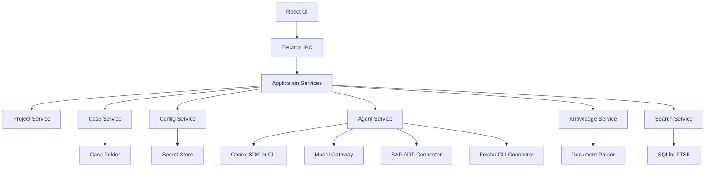
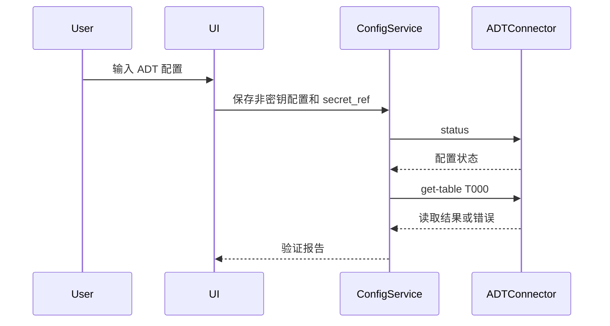

# SAP AI 顾问工作台技术实现文档

版本：MVP v0.1
日期：2026-07-01
适用范围：个人本地版

## 1. 技术目标

MVP 的技术目标是实现一个本地优先的桌面工作台，能稳定完成：

1. 管理多个 SAP 项目。
2. 配置和验证 ADT、飞书 CLI、API 模型、Codex 能力。
3. 通过自然语言处理 SAP 问题、ABAP 开发、文档生成、流程图生成。
4. 将所有过程文件和交付物保存到案件目录。
5. 将知识候选进入待确认区，人工确认后入库。
6. 支持全局搜索和案件上下文恢复。

## 2. 推荐技术路线

### 2.1 桌面壳

推荐使用 Electron + React + TypeScript。

原因：

- Windows 本地桌面集成成熟。
- 调用本地 CLI、文件系统和子进程方便。
- 适合集成现有 Python ADT CLI、lark-cli、Codex SDK 或 CLI。
- 前端生态适合实现 Codex 风格界面。

备选方案是 Tauri，但 MVP 阶段不推荐作为首选，因为 Rust 命令层和 Node/Python 工具链整合成本更高。

### 2.2 本地存储

推荐：

- SQLite：项目、案件、文件索引、知识元数据、搜索索引。
- 本地文件系统：案件文件、输出文件、快照、日志。
- OS 安全存储：API Key、SAP 密码、飞书 Token。

SQLite 必须开启 FTS5，用于本地全文搜索。

### 2.3 前端技术

推荐：

- React。
- TypeScript。
- Zustand 或 Jotai 管理前端状态。
- TanStack Query 管理异步请求状态。
- CSS Modules、Tailwind 或 UnoCSS 任选一种，但必须保持设计系统一致。
- Lucide 图标库。

### 2.4 后端技术

Electron 主进程负责：

- 文件系统读写。
- SQLite 访问。
- 子进程调用。
- 连接器调度。
- 安全存储访问。
- IPC 接口。

可选增加 Node 本地服务层，但 MVP 不建议一开始拆成独立服务，避免部署复杂。

## 3. 总体架构



## 4. 模块边界

| 模块 | 职责 | 不负责 |
|---|---|---|
| UI Layer | 展示、交互、拖拽布局、弹层 | 不直接读写 SAP、不直接保存密钥 |
| Project Service | 项目增删改查、可见项目、项目配置引用 | 不执行模型任务 |
| Case Service | 案件创建、文件夹管理、对话记录、文件索引 | 不解析业务结论 |
| Config Service | 配置校验、状态管理、密钥引用 | 不明文返回密钥 |
| Agent Service | 任务模式编排、上下文组装、调用模型和工具 | 不直接操作 UI |
| SAP ADT Connector | 只读读取 SAP、状态验证、T000 验证 | MVP 不写 SAP |
| Feishu Connector | 验证登录、发布文档、白板更新 | 不保存飞书密码 |
| Knowledge Service | 文档解析、候选知识、冲突检测、入库 | 不把未确认内容当正式知识 |
| Search Service | 全文索引、文件索引、知识检索 | 不决定业务结论 |

## 5. 本地目录结构

推荐根目录：

```text
SAPAIWorkbench/
  app.db
  projects/
    <project_id>/
      project.json
      standards/
      knowledge/
      cases/
        <case_id>/
          README.md
          conversation.md
          timeline.md
          context_pack.md
          outputs/
          knowledge_candidates/
          snapshots/
          evidence/
          technical/
          metadata.json
  indexes/
  logs/
  temp/
```

目录说明：

| 路径 | 用途 |
|---|---|
| app.db | SQLite 主库。 |
| project.json | 项目基本信息和非密钥配置。 |
| standards/ | 当前项目规范副本。 |
| knowledge/ | 项目知识库文件和索引源。 |
| cases/ | 案件目录。 |
| outputs/ | 用户关心的交付物。 |
| knowledge_candidates/ | 待确认知识文件。 |
| snapshots/ | 源码、文档、表结构快照。 |
| evidence/ | 查询结果和验证记录。 |
| technical/ | 过程文件和工具调用记录。 |

## 6. 数据模型

### 6.1 Project

```text
Project
  id
  name
  sap_version: S4 | ECC | UNKNOWN
  visible_order
  is_visible
  default_system_id
  standards_profile_id
  knowledge_scope
  created_at
  updated_at
```

### 6.2 SapSystemConfig

```text
SapSystemConfig
  id
  project_id
  alias
  url
  client
  username
  language
  ssl_mode
  read_only: true
  secret_ref
  last_status
  last_verified_at
  created_at
  updated_at
```

密码不得进入该表，只保存 secret_ref。

### 6.3 ApiProvider

```text
ApiProvider
  id
  name
  type: OPENAI_COMPATIBLE | DEEPSEEK | CUSTOM
  base_url
  secret_ref
  enabled
  last_status
  last_models_sync_at
```

### 6.4 Model

```text
Model
  id
  provider_id
  model_name
  display_name
  capabilities: json
  is_default
  enabled
  last_seen_at
```

### 6.5 Case

```text
Case
  id
  project_id
  title
  status: active | solved | archived
  case_folder
  current_summary
  current_context_pack_path
  created_at
  updated_at
  last_opened_at
```

### 6.6 CaseMessage

```text
CaseMessage
  id
  case_id
  role: user | assistant | system
  content
  model_id
  task_mode
  created_at
```

### 6.7 CaseFile

```text
CaseFile
  id
  case_id
  path
  file_type
  purpose: output | conversation | candidate_knowledge | technical | evidence | snapshot
  display_name
  size
  hash
  created_at
  updated_at
  indexed_at
```

### 6.8 KnowledgeItem

```text
KnowledgeItem
  id
  project_id
  title
  type: qa | doc | sap_object | case_note | timeline_fact
  status: draft | pending | published | conflicted | expired
  content_path
  source_case_id
  source_file_id
  effective_from
  effective_to
  reviewer
  created_at
  updated_at
```

### 6.9 StandardsProfile

```text
StandardsProfile
  id
  project_id
  source_type: global_template | sap_version_template | copied_project
  source_ref
  version
  active
  created_at
  updated_at
```

## 7. 配置实现

### 7.1 密钥保存

优先使用系统安全存储：

- Windows Credential Manager。
- macOS Keychain。
- Linux Secret Service。

如果开发阶段必须使用本地文件保存临时密钥，必须：

1. 加入明显风险提示。
2. 文件权限限制为当前用户。
3. 不在日志、Markdown、错误信息中输出密钥。

### 7.2 ADT 验证流程



验证必须包括：

- URL。
- Client。
- Username。
- SSL。
- 只读模式。
- T000 最小读取。

### 7.2.1 ADT 连接器实战规则

ADT 配置不能只做到“表单保存成功”。对用户来说，真正可用的标准是：当前账号能通过 ADT 读取最小对象，并且写入能力处于禁用状态。

MVP 的 ADT 连接器必须把验证拆成三层：

| 层级 | 验证内容 | 成功标准 |
|---|---|---|
| 配置检查 | URL、Client、用户、语言、SSL、只读开关 | 字段完整、格式正确、密钥引用存在 |
| 状态检查 | 调用 ADT CLI 或等价连接器执行 `status` | 能显示目标系统、Client、用户、写入状态 |
| 最小读取 | 读取 `T000` 或等价低风险 DDIC 对象 | SAP 返回成功，证明账号、密码、权限、网络均可用 |

状态检查只能证明本地配置存在，不能证明 SAP 登录成功。只有最小读取成功，才允许标记为“已验证”。

ADT 验证报告必须展示：

```text
系统别名
SAP URL
Client
用户
SSL模式
写入模式
传输写入模式
最小读取对象
最后验证时间
验证结果
失败原因
修复建议
```

### 7.2.2 ADT 命令抽象

MVP 可以先通过本地子进程调用现有 `sap_adt_cli.py`，后续再封装为内部 SDK。UI 和业务层不得直接拼接命令行，必须通过 `SapAdtConnector` 抽象。

建议接口：

```text
SapAdtConnector
  status(projectId, systemId)
  verifyMinimalRead(projectId, systemId)
  searchObject(projectId, systemId, query, maxResults)
  getProgram(projectId, systemId, name)
  getClass(projectId, systemId, name)
  getFunction(projectId, systemId, name, group)
  getInclude(projectId, systemId, name)
  getTable(projectId, systemId, name)
  getStructure(projectId, systemId, name)
  runSelect(projectId, systemId, openSql, maxRows)
```

MVP 默认只实现只读方法。即使底层 CLI 支持写入、激活、传输，产品层也必须默认隐藏这些能力。

### 7.2.3 ADT 安全和错误处理

必须遵守：

1. 默认只读。
2. 写入源码、激活对象、创建或释放传输不进入 MVP。
3. 如果未来开启写入，每次写入都必须有当前操作的一次性确认，不能复用历史确认。
4. SAP 密码不得出现在日志、案件文件、错误信息、Markdown、截图或模型上下文中。
5. 读取 SAP 对象前必须确认当前项目和当前系统，避免跨客户或测试/生产混用。
6. 生产系统必须有更明显的只读标识。

常见错误映射：

| 错误 | 判断 | 用户提示 |
|---|---|---|
| 未配置 | 当前项目没有完整 ADT 配置 | 请在配置中心填写 URL、Client、用户和密码，并保存后验证。 |
| 401 | 账号或密码错误 | 当前 SAP 账号或密码未通过登录，请重新配置密码。 |
| 403 | 权限不足 | 当前账号缺少 ADT 读取权限，需要 Basis 开通 ADT 相关权限。 |
| 404 | 对象或路径不存在 | 请检查 SAP 对象名、函数组或 ADT 服务路径。 |
| 503 | ADT 服务不可用 | SAP ADT 服务可能未启用，需要 Basis 检查 SICF `/sap/bc/adt`。 |
| SSL | 证书问题 | 内网或自签证书系统可在项目配置中开启跳过证书验证。 |
| 网络中断 | 代理、VPN、内网访问异常 | 请检查网络、VPN、代理设置和 SAP 地址是否可达。 |

### 7.2.4 源码读取和落盘策略

ADT 读取结果不等于必须保存文件。产品层需要根据任务模式决定是否落盘：

| 场景 | 是否读取 SAP | 是否保存本地 |
|---|---:|---:|
| 简单解释逻辑 | 是 | 否，除非用户要求 |
| 多轮问题分析 | 是 | 临时缓存，可清理 |
| 修改 ABAP | 是 | 必须保存快照 |
| 生成开发说明书 | 是 | 建议保存关键快照 |
| 版本对比 | 是 | 必须保存快照和差异 |

保存到本地的 SAP 材料必须进入当前案件目录的 `snapshots/`、`evidence/` 或 `technical/`，不在主界面固定展示。

### 7.3 飞书 CLI 验证流程

1. 检测 lark-cli 是否存在。
2. 执行 doctor。
3. 验证 auth status。
4. 必要时提示用户授权。
5. 保存 Profile 和验证状态。

### 7.3.1 飞书 CLI 实战工作流

飞书集成不是只检测 CLI 是否安装。真正可用的标准是：当前 Profile 已登录、权限范围满足文档创建/更新/白板更新，并且能返回可追溯的文档 URL 或错误原因。

配置中心必须支持：

| 检查项 | 命令或动作 | 成功标准 |
|---|---|---|
| CLI 存在 | `lark-cli doctor` | CLI 可执行，应用配置可解析 |
| 登录状态 | `lark-cli auth status --verify` | 用户身份可用，必要 scope 存在 |
| 创建文档 | `lark-cli docs +create --api-version v2` | 返回文档 URL 和 document_id |
| 更新文档 | `lark-cli docs +update --api-version v2` | 目标文档被成功覆盖或更新 |
| 更新白板 | `lark-cli docs +whiteboard-update` | Mermaid 内容写入白板块 |

文档生成模式的默认产物：

```text
outputs/
  <object>_dev_spec.md
  <object>_logic_whiteboard.mmd
  <object>_feishu_create_result.json
  <object>_whiteboard_update_result.json
```

发布到飞书后，案件 `README.md` 和 `metadata.json` 必须记录：

```text
Feishu Doc URL
document_id
whiteboard block token
publish time
local source file
publish status
```

不得记录：

- 飞书 App Secret。
- 用户 Token。
- 租户敏感密钥。

### 7.3.2 飞书缺少权限处理

如果飞书 CLI 返回 `missing_scope`，不能反复重试创建文档。必须进入授权流程：

1. 生成授权 URL。
2. 提示用户扫码或打开 URL 授权。
3. 等用户完成授权后，再执行登录完成命令。
4. 重新执行 `auth status --verify`。

产品界面必须显示：

```text
飞书未完成授权
需要权限：文档创建、文档写入、白板节点创建/读取
下一步：点击重新授权
```

授权过程中不要连续生成多个 device code，避免旧授权链接失效。

### 7.3.3 飞书文档内容规范

从案件生成飞书文档时，优先保证业务可读性，而不是把所有技术细节搬进去。

默认文档结构：

```text
基本信息
业务背景
处理目标
关键逻辑
数据来源
异常与边界说明
交付物
上线确认清单
附录：技术对象和证据
```

复杂业务逻辑需要同时生成 Mermaid 源文件。若需要飞书白板，Markdown 中使用白板占位，再通过 CLI 写入 Mermaid。

### 7.4 API 模型获取流程

对 OpenAI 兼容渠道：

1. 读取 Base URL。
2. 使用 API Key 请求 models endpoint。
3. 保存模型列表。
4. 对选定模型做最小 chat 测试。
5. 将模型能力写入 Model.capabilities。

DeepSeek 作为独立 Provider，但接口按 OpenAI 兼容形式适配。

## 8. Agent 和任务模式

### 8.1 任务模式定义

```text
TaskMode
  id
  name
  required_tools
  allowed_tools
  default_model_policy
  required_standards
  output_policy
  snapshot_policy
  knowledge_candidate_policy
```

### 8.2 问题分析模式

默认行为：

- 分析用户问题。
- 判断是否需要读取 SAP。
- 尽量实时读取，不默认保存源码。
- 输出结论和必要文件。
- 生成候选知识，但不自动入库。

### 8.3 ABAP 开发模式

默认行为：

- 判断是新开发还是修改已有对象。
- 修改已有对象时读取 SAP 最新源码。
- 需要修改时建立源码快照。
- 套用当前项目 ABAP 规范。
- 输出代码、说明、请求描述。
- MVP 不自动写入 SAP。

### 8.4 文档生成模式

默认行为：

- 读取当前案件 context_pack。
- 读取相关输出文件。
- 套用文档模板。
- 输出 Markdown、Word 或飞书文档。

### 8.5 画流程图模式

默认行为：

- 从案件上下文提取业务流程。
- 优先生成 Mermaid。
- 可进一步生成图片或飞书画布素材。
- 图示规范来自当前项目规范中心。

## 9. SAP 源码和快照策略

默认不将所有 SAP 源码落盘。

| 场景 | 策略 |
|---|---|
| 简单阅读分析 | 实时读取，不保存源码。 |
| 多轮问题分析 | 临时缓存，可清理。 |
| 修改 ABAP | 必须保存源码快照。 |
| 生成交付文档 | 建议保存必要快照。 |
| 版本对比 | 必须有本地快照和 SAP 最新读取结果。 |

快照作为文件保存，不在 UI 固定展示。

## 10. 知识库实现

### 10.1 入库流程


### 10.2 文档解析

解析分层：

1. 原始文件保存。
2. 结构解析。
3. 文本、表格、图片、公式、时间线事实提取。
4. 生成可检索索引。
5. 生成候选知识。
6. 人工确认入库。

### 10.3 跨页表格

表格解析必须保留：

- 文档来源。
- 页码范围。
- 所属章节。
- 表头。
- 行数据。
- 前后上下文。

不能只按固定 token 切片。

### 10.4 时间线事实

时间线事实格式：

```text
TimelineFact
  subject
  relation
  object
  role
  organization
  effective_from
  effective_to
  source
```

这样才能支持类似问题：

> B 公司的哪位同事曾经做过销售经理？

## 11. 搜索实现

MVP 搜索采用混合检索：

1. SQLite FTS5 全文搜索。
2. 文件名和标签搜索。
3. 元数据过滤。
4. 后续可加入向量检索。

搜索结果必须显示：

- 类型。
- 标题。
- 所属项目。
- 所属案件。
- 来源文件。
- 更新时间。
- 匹配片段。

## 12. UI 状态和布局实现

### 12.1 可拖拽布局

需要实现：

- 左侧宽度可调整。
- 右侧文件面板可隐藏和调整。
- 中间区域自适应。
- 最小宽度限制，避免输入框和文本挤压。

推荐默认：

| 区域 | 默认宽度 | 最小宽度 |
|---|---:|---:|
| 左侧栏 | 300px | 240px |
| 右侧文件面板 | 320px | 260px |
| 中间区域 | 自动 | 640px |

### 12.2 对话 UI

必须遵守：

- 用户消息靠右。
- AI 回复靠左。
- 不显示头像。
- AI 回复不是卡片。
- 文件产物作为内联文件 chip。
- 技术过程不默认展示。

### 12.3 右侧文件面板

文件面板从 CaseFile 表和案件目录读取。

必须支持：

- 展开和折叠目录。
- 搜索当前案件文件。
- 打开文件。
- 显示待确认标签。
- 隐藏和恢复面板。

不做：

- 文件预览大面板。
- 技术证据 Dashboard。
- 多余视图切换按钮。

## 13. 错误处理

### 13.1 ADT 错误

| 错误 | 用户提示 |
|---|---|
| 401 | 账号或密码错误，请重新配置当前项目 SAP 凭据。 |
| 403 | 当前账号缺少 ADT 读取权限。 |
| 404 | 对象或 ADT 路径不存在，请检查对象名或系统服务。 |
| 503 | ADT 服务不可用，需要 Basis 检查 SICF 服务。 |
| SSL | 证书校验失败，可在内网系统中开启跳过证书验证。 |

### 13.2 飞书错误

| 错误 | 用户提示 |
|---|---|
| CLI 不存在 | 未检测到 lark-cli，请先安装或配置路径。 |
| 未登录 | 飞书 CLI 未登录，请重新授权。 |
| 权限不足 | 当前账号没有创建或更新文档权限。 |

### 13.3 API 错误

| 错误 | 用户提示 |
|---|---|
| API Key 无效 | 当前渠道密钥不可用，请重新配置。 |
| Base URL 错误 | 无法连接模型服务，请检查 API 地址。 |
| 模型不可用 | 当前模型调用失败，请选择其他模型。 |
| 超时 | 网络或模型响应过慢，可重试或切换模型。 |

## 14. 日志和审计

必须记录：

- 配置验证时间和结果。
- 模型调用元数据，不记录完整密钥。
- SAP 读取对象和时间。
- 文件生成记录。
- 知识候选生成和审核记录。
- 用户确认入库记录。

日志不得记录：

- SAP 密码。
- API Key。
- 飞书 Token。
- 大段 SAP 源码，除非用户明确保存为案件文件。

## 15. 测试方案

### 15.1 单元测试

- Project Service。
- Case Service。
- Config Service。
- Search Service。
- Knowledge candidate state machine。
- Standards inheritance and copy logic。

### 15.2 集成测试

- ADT status + T000 验证。
- Feishu CLI doctor + auth status。
- API models 获取。
- 创建案件并保存文件。
- 生成知识候选并人工确认入库。
- 全局搜索找回案件和文件。

### 15.3 UI 测试

- 左侧栏折叠。
- 项目添加和移除。
- 多项目可见列表。
- 右侧文件面板折叠。
- 输入框任务模式切换。
- 模型选择器按渠道分组。
- 小屏窗口下布局不重叠。

### 15.4 安全测试

- 密钥不出现在日志。
- 密码不显示在界面。
- 默认写入模式禁用。
- 生产系统不允许无确认操作。

## 16. MVP 开发顺序

推荐分 5 个阶段：

### 阶段 1：应用壳和本地数据

- Electron + React 桌面壳。
- 左侧栏、中心对话、右侧文件面板。
- SQLite 数据库。
- 项目、案件、文件索引。

### 阶段 2：配置中心

- ADT 配置和验证。
- 飞书 CLI 检测和验证。
- API 渠道和模型获取。
- 本地安全存储。

### 阶段 3：案件工作流

- 新建案件。
- 任务模式。
- 对话记录。
- 文件生成和保存。
- context_pack 生成。

### 阶段 4：规范中心

- 模板复制。
- 项目规范副本。
- 差异查看。
- ABAP 规范应用到任务模式。

### 阶段 5：知识库

- 文档上传。
- 结构解析。
- 候选知识。
- 人工确认。
- 冲突检测。
- 搜索整合。

## 17. 开发验收

MVP 完成时必须能完成一条端到端流程：

1. 创建项目「演示 S4HANA」。
2. 配置 ADT 并读取 T000 验证成功。
3. 配置 Fengsha API 并获取模型。
4. 新建案件「DEMO001 演示BOM清单」。
5. 用户输入问题。
6. 系统生成分析结论。
7. 系统生成 Excel、Markdown 文档和逻辑图文件。
8. 右侧文件面板显示这些文件。
9. 系统生成候选知识。
10. 用户确认入库。
11. 通过搜索能找回案件、文件和知识卡片。

## 18. 重要约束

1. MVP 默认只读 SAP。
2. 不实现团队版。
3. 不实现注册登录。
4. 不实现云端同步。
5. 不实现自动写 SAP。
6. 不允许知识自动正式入库。
7. 不允许 UI 固定展示中间技术产物。
8. 不允许项目规范互相污染。
9. 不允许模型选择散落在多个位置。
10. 不允许出现无法解释的按钮。
