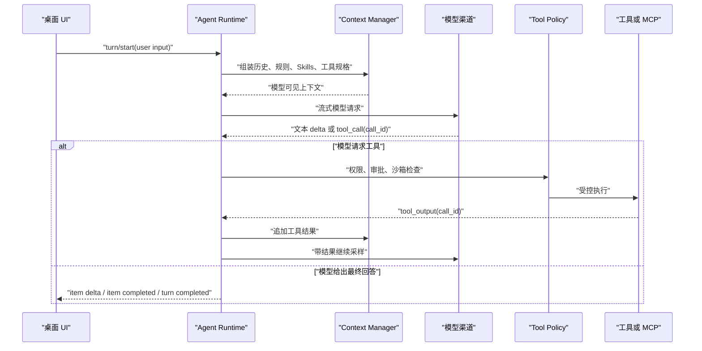
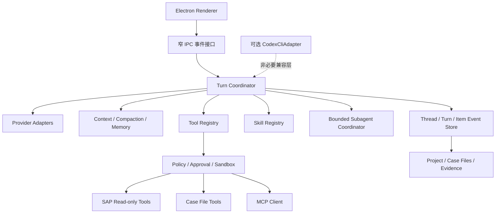

# Codex 公开运行时与本项目独立 Agent Runtime 研究

> 研究日期：2026-07-15
> 研究对象：OpenAI 官方仓库 `openai/codex`
> 固定提交：[`3f74f00295dcb1346340686bb09c5bfd4f0237c4`](https://github.com/openai/codex/tree/3f74f00295dcb1346340686bb09c5bfd4f0237c4)
> 本机只读副本：`C:/Users/CM1165/AppData/Local/Temp/openai-codex-research-20260715`
> 资料范围：只使用 OpenAI 官方仓库、`developers.openai.com` 和 `learn.chatgpt.com`，不使用博客、论坛或二手解读。

## 结论先说

1. `openai/codex` 是一套相当完整的公开 Codex CLI、核心 Agent Runtime、协议、持久化、app-server、MCP、Skills、subagents 和 TypeScript SDK 实现，可以用于研究 Codex 的本地执行主链路。
2. 它不是完整 Codex App 产品源码。公开仓库没有证明 ChatGPT/Codex 桌面产品的完整 UI、OpenAI 私有账号与计费服务、托管推理后端、云端任务调度与全部产品后台已经开源。仓库根说明把 CLI、Codex App 和 Codex Web 分开指向不同产品入口，这本身就是明确的边界信号。[仓库 README](https://github.com/openai/codex/blob/3f74f00295dcb1346340686bb09c5bfd4f0237c4/README.md)
3. 公开运行时的核心不是“让模型直接操作电脑”，而是一个受宿主控制的循环：组装上下文，调用模型，接收工具请求，由宿主按权限执行工具，把结果写回上下文，再次调用模型，直到模型不再要求后续动作。
4. `Thread / Turn / Item` 是对话与执行的领域模型，app-server 的 JSON-RPC 事件是给客户端消费的稳定边界。UI 应订阅事件并渲染状态，不应把 UI 状态本身当作运行时真相。
5. rollout 是追加式会话记录。恢复不是简单读取一段聊天文本，而是根据 rollout、压缩替换点、回滚边界和元数据重建模型可见历史与线程状态。
6. context、compaction 和 memory 是三层不同机制：context 是本轮真实送给模型的工作集；compaction 在窗口接近上限时替换或压缩历史；memory 是跨任务的可选长期回忆。memory 不能替代规范、审计证据或正式知识库。
7. Skills、MCP 和 subagents 都是扩展层，不是基础对话成立的前提。正确顺序应是先完成独立的 Thread/Turn/Item、流式事件、工具循环和恢复，再逐层接入扩展能力。
8. `@openai/codex-sdk` 当前公开实现不是独立运行时。它解析 `@openai/codex` 的平台二进制，启动 `codex exec --experimental-json`，通过 stdin/stdout 交换 JSONL。因此，把 SDK 接入产品仍然等价于依赖 Codex CLI。[TypeScript SDK 执行器](https://github.com/openai/codex/blob/3f74f00295dcb1346340686bb09c5bfd4f0237c4/sdk/typescript/src/exec.ts#L1-L227)
9. 本项目应借鉴 Codex 的运行时分层、事件协议、工具安全边界、恢复、上下文预算和渐进式扩展设计，但必须拥有自己的 Agent Runtime、数据模型和 SAP 安全策略。Codex CLI 只适合作为可选兼容适配器，不能继续作为核心中转或必要依赖。

## 1. 公开仓库包含什么，不包含什么

### 1.1 已确认包含

固定提交中的公开实现至少覆盖以下层次：

| 层次 | 公开内容 | 可研究价值 |
| --- | --- | --- |
| CLI 与非交互执行 | Codex CLI、TUI、`codex exec` 等 | 本地 Agent 如何启动、收发输入、流式执行 |
| 核心运行时 | session、turn、context、tool router、compaction | 用户消息到模型、工具、再到最终回答的主循环 |
| 公共协议 | Thread、Turn、Item、事件和配置类型 | 客户端与运行时之间的稳定数据契约 |
| app-server | 基于 stdio JSONL 的 JSON-RPC 服务 | 桌面或 IDE 类客户端如何创建、恢复和驱动线程 |
| rollout | `.jsonl` 记录、列表、归档和重建 | 会话持久化、恢复、分叉、回滚的实现参考 |
| 扩展能力 | Skills、MCP、插件、hooks | 如何按需暴露能力而不是把全部内容塞进上下文 |
| 多 Agent | spawn、send message、wait、父子线程关系 | 子任务隔离、并行读取、结果回传 |
| TypeScript SDK | `@openai/codex-sdk` | 程序化驱动 CLI 的适配方式 |

关键公开入口包括：

- [app-server 协议说明](https://github.com/openai/codex/blob/3f74f00295dcb1346340686bb09c5bfd4f0237c4/codex-rs/app-server/README.md)
- [Turn 主循环](https://github.com/openai/codex/blob/3f74f00295dcb1346340686bb09c5bfd4f0237c4/codex-rs/core/src/session/turn.rs#L130-L381)
- [工具路由](https://github.com/openai/codex/blob/3f74f00295dcb1346340686bb09c5bfd4f0237c4/codex-rs/core/src/tools/router.rs)
- [rollout 记录器](https://github.com/openai/codex/blob/3f74f00295dcb1346340686bb09c5bfd4f0237c4/codex-rs/rollout/src/recorder.rs#L1-L113)
- [rollout 历史重建](https://github.com/openai/codex/blob/3f74f00295dcb1346340686bb09c5bfd4f0237c4/codex-rs/core/src/session/rollout_reconstruction.rs)
- [TypeScript SDK](https://github.com/openai/codex/tree/3f74f00295dcb1346340686bb09c5bfd4f0237c4/sdk/typescript)

### 1.2 不能据此声称包含

下列内容不能因为 `openai/codex` 开源而被推断为完整公开：

- 完整 ChatGPT Codex App 桌面 UI 和全部产品交互源码。
- OpenAI 托管模型的权重、推理服务和内部路由策略。
- ChatGPT 账号、组织、计费、额度、风控和全部云端控制面实现。
- Codex cloud 的完整任务调度、隔离环境和后台服务实现。
- OpenAI 内部专用工具、未公开策略、线上遥测与运营系统。

app-server 暴露账号、额度、云任务或应用相关方法，只能证明公开客户端协议或适配入口存在，不能证明对应私有后台也在仓库中。研究和产品规划都必须把“公开本地运行时”与“OpenAI 托管服务”分开。

### 1.3 对本项目的直接判断

本项目不需要复刻完整 Codex App。真正值得复用的是运行时思想和公开协议，而不是产品外壳。我们的目标应是一个更小、更窄、更符合 SAP 顾问工作流的独立 Agent Runtime。

## 2. Thread、Turn、Item 与 app-server 事件

### 2.1 三层模型

app-server 对三者的官方定义非常清楚：[Thread / Turn / Item 定义](https://github.com/openai/codex/blob/3f74f00295dcb1346340686bb09c5bfd4f0237c4/codex-rs/app-server/README.md#L66-L71)

- `Thread`：一段持续会话，包含多个 Turn。
- `Turn`：通常从一次用户输入开始，到本次 Agent 完成或失败结束，内部可以发生多次模型调用和工具执行。
- `Item`：Turn 内可持久化、可流式展示的最小语义单元，例如用户消息、Agent 消息、推理、命令执行、文件修改和工具调用。

这意味着“一次发送”不等于“一次模型请求”。一次 Turn 可以包含多轮模型采样、多个工具调用、审批等待和大量 Item。

### 2.2 app-server 是客户端边界

app-server 通过 stdio 传输 JSONL，每行一个 JSON-RPC 消息。官方文档把它定位为构建丰富 Codex 客户端的接口：[Codex App Server 官方文档](https://developers.openai.com/codex/app-server)。公开仓库给出了相同协议的详细方法和事件说明：[app-server README](https://github.com/openai/codex/blob/3f74f00295dcb1346340686bb09c5bfd4f0237c4/codex-rs/app-server/README.md#L24-L80)。

典型生命周期如下：

1. 客户端初始化并声明能力。
2. 调用 `thread/start` 新建，或 `thread/resume` 恢复已有线程。
3. 调用 `turn/start` 发送用户输入。
4. 服务端发送 `thread/started`、`turn/started`。
5. Item 依次发送 `item/started`、各类 delta、`item/completed`。
6. Agent 文本通过 `item/agentMessage/delta` 等事件增量到达。
7. Turn 最终发送 `turn/completed`，状态可能是完成、失败或中断。

相关公开证据：

- [Thread 生命周期方法](https://github.com/openai/codex/blob/3f74f00295dcb1346340686bb09c5bfd4f0237c4/codex-rs/app-server/README.md#L138-L168)
- [Turn 生命周期方法](https://github.com/openai/codex/blob/3f74f00295dcb1346340686bb09c5bfd4f0237c4/codex-rs/app-server/README.md#L169-L174)
- [事件流说明](https://github.com/openai/codex/blob/3f74f00295dcb1346340686bb09c5bfd4f0237c4/codex-rs/app-server/README.md#L82-L136)

### 2.3 本项目应采用的对应关系

| Codex 概念 | 本项目建议含义 |
| --- | --- |
| Thread | 一条 Work 或 Daily chat 会话，有稳定 `thread_id` |
| Turn | 用户一次发送触发的一次完整处理，有稳定 `turn_id` |
| Item | 消息、工具调用、审批、SAP 读取、文件成果、错误等事件 |
| Project | 本项目业务域，不等于 Thread，用于隔离客户和配置 |
| Case | 本项目工作单元，可以关联一个或多个 Thread，但不能被 Thread 取代 |

UI 只维护选择状态、展开状态和临时输入。消息、工具进度、失败、取消、恢复等业务状态都应来自运行时事件和持久化记录。

## 3. 用户发送消息后的底层工具循环

### 3.1 核心事实

公开源码在 `run_turn` 上方直接说明了循环语义：模型可以返回工具请求或普通 Agent 消息；请求工具时，宿主执行工具并把输出加入下一次采样；只返回 Agent 消息时，本轮结束。[Turn 主循环注释与实现](https://github.com/openai/codex/blob/3f74f00295dcb1346340686bb09c5bfd4f0237c4/codex-rs/core/src/session/turn.rs#L130-L151)

OpenAI API 官方 Function Calling 文档描述了相同的通用流程：应用把工具定义交给模型，模型返回带 `call_id` 的工具调用，应用执行工具并回传输出，然后继续请求，直到得到最终结果。[Function Calling 官方文档](https://developers.openai.com/api/docs/guides/function-calling)

### 3.2 实际处理步骤

1. **接收 Turn 输入**：客户端提交文本、图片或其他输入，并带上线程、模型、工作目录、权限等选择。
2. **固定本轮配置**：运行时形成 Turn 级配置快照，避免执行中途被全局设置意外改变。
3. **检查上下文预算**：在正式采样前判断新增输入是否会越过压缩阈值，必要时先 compact。[预采样压缩](https://github.com/openai/codex/blob/3f74f00295dcb1346340686bb09c5bfd4f0237c4/codex-rs/core/src/session/turn.rs#L154-L171)
4. **加载按需能力**：收集本轮明确提到或可用的 Skills、插件和 MCP 工具，只把需要的说明和工具规格放进模型上下文。
5. **记录用户输入**：用户 Item 写入历史和 rollout，然后构造模型可见 prompt。
6. **调用模型并流式接收**：文本 delta、推理、工具请求等先转为运行时 Item，再通知客户端。
7. **解析工具请求**：`ToolRouter` 根据工具名、命名空间、`call_id` 和参数找到注册执行器。[ToolRouter 数据结构](https://github.com/openai/codex/blob/3f74f00295dcb1346340686bb09c5bfd4f0237c4/codex-rs/core/src/tools/router.rs#L1-L77)
8. **执行安全检查**：宿主检查工具是否启用、是否要审批、允许访问哪些路径或网络、是否必须沙箱运行。模型只能提出请求，不能绕过宿主策略。
9. **执行工具并回写结果**：执行结果或错误以相同 `call_id` 对应回原调用，写入历史和 rollout。
10. **再次采样**：如果模型仍需要工具或有用户 steer 输入，就携带最新历史继续循环。
11. **结束 Turn**：当 `needs_follow_up` 为假时运行结束钩子，保存最后 Agent 消息并发送完成事件。[采样后判断与结束](https://github.com/openai/codex/blob/3f74f00295dcb1346340686bb09c5bfd4f0237c4/codex-rs/core/src/session/turn.rs#L299-L381)

### 3.3 对性能和体验的含义

- UI 必须在收到用户发送动作后立即清空输入框并插入本地 pending Item，不要等待网络响应。
- 流式事件应按 `thread_id + turn_id + item_id` 合并，避免每个 token 重刷整个页面。
- “正在连接模型”“正在执行工具”“等待批准”“正在生成最终回答”应是不同状态。
- 用户取消应取消当前 Turn 的模型请求和工具任务，但不能删除已经持久化的历史。
- 模型或工具失败应生成中文错误 Item，并保留可重试信息，不能只显示一条临时 toast。

## 4. Rollout、恢复、分叉与回滚

### 4.1 rollout 是什么

rollout 记录器源码的模块说明是“持久化 Codex session rollouts（`.jsonl`），以便之后 replay 或 inspect”。[rollout recorder](https://github.com/openai/codex/blob/3f74f00295dcb1346340686bb09c5bfd4f0237c4/codex-rs/rollout/src/recorder.rs#L1-L18)

它不是只保存用户和助手文本，而是保存会话元数据和可重放的 `RolloutItem`。因此它可以承载：

- 用户与 Agent 消息；
- 工具调用及结果；
- Turn 上下文与世界状态；
- compaction 后的替换历史；
- 回滚、中断、分叉和父子线程信息；
- 恢复所需的模型和配置事实。

### 4.2 恢复不是“重新显示聊天记录”

`rollout_reconstruction.rs` 会重建历史、上轮设置、参考上下文、世界状态和 context window 标识；它还处理 surviving replacement-history checkpoint 和 rollback 边界。[Rollout reconstruction](https://github.com/openai/codex/blob/3f74f00295dcb1346340686bb09c5bfd4f0237c4/codex-rs/core/src/session/rollout_reconstruction.rs#L1-L118)

这说明恢复至少包含两种不同需求：

1. **显示恢复**：把历史 Turn 和 Item 展示给用户。
2. **执行恢复**：重建下一次模型调用真正需要的历史、上下文基线、压缩结果和配置。

只保存 Markdown 聊天文本只能满足前者，不能可靠满足后者。

### 4.3 app-server 的会话操作

- `thread/read`：读取持久化线程，不启动实时会话。
- `thread/resume`：重建历史并恢复为可继续执行的线程。
- `thread/fork`：复制指定边界之前的历史，生成新线程 ID。
- `thread/archive`：移动 rollout 到归档目录。
- `thread/delete`：硬删除线程及相关派生线程。
- `thread/rollback`：从尾部回退用户 Turn，并保持事件语义。

公开依据见 [Thread API](https://github.com/openai/codex/blob/3f74f00295dcb1346340686bb09c5bfd4f0237c4/codex-rs/app-server/README.md#L138-L168) 和 [恢复时历史重建说明](https://github.com/openai/codex/blob/3f74f00295dcb1346340686bb09c5bfd4f0237c4/codex-rs/app-server/README.md#L311-L351)。

### 4.4 本项目应采用的恢复底座

建议以 SQLite 作为可查询事实库，同时保留 append-only 事件语义：

- `threads`：线程元数据、所属模式、Project/Case 关联、归档状态。
- `turns`：开始、完成、失败、中断、模型与配置快照。
- `items`：按单调序号保存语义 Item 和流式完成状态。
- `tool_calls`：`call_id`、审批、参数摘要、结果摘要和错误。
- `context_checkpoints`：压缩前边界、摘要、保留引用和版本。
- `thread_edges`：fork、subagent parent-child 等关系。

Case 文件继续承担长期成果和证据，SQLite 事件记录承担运行时恢复。两者不能互相替代。

## 5. Context、Compaction 与 Memory

### 5.1 Context 是本轮真实工作集

模型可见 context 通常包括：

- system/developer/AGENTS 规则；
- 当前 Thread 的有效历史；
- 当前用户输入；
- 必要的环境、工作目录和世界状态；
- 本轮选中的 Skills 说明；
- 可用工具规格；
- 工具调用结果；
- 经允许注入的 memory 或知识摘要。

公开 `History` 实现同时管理原始 Item、prompt 视图、token 估算、历史替换以及工具输出截断。[History context manager](https://github.com/openai/codex/blob/3f74f00295dcb1346340686bb09c5bfd4f0237c4/codex-rs/core/src/context_manager/history.rs#L36-L223)

### 5.2 Compaction 是有损的历史替换

Codex 在 Turn 前和 Turn 中都可以触发自动 compact。公开实现根据 token 状态判断，并支持本地 compact 或 provider 支持的 remote compaction。[compaction 实现入口](https://github.com/openai/codex/blob/3f74f00295dcb1346340686bb09c5bfd4f0237c4/codex-rs/core/src/compact.rs#L56-L166) [Turn 中自动压缩判断](https://github.com/openai/codex/blob/3f74f00295dcb1346340686bb09c5bfd4f0237c4/codex-rs/core/src/session/turn.rs#L299-L370)

OpenAI API 官方文档也把 compaction 定义为长对话接近窗口限制时的压缩机制，并提供服务端自动 compact 与显式 compact 两种方式。服务端 compact Item 可以是供后续请求使用的 opaque 状态，不保证适合人直接阅读。[Compaction 官方文档](https://developers.openai.com/api/docs/guides/compaction)

因此本项目必须遵守三个原则：

1. 压缩摘要不等于完整历史，原始事件不能被摘要覆盖删除。
2. 摘要必须记录来源边界和版本，能追溯它压缩了哪些 Turn/Item。
3. 不能只依赖某家模型的 opaque compact。多渠道产品需要本地可移植摘要作为兜底。

### 5.3 Memory 是跨任务回忆，不是事实真相

Codex 官方文档明确把本地 Codex memory 与 ChatGPT 网页端 memory 区分开，并强调长期规则应放在 `AGENTS.md` 或文档中，memory 是辅助回忆而不是 source of truth。[Memories 官方文档](https://developers.openai.com/codex/customization/memories)

固定提交中也存在本地 memory 使用追踪和持久化迁移结构，证明它是独立的本地子系统，而不是单纯把全部旧聊天重新塞入 prompt。[memory 使用追踪](https://github.com/openai/codex/blob/3f74f00295dcb1346340686bb09c5bfd4f0237c4/codex-rs/core/src/memory_usage.rs) [memory state migration](https://github.com/openai/codex/blob/3f74f00295dcb1346340686bb09c5bfd4f0237c4/codex-rs/state/memory_migrations/0001_memories.sql)

本项目建议把长期信息分为四层：

| 层次 | 内容 | 是否自动进入模型 |
| --- | --- | --- |
| 规则 | SAP 只读、审批边界、项目规范 | 必须，按作用域加载 |
| 线程历史 | 当前问题的消息和工具过程 | 按窗口预算加载 |
| 工作记忆 | 当前 Case 的摘要、待办、关键对象 | 按相关性加载，可重新生成 |
| 正式知识 | 用户审核通过的规范与经验 | 检索后引用，不自动写入 |

尤其不能让模型自动把未审核回答写进正式知识库。Memory 可以自动形成候选，但必须经过用户确认才能晋升为知识。

## 6. Skills

### 6.1 Skills 的本质

Skill 是一个带说明、资源和可选脚本的能力包。官方推荐目录以 `SKILL.md` 为入口，可附带 `scripts/`、`references/`、`assets/` 和界面元数据。[Build skills 官方文档](https://developers.openai.com/codex/build-skills)

真正重要的是 progressive disclosure，也就是渐进披露：

1. 初始上下文只注入 Skill 的名称、描述和路径等轻量目录。
2. 当用户明确提到或模型判断相关时，再读取完整 `SKILL.md`。
3. 只有执行到具体步骤时，才读取引用文件或运行脚本。

公开实现会构造“可用 Skills”上下文片段，并区分 catalog 与使用说明。[available skills context](https://github.com/openai/codex/blob/3f74f00295dcb1346340686bb09c5bfd4f0237c4/codex-rs/core/src/context/available_skills_instructions.rs)；核心 Skills 服务还区分显式、隐式调用和作用域。[skills core integration](https://github.com/openai/codex/blob/3f74f00295dcb1346340686bb09c5bfd4f0237c4/codex-rs/core/src/skills.rs)

### 6.2 本项目的 Skill 支持范围

第一阶段只需要支持：

- 扫描 Project、用户和内置目录中的 `SKILL.md`；
- 解析名称、描述、作用域、依赖和入口；
- 把轻量目录加入 context；
- 用户显式选择或模型匹配后按需读取正文；
- 脚本执行沿用统一 Tool Policy，不能因为来自 Skill 就默认可信；
- 记录本轮启用了哪些 Skill、读取了哪些资源、产生了什么结果。

不应在第一阶段内置大量 Skill。先把协议、加载、审批和审计做对，再按 SAP 顾问真实需求增加 ABAP 审查、开发说明书、流程图、故障分析等 Skill。

## 7. MCP

### 7.1 MCP 在运行时中的位置

MCP 是外部工具和上下文的标准接入协议，不是 Agent Runtime 本身。Codex 官方支持本地 STDIO 与 Streamable HTTP 服务器，并提供 OAuth、Bearer token、超时、工具启停和审批等配置。[MCP 官方文档](https://developers.openai.com/codex/extend/mcp)

公开 `rmcp-client` 同时包含 stdio launcher、Streamable HTTP、OAuth、资源读取和工具调用等实现。[RMCP client](https://github.com/openai/codex/blob/3f74f00295dcb1346340686bb09c5bfd4f0237c4/codex-rs/rmcp-client/src/rmcp_client.rs#L1-L90)。Session 层再为每轮生成 MCP 配置、连接管理器、环境与审批上下文。[session MCP runtime](https://github.com/openai/codex/blob/3f74f00295dcb1346340686bb09c5bfd4f0237c4/codex-rs/core/src/session/mcp.rs#L80-L198)

### 7.2 必须由宿主承担的安全责任

MCP 只解决“如何发现和调用”，不自动解决“能不能调用”。本项目仍需自己控制：

- 哪些 MCP server 可启用；
- 哪些工具允许暴露给当前 Project/Case；
- 每个工具是否只读、是否需要审批；
- 启动和调用超时；
- 网络域名、工作目录和文件路径范围；
- OAuth/API key 的安全存储；
- 返回内容是否含客户数据或 prompt injection；
- 调用日志和脱敏审计。

SAP 工具即使通过 MCP 接入，也必须继续遵守本项目的 SAP 默认只读硬边界。

## 8. Subagents

### 8.1 公开运行模式

Codex 官方把 subagent 描述为由主 Agent 委派的专门 Agent。每个子 Agent 有自己的上下文和工具执行，完成后把结果汇总给主线程。它适合并行、边界清晰、偏读取的任务，但会增加 token 消耗，多个写任务还可能相互冲突。[Subagents 官方文档](https://developers.openai.com/codex/subagents)

固定提交中的公开证据包括：

- app-server 的子线程可带 `parentThreadId`，并支持按 parent 或 ancestor 查询。[父子线程 API](https://github.com/openai/codex/blob/3f74f00295dcb1346340686bb09c5bfd4f0237c4/codex-rs/app-server/README.md#L140-L146)
- `spawn_agent` 创建新的 Agent Thread，并记录 spawn 来源和新的 thread ID。[spawn handler](https://github.com/openai/codex/blob/3f74f00295dcb1346340686bb09c5bfd4f0237c4/codex-rs/core/src/tools/handlers/multi_agents_v2/spawn.rs#L28-L165)
- `send_message` 向目标 Agent 的输入队列发送消息。[send message handler](https://github.com/openai/codex/blob/3f74f00295dcb1346340686bb09c5bfd4f0237c4/codex-rs/core/src/tools/handlers/multi_agents_v2/send_message.rs)
- `wait_agent` 订阅子 Agent 活动并带有最小、最大和默认超时。[wait handler](https://github.com/openai/codex/blob/3f74f00295dcb1346340686bb09c5bfd4f0237c4/codex-rs/core/src/tools/handlers/multi_agents_v2/wait.rs)

### 8.2 本项目应该怎样收敛

首版 subagents 只开放三种受控模式：

1. **并行研究**：分别读取 SAP 系统、规范、知识和本地证据，返回带来源的摘要。
2. **交叉审查**：一个 Agent 生成开发说明书或流程图，另一个只读审查遗漏与矛盾。
3. **验证 Agent**：只运行测试、读取输出并报告，不修改成果。

每个子任务必须有 `child_thread_id`、`parent_thread_id`、输入范围、允许工具、预算、超时和结构化结果。首版禁止多个 subagent 同时修改同一 Case 文件，也不允许 subagent 获得 SAP 写入能力。

## 9. `@openai/codex-sdk` 对 CLI 的依赖

### 9.1 已确认的实现事实

官方 SDK 文档把 TypeScript SDK 定位为以编程方式控制 Codex agent 的方式。[Codex SDK 官方文档](https://developers.openai.com/codex/codex-sdk)

但固定提交的实现显示：

1. `exec.ts` 从 Node.js 导入 `spawn`。
2. 常量 `CODEX_NPM_NAME` 是 `@openai/codex`，并映射各平台二进制包。
3. 执行参数以 `exec --experimental-json` 开始。
4. SDK 启动解析出的 Codex 可执行文件。
5. 用户输入写入子进程 stdin，stdout 按行解析 JSONL 事件。

证据见 [SDK executable resolution 与命令参数](https://github.com/openai/codex/blob/3f74f00295dcb1346340686bb09c5bfd4f0237c4/sdk/typescript/src/exec.ts#L1-L99) 和 [SDK spawn 子进程](https://github.com/openai/codex/blob/3f74f00295dcb1346340686bb09c5bfd4f0237c4/sdk/typescript/src/exec.ts#L172-L227)。

### 9.2 对本项目的结论

使用 `@openai/codex-sdk` 可以减少我们直接解析 CLI JSONL 的工作，但它没有消除 CLI 依赖，也没有给我们一个与 Codex 无关的独立 Agent Runtime。

因此：

- 不把 SDK 放进核心发送链路。
- 不要求用户安装或登录 Codex 才能使用 Work、Chat、知识库和 SAP 只读工具。
- 可以保留一个 `CodexCliAdapter`，用于用户主动选择的工程辅助任务。
- 独立运行时通过模型 Provider Adapter 直接调用已配置渠道。

## 10. 本项目应该借鉴什么，不应该耦合什么

### 10.1 应该借鉴

| 设计 | 借鉴原因 | 本项目落法 |
| --- | --- | --- |
| Thread/Turn/Item | 把对话、一次执行和细粒度事件分开 | SQLite 稳定 ID 与事件序号 |
| 流式事件协议 | UI 与运行时解耦，支持进度、取消和恢复 | 窄 IPC 推送 typed events |
| 显式工具循环 | 模型提议，宿主执行，结果回填 | Provider-neutral Turn Coordinator |
| Tool Router + Policy | 工具发现与权限执行分离 | Registry、Policy、Approval、Executor 四层 |
| append-only rollout 思想 | 可恢复、可审计、可重放 | 事件表加定期 checkpoint |
| context budget | 避免长会话无限膨胀 | 每模型 token 预算与压缩阈值 |
| compaction checkpoint | 让长任务可持续 | 本地可读摘要加来源边界 |
| Skills 渐进披露 | 降低 context 噪声 | 先目录，命中后读正文和资源 |
| MCP 客户端层 | 标准化外部工具接入 | 可选扩展，受统一 Policy 管理 |
| 父子 Agent 图 | 支持并行和交叉审查 | 受控 spawn/send/wait，限制并发与写入 |

### 10.2 不应该耦合

1. **不耦合 Codex CLI 生命周期**：产品启动、对话和 SAP 工作不能依赖本机是否安装或登录 Codex。
2. **不耦合 `@openai/codex-sdk`**：它是 CLI 进程适配器，不是独立内核。
3. **不把 Codex rollout 当本项目业务库**：我们的 Project、Case、SAP connection、知识审核和成果文件有独立领域含义。
4. **不读取 Codex App 私有历史作为常规功能**：用户主动导入可以作为二期兼容功能，不能成为正常运行前提。
5. **不依赖单一 Provider 的 opaque compaction**：需要本地可移植 checkpoint。
6. **不默认信任 Skill 脚本或 MCP 工具**：所有执行都经过同一安全策略。
7. **不照搬通用编码 Agent 的工具集合**：只内置 SAP 顾问首版真正需要的工具。
8. **不让 Thread 取代 Project/Case**：对话是过程，Case 文件和审核后的知识才是长期资产。

### 10.3 建议的独立运行时结构

职责边界：

- **Renderer**：渲染和交互，不持有密钥、不运行命令、不直连 SAP 或模型。
- **Turn Coordinator**：驱动一轮完整工具循环、取消、重试和结束条件。
- **Provider Adapter**：统一 OpenAI-compatible、OpenAI、Anthropic 等渠道的流式响应和 tool call。
- **Context Manager**：选择有效历史、控制预算、生成 checkpoint、按需检索 memory 和知识。
- **Tool Policy**：执行所有权限、审批、只读和作用域判断。
- **Event Store**：是会话恢复的事实来源，UI 状态只是投影。
- **Case Files**：保存可交付成果、证据与用户确认后的长期资料。

## 11. 建议开发顺序

### 阶段 A：独立对话内核

- 建立 Thread/Turn/Item schema 和状态机。
- 完成一个 Provider-neutral 流式接口。
- 支持发送、立即清空输入、增量显示、取消、失败重试和恢复。
- Work 与 Daily chat 共用内核，仅 context policy 不同。

### 阶段 B：工具与安全内核

- 建立 Tool Registry、`call_id`、Tool Policy 和审批。
- 首批只接本地只读文件、Case 成果写入和 SAP 只读查询。
- 将所有工具过程保存为可审计 Item。

### 阶段 C：Context、Compaction、Memory

- 为每个 Provider/模型维护 context window 和安全预算。
- 实现本地可读 checkpoint，并保留原始事件。
- 建立工作记忆候选，不自动晋升正式知识。

### 阶段 D：Skills 与 MCP

- 先支持轻量目录和按需加载，再开放脚本。
- MCP 从只读、白名单 server 开始。
- Skill 和 MCP 共用 Tool Policy，不形成安全旁路。

### 阶段 E：受控 Subagents

- 先支持并行读取、交叉审查和验证。
- 限制并发、预算、超时和写入范围。
- 子 Agent 只回传结构化摘要和证据引用，不把全部内部历史灌回主线程。

## 12. 最终决策

本项目有必要从底层开发独立 Agent Runtime，但没有必要复制 Codex 的全部规模。最小但正确的核心是：

> `Thread/Turn/Item + 流式事件 + Provider Adapter + 受控工具循环 + 可恢复事件存储 + Context/Compaction`。

Skills、MCP、memory 和 subagents 应建立兼容接口并分阶段启用。Codex CLI 与 `@openai/codex-sdk` 保留为可选工程执行适配器，不参与产品基本可用性判断，也不承担本项目会话、记忆、SAP 连接或知识库的事实存储。

这条路线既吸收了 `openai/codex` 公开实现中已经验证的工程结构，也避免把个人 SAP 顾问产品绑定到 Codex 安装状态、OpenAI 专属协议或尚未公开的产品后台。

## 官方资料索引

### OpenAI 官方文档

- [Codex App Server](https://developers.openai.com/codex/app-server)
- [Codex SDK](https://developers.openai.com/codex/codex-sdk)
- [Build skills](https://developers.openai.com/codex/build-skills)
- [Model Context Protocol](https://developers.openai.com/codex/extend/mcp)
- [Subagents](https://developers.openai.com/codex/subagents)
- [Memories](https://developers.openai.com/codex/customization/memories)
- [Function Calling](https://developers.openai.com/api/docs/guides/function-calling)
- [Compaction](https://developers.openai.com/api/docs/guides/compaction)

### 固定提交源码

- [仓库根说明](https://github.com/openai/codex/blob/3f74f00295dcb1346340686bb09c5bfd4f0237c4/README.md)
- [app-server 协议](https://github.com/openai/codex/blob/3f74f00295dcb1346340686bb09c5bfd4f0237c4/codex-rs/app-server/README.md)
- [Turn 主循环](https://github.com/openai/codex/blob/3f74f00295dcb1346340686bb09c5bfd4f0237c4/codex-rs/core/src/session/turn.rs)
- [工具路由](https://github.com/openai/codex/blob/3f74f00295dcb1346340686bb09c5bfd4f0237c4/codex-rs/core/src/tools/router.rs)
- [rollout recorder](https://github.com/openai/codex/blob/3f74f00295dcb1346340686bb09c5bfd4f0237c4/codex-rs/rollout/src/recorder.rs)
- [rollout reconstruction](https://github.com/openai/codex/blob/3f74f00295dcb1346340686bb09c5bfd4f0237c4/codex-rs/core/src/session/rollout_reconstruction.rs)
- [history context manager](https://github.com/openai/codex/blob/3f74f00295dcb1346340686bb09c5bfd4f0237c4/codex-rs/core/src/context_manager/history.rs)
- [compaction](https://github.com/openai/codex/blob/3f74f00295dcb1346340686bb09c5bfd4f0237c4/codex-rs/core/src/compact.rs)
- [Skills integration](https://github.com/openai/codex/blob/3f74f00295dcb1346340686bb09c5bfd4f0237c4/codex-rs/core/src/skills.rs)
- [MCP client](https://github.com/openai/codex/blob/3f74f00295dcb1346340686bb09c5bfd4f0237c4/codex-rs/rmcp-client/src/rmcp_client.rs)
- [Subagent spawn](https://github.com/openai/codex/blob/3f74f00295dcb1346340686bb09c5bfd4f0237c4/codex-rs/core/src/tools/handlers/multi_agents_v2/spawn.rs)
- [TypeScript SDK exec adapter](https://github.com/openai/codex/blob/3f74f00295dcb1346340686bb09c5bfd4f0237c4/sdk/typescript/src/exec.ts)
