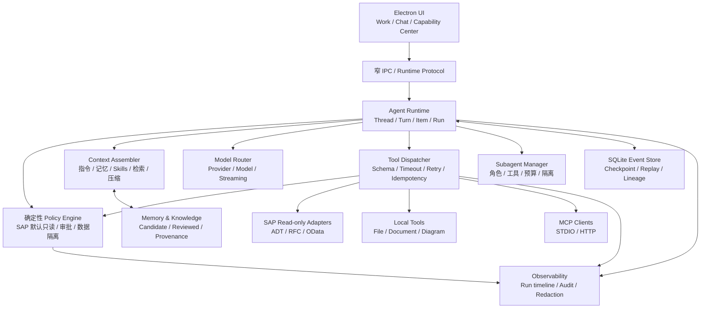

# 前沿 Agent 产品技术对标研究

> 研究对象：OpenAI Codex、Anthropic Claude Code、OpenClaw、Nous Research Hermes Agent  
> 资料截止日期：2026-07-31  
> 研究目的：为 SAP AI 顾问工作台的独立 Agent runtime、Skills、MCP、记忆、上下文管理、子 Agent、安全与恢复机制提供可落地依据。

## 1. 结论摘要

SAP AI 顾问工作台有必要建设独立的 Agent runtime，但不应复制任何一个通用 Agent 产品的全部能力，也不应把 Codex CLI、Claude Code 或其他外部 Agent 当成核心中转层。

建议吸收四个项目中最成熟、最适合本产品的部分：

- **Codex**：采用 `Thread -> Turn -> Item` 事件模型、流式事件协议、恢复/分叉/中断语义、渐进式 Skills 加载和细粒度 MCP 配置。
- **Claude Code**：采用可审阅的 Markdown 指令与记忆、确定性 hooks、会话 checkpoint、隔离的子 Agent 上下文。
- **OpenClaw**：采用按会话串行队列、写锁、幂等键、过期运行保护、watchdog、可读压缩摘要和元数据审计。
- **Hermes Agent**：采用 provider-neutral 模型适配、分层 prompt cache、SQLite 会话谱系、分阶段 Skills 写入和 MCP 进程生命周期管理。

同时必须坚持 SAP 场景的硬边界：

1. **SAP 只读是代码级策略，不是系统提示词。**
2. **Project、Case、SAP connection、会话和记忆必须严格隔离。**
3. **原始事件和证据不可被压缩摘要替代。**
4. **Skills、MCP、子 Agent 默认最小权限；自动生成或修改能力必须先进入待审核区。**
5. **稳定恢复、审计和可解释性优先于多 Agent 数量、工具数量和自动化程度。**

本报告是产品和架构对标，不是当前代码完成度审计。文中“建议采用”不代表仓库已经实现。

## 2. 研究边界与可信度

### 2.1 证据等级

| 等级 | 证据 | 可用于什么结论 |
| --- | --- | --- |
| A | 官方源码与官方协议/开发文档可相互验证 | runtime、状态模型、工具循环、存储结构等关键结论 |
| B | 官方产品文档描述行为，但核心实现未完整开源 | 用户可观察行为、配置语义、产品能力边界 |
| C | 官方发布说明、产品介绍或示例 | 只作背景，不用于推断未公开的底层实现 |

本报告不使用营销二手稿、非官方博客、反编译内容、泄露或转载的系统提示词作为关键证据。

### 2.2 同名项目与公开范围说明

#### OpenAI Codex

本文的 Codex 指 [openai/codex](https://github.com/openai/codex) 中公开的 CLI、Rust runtime、App Server、协议和配套官方文档。该仓库足以研究公开 runtime 和客户端协议，但**不能据此断言 Codex Desktop、云端执行和 OpenAI 内部编排的全部实现均已开源**。

#### Anthropic Claude Code

本文的 Claude Code 指 [anthropics/claude-code](https://github.com/anthropics/claude-code) 及 [Claude Code 官方文档](https://code.claude.com/docs/en/overview)。官方仓库包含发布、插件、示例和问题跟踪材料，但核心运行时没有以与 Codex Rust runtime 同等可审计的方式完整公开。因此，本文对 Claude Code 的底层行为使用 **B 级官方文档证据**，不使用网络流传的所谓“完整系统提示词”推断实现。

#### OpenClaw

本文的 OpenClaw 专指 OpenClaw Foundation 的 [openclaw/openclaw](https://github.com/openclaw/openclaw) 和 [docs.openclaw.ai](https://docs.openclaw.ai/)。不包含同名的游戏、P2P、研究样例或其他组织仓库。

#### Nous Research Hermes

“Hermes”同时可指 Nous Research 的模型系列、Agent 产品及其他无关项目。本文只研究 Nous Research 官方的 [NousResearch/hermes-agent](https://github.com/NousResearch/hermes-agent) 和 [Hermes Agent 官方文档](https://hermes-agent.nousresearch.com/docs/)，不把 Hermes 模型能力等同于 Hermes Agent runtime 能力。

## 3. 横向对比

| 维度 | OpenAI Codex | Claude Code | OpenClaw | Hermes Agent |
| --- | --- | --- | --- | --- |
| 公开可信度 | A：核心 Rust runtime、App Server 和协议公开 | B：行为文档充分，核心 runtime 未同等公开 | A：Gateway、Agent loop 和存储实现公开 | A：Python runtime、存储和工具实现公开 |
| Runtime | Rust runtime + App Server；面向多种客户端 | 本地 coding agent；终端、IDE 和 hooks 深度结合 | 长驻 Gateway + channel/session 路由 + Agent runner | Provider-neutral `AIAgent`，CLI/Gateway/ACP/API 多入口 |
| 工具循环 | Turn 内持续产生 model/tool/approval/item 事件 | 收集上下文、行动、验证、重复 | 会话队列串行执行，流式生命周期事件 | 模型请求、工具分发、结果回填循环 |
| Skills | `SKILL.md` 渐进加载，目录可带脚本、参考资料和资产 | 个人/项目 Skills，支持自动或显式调用 | 多来源发现、优先级、allowlist、快照 | Agent Skills 兼容，三级渐进披露，可自动创建 |
| MCP | STDIO、Streamable HTTP、OAuth、工具 allow/deny/approval | local/project/user scope，`.mcp.json` 需信任 | 以工具和 Gateway 扩展为主 | STDIO/HTTP/OAuth/mTLS、过滤和进程回收 |
| 记忆 | 本地 memory 功能可配置；明确不应存秘密 | `CLAUDE.md`、auto memory、按需主题文件 | Markdown 长期记忆、daily notes、检索和候选晋升 | 有界 `MEMORY.md`/`USER.md`，会话启动快照 |
| 上下文压缩 | 显式 compact；Responses API 可使用不透明 compaction item | 自动 compact 后重新加载关键项目指令 | 可读摘要持久化，保留近期尾部和原始历史 | 双层压缩、保护近期尾部、保留 session lineage |
| 子 Agent | 独立 thread，继承 sandbox/permission，可配置角色 | 独立上下文/工具/权限，结果摘要返回父会话 | delegate 身份与工具策略分离 | 可组合工具与 Agent 能力，公开实现相对轻量 |
| 权限 | `approval_policy` + `sandbox_mode` + MCP 工具审批 | allow/ask/deny + permission mode + hooks | tool policy、exec approval、sandbox、channel allowlist | smart/manual/off 审批、文件与容器安全 |
| 恢复 | thread resume/fork/read/archive；turn interrupt/steer | resume/fork/rewind；文件 checkpoint | runId、队列、锁、watchdog、过期运行保护 | SQLite WAL、FTS5、会话谱系、导出和裁剪 |
| 可观测性 | 结构化 Item/event、状态和 usage | hooks、JSONL 会话、工具结果 | 生命周期流、日志、脱敏、元数据审计 | token/cost、session/tool 日志、SQLite 检索 |

### 3.1 总体判断

- **协议与事件建模**：Codex 最值得参考。
- **用户可读指令、checkpoint 和项目级工作方式**：Claude Code 最成熟。
- **长时间运行稳定性、队列、恢复和审计**：OpenClaw 的工程细节最有参考价值。
- **独立 provider runtime、上下文缓存和轻量本地实现**：Hermes Agent 最接近可复用的开源样板。
- **SAP 产品落地**：不能直接复刻任何一个。四者均为通用 Agent，默认权限、自动学习或工具范围都可能超过 SAP 顾问工作台应有边界。

## 4. OpenAI Codex

### 4.1 Agent runtime 与工具循环

[Codex App Server](https://developers.openai.com/codex/app-server) 为图形客户端和 IDE 提供双向 JSON-RPC 2.0 接口。公开协议将运行状态拆分为：

- **Thread**：持久会话，可创建、读取、恢复、分叉、归档和删除。
- **Turn**：一次用户输入触发的运行，可开始、追加指令、打断和压缩。
- **Item**：消息、推理、命令、文件修改、MCP 调用、审批、压缩等可流式观察单元。

默认 stdio 传输使用 JSONL；WebSocket 仍标记为实验性。App Server 对初始化握手、服务器事件、队列过载和客户端恢复都有明确约定。官方源码说明见 [codex-rs/app-server/README.md](https://github.com/openai/codex/blob/main/codex-rs/app-server/README.md)。

这个模型的关键价值不是“会调用工具”，而是把一次 Agent 运行拆成可持久化、可重放、可审批和可中断的状态机。工具调用不是聊天文本中的特殊字符串，而是明确的 Item 和事件。

### 4.2 Skills 与 MCP

[Agent Skills](https://developers.openai.com/codex/build-skills) 采用渐进披露：

1. 初始只把 Skill 名称、描述和路径放入上下文。
2. 模型确定相关后再读取完整 `SKILL.md`。
3. 脚本、参考资料和资产按需要继续加载。

这降低了安装大量 Skills 后的基础上下文成本。Skill 可以带 `scripts/`、`references/`、`assets/` 和 Agent 配置，但能力边界仍需由 runtime 工具权限控制。

[Codex MCP](https://developers.openai.com/codex/extend/mcp) 支持 STDIO 和 Streamable HTTP，并支持 bearer token、OAuth、服务器启停、必需服务器、工具 allow/deny 与单工具审批。用户级和受信任项目级配置分开，降低项目文件静默提升权限的风险。

### 4.3 记忆与上下文压缩

[Codex Memories](https://developers.openai.com/codex/customization/memories) 是可选本地能力，官方明确强调不要把秘密存入记忆。记忆应被视为辅助上下文，而不是安全策略。

Codex 同时存在两种相关压缩语义：

- App Server 的 `thread/compact/start`：压缩作为正常 Turn/Item 事件流的一部分。
- Responses API 的 [Compaction](https://developers.openai.com/api/docs/guides/compaction)：服务端可在阈值后返回不透明压缩 item，后续请求继续携带它。

后一种方式适合模型连续性，但不适合单独承担 SAP 审计，因为用户无法仅凭不透明 item 复核压缩内容。

### 4.4 子 Agent、权限、恢复与可观测性

[Codex Subagents](https://developers.openai.com/codex/subagents) 使用独立 thread，并可配置角色、模型、推理强度和工具。子 Agent 继承 sandbox 与 permission mode，避免通过委派绕过父任务边界。

[配置参考](https://developers.openai.com/codex/config-reference) 将 `approval_policy`、`sandbox_mode`、provider、MCP 和 telemetry 分离。敏感配置不能被项目级文件任意覆盖，项目配置也要求信任。

恢复能力包括 thread resume/fork、turn interrupt/steer、历史读取和归档。Item/event 结构天然适合 UI 显示执行阶段、审批请求、token usage 和错误。

### 4.5 对 SAP AI 顾问工作台的取舍

**适合采用**

- `Thread -> Turn -> Item` 作为会话、运行和事件的主模型。
- 流式事件、明确运行状态、取消、恢复、分叉和幂等重试。
- Skills 渐进加载和 MCP 单工具审批。
- Runtime 与 Electron UI 通过窄协议通信。

**不适合照搬**

- 不应让 Codex CLI 成为所有模型和工具的必经中转。
- 不应把 provider 的不透明压缩 item 当作唯一历史记录。
- 不应开放可绕过 SAP 工具网关的通用 shell 或任意文件权限。
- 不应假定公开 Codex 仓库等同于 Codex Desktop/Cloud 的全部实现。

## 5. Anthropic Claude Code

### 5.1 Agent runtime 与工具循环

[How Claude Code works](https://code.claude.com/docs/en/how-claude-code-works) 将工作过程描述为“收集上下文、采取行动、验证结果、重复”。工具结果会回到模型上下文，模型根据新状态决定下一步。

该模式的重要启示是：Agent 不应把“生成答案”当作终点，而应根据任务类型执行验证。不过，Claude Code 的核心 runtime 未以等同 Codex 的协议和源码形式完整公开，因此不能从官方仓库推断其全部内部调度细节。

### 5.2 Skills、MCP 与 hooks

[Claude Code Skills](https://code.claude.com/docs/en/skills) 支持个人级 `~/.claude/skills` 和项目级 `.claude/skills`，可由模型自动选择，也可由用户显式调用。Skill 可以引用相邻文件和脚本。

[MCP 配置](https://code.claude.com/docs/en/mcp) 有 local、project、user scope。项目 `.mcp.json` 需要用户确认，避免克隆仓库后自动信任外部服务器。

[Hooks](https://code.claude.com/docs/en/hooks-guide) 是 Claude Code 对 SAP 产品最有价值的能力之一。它把关键控制放在确定性生命周期事件上，而不是依赖模型“记住规则”。例如，工具调用前检查、调用后验证、会话结束审计都可以由 hooks 实现。

### 5.3 记忆与压缩

[Memory](https://code.claude.com/docs/en/memory) 主要由以下层次组成：

- `CLAUDE.md`：项目或目录范围的人工指令。
- Auto memory：模型维护的长期工作笔记。
- 主题文件：按需要读取。

Auto memory 使用普通 Markdown。主 `MEMORY.md` 只预加载有限内容，其余主题按需读取。这种结构可审阅、可版本管理，也有利于控制基础上下文。

重要边界是：`CLAUDE.md` 和 memory 都只是上下文，不是不可绕过的权限策略。官方建议关键限制使用 permission 和 `PreToolUse` hook。

会话压缩后，项目根部 `CLAUDE.md` 会重新加载，以降低核心约束丢失的概率。

### 5.4 子 Agent、权限与恢复

[Subagents](https://code.claude.com/docs/en/sub-agents) 可以拥有独立上下文、自定义系统提示词、工具和权限。父 Agent 只接收子 Agent 返回的结果，适合把大型搜索或专项审查隔离出去。fork 模式则继承父上下文，适合需要完整背景的分支任务。

[Permissions](https://code.claude.com/docs/en/permissions) 使用 allow/ask/deny 和不同 permission mode。被拒绝的 MCP 工具可以不进入模型工具上下文，既降低风险，也减少上下文占用。

[Checkpointing](https://code.claude.com/docs/en/checkpointing) 在代码修改前保存受影响文件快照，并支持会话 resume、fork 和 rewind。会话以 JSONL 形式保存在本地项目目录下，便于恢复和检查。

### 5.5 对 SAP AI 顾问工作台的取舍

**适合采用**

- 将“硬策略、人工项目指令、工作记忆、经验候选”分层。
- 使用普通 Markdown 保存可审阅记忆和 Skills。
- 用确定性 hooks 实现调用前检查、调用后验证和成果沉淀。
- 子 Agent 默认独立上下文和最小工具集。
- 为 Case 提供 checkpoint、恢复和分叉。

**不适合照搬**

- SAP 只读、客户隔离和秘密保护不能只写在提示词或记忆中。
- 不应默认提供 coding agent 式通用终端能力。
- 不应让模型自动写入的 memory 直接成为正式 SAP 知识。
- 不应把官方仓库误认为已公开全部 Claude Code runtime。

## 6. OpenClaw

### 6.1 Agent runtime 与工具循环

[OpenClaw Architecture](https://docs.openclaw.ai/concepts/architecture) 以长驻 Gateway 为中心，负责 channel、session、routing 和 Agent 执行。客户端通过类型化 WebSocket 请求、响应和事件交互。

[Agent Loop](https://docs.openclaw.ai/concepts/agent-loop) 的执行过程具有几个关键工程特征：

- 同一 session 的 Agent run 串行排队。
- 工具和 lifecycle 事件持续流式输出。
- side effect 使用幂等键和去重。
- session transcript 变更、压缩和截断使用写锁。
- 过期 run 不能覆盖更新 generation 的状态。
- run 可通过 runId 等待、超时并进行 stall recovery。

这些机制比单纯“流式文字输出”更重要，直接决定长任务是否会重复执行、历史是否损坏、应用重启后是否能继续。

### 6.2 Skills、记忆与压缩

[Skills](https://docs.openclaw.ai/tools/skills) 支持 workspace、个人、状态目录、bundled 和额外路径等多来源发现，并通过优先级、allowlist 和快照控制生效范围。Skill 在磁盘上的位置与某个 Agent 是否可用是两个独立概念。

[Memory](https://docs.openclaw.ai/concepts/memory) 使用普通 Markdown，包括 `USER.md`、`MEMORY.md` 和每日记录；支持检索、候选评分和压缩前 memory flush。官方明确指出 memory 不承担权限强制。

[Compaction](https://docs.openclaw.ai/concepts/compaction) 将可读摘要写入 transcript，保留近期消息尾部和工具调用/结果配对，完整历史仍留在磁盘。它还区分持久压缩与仅在内存中裁剪较旧工具结果。

这种“原始历史不丢、摘要可读、近期上下文保留”的做法非常适合 SAP 证据链。

### 6.3 子 Agent、权限、恢复与可观测性

[Delegate Architecture](https://docs.openclaw.ai/concepts/delegate-architecture) 把身份、人格和 Gateway 工具权限分开，支持分层能力和显式委派。

[Security](https://docs.openclaw.ai/gateway/security) 明确指出，prompt injection 不能靠系统提示词彻底解决，必须依赖 tool policy、exec approval、sandbox 和 channel allowlist。[Sandboxing](https://docs.openclaw.ai/gateway/sandboxing) 可以把工具执行放入隔离环境，但其默认关闭，这一点不适合直接沿用到 SAP 产品。

[Logging](https://docs.openclaw.ai/logging) 支持敏感信息脱敏和只记录元数据的审计 ledger，避免把 prompt、工具参数、工具结果和原始错误直接写入审计日志。

### 6.4 对 SAP AI 顾问工作台的取舍

**适合采用**

- 每个 Case/session 串行队列、写锁、幂等键和 stale-run 防护。
- watchdog、运行超时、重试分类和崩溃恢复。
- 可读压缩摘要、原始历史保留、工具调用与结果成对保存。
- 元数据审计与秘密脱敏。
- Agent 身份、提示词和工具权限分离。

**不适合照搬**

- 不使用跨客户共享的主会话或统一长期记忆。
- MVP 不需要广泛的消息 channel、个人助理入口和大量内置工具。
- sandbox 不应默认关闭。
- 不允许 Skills 或记忆候选未经审核自动晋升为正式知识。
- UI 不能依赖“事件不重放”的临时连接；必须从本地事件存储恢复。

## 7. Nous Research Hermes Agent

### 7.1 Agent runtime 与工具循环

[Hermes Agent Architecture](https://hermes-agent.nousresearch.com/docs/developer-guide/architecture) 的核心是 provider-neutral `AIAgent`。CLI、Gateway、ACP、API 和 Python 入口最终复用模型解析、prompt 构建、工具分发和会话存储。

[Agent Loop](https://hermes-agent.nousresearch.com/docs/developer-guide/agent-loop) 将模型请求与工具执行迭代分开，并支持中断长时间 API 调用。该项目以 Python 实现，适合研究 provider adapter 和工具注册，但不意味着 Electron 产品也应将 Python 作为核心依赖。

### 7.2 Skills、MCP 与权限

[Skills](https://hermes-agent.nousresearch.com/docs/user-guide/features/skills) 与 Agent Skills 结构兼容，并使用三级渐进披露：

1. 只暴露 Skill 基本信息。
2. 选中后加载完整说明。
3. 需要时加载参考文件。

Hermes 可自动创建和更新 Skills。官方提供 `skills.write_approval`，开启后先把变更放入 `~/.hermes/pending/skills`。对 SAP 产品而言，应采用“始终暂存并审核”，而不是自由写入作为默认值。

[MCP](https://hermes-agent.nousresearch.com/docs/user-guide/features/mcp) 支持 STDIO、HTTP、OAuth、mTLS、工具过滤、环境隔离和进程生命周期回收。进程寿命和空闲回收对长期运行桌面应用很有价值。

[Security](https://hermes-agent.nousresearch.com/docs/user-guide/security) 提供用户认证、危险命令审批、文件写入保护、容器隔离、MCP 环境隔离和跨会话隔离。`smart` 审批会借助辅助模型判断风险，这可以改善体验，但不应成为 SAP 写操作的唯一决策层。

### 7.3 记忆、上下文压缩与恢复

[Context Compression and Caching](https://hermes-agent.nousresearch.com/docs/developer-guide/context-compression-and-caching) 将 prompt 分成稳定、上下文和易变部分，以提高 provider prompt cache 命中率。它同时使用：

- 接近上下文上限时的安全压缩。
- Agent loop 内更早触发的压缩。
- 受保护的近期消息尾部。
- 可替换的 context engine。

[Session Storage](https://hermes-agent.nousresearch.com/docs/developer-guide/session-storage) 使用 SQLite WAL 和 FTS5，压缩产生新会话时保留 `parent_session_id` 谱系，并记录 token/cost 等信息。

[Memory](https://hermes-agent.nousresearch.com/docs/user-guide/features/memory) 使用有界 `MEMORY.md` 和 `USER.md`，在会话开始时形成快照。限制文件体积有助于稳定缓存，但不足以承载 SAP landscape、跨系统差异、项目规范和长期知识。

### 7.4 对 SAP AI 顾问工作台的取舍

**适合采用**

- Provider-neutral runtime 和统一 adapter。
- 稳定/上下文/易变 prompt 分层与缓存。
- SQLite WAL、FTS5、会话谱系、来源标签和 token/cost 统计。
- MCP 进程回收与环境隔离。
- Skills 自动修改进入 pending 区后人工确认。

**不适合照搬**

- 不允许 Skills 默认自由自修改。
- 不把辅助 LLM 风险判断当作 SAP 操作的最终审批。
- 不用少量扁平 Markdown 替代结构化 Project/Case/connection 数据。
- 不在首版引入大量通用工具、channel 和 Python 运行依赖。

## 8. 面向 SAP AI 顾问工作台的目标架构

### 8.1 Runtime 状态模型

建议至少包含以下实体：

- `Conversation`：用户看到的会话，区分 Daily chat 与 Case conversation。
- `Thread`：runtime 持久执行上下文，可恢复和分叉。
- `Turn`：一次用户输入触发的运行。
- `Item`：用户消息、模型增量、工具调用、工具结果、审批、错误、压缩和成果。
- `Run`：可排队、运行、中断、失败、恢复或完成的执行实例。
- `Checkpoint`：可恢复的一致状态，包括上下文版本和文件快照引用。

所有状态变化应先写入本地事件存储，再通知 UI。应用崩溃或流式连接中断后，UI 应从 SQLite 重放，而不是依赖内存中的最后一个 token。

### 8.2 工具循环

推荐流程：

1. 接收用户消息并立即持久化，清空输入框。
2. 建立带幂等键的 Run，进入对应 Project/Case 串行队列。
3. Policy Engine 计算允许暴露给模型的工具。
4. Context Assembler 按预算加载指令、相关 Skills、记忆和证据。
5. Model Router 发起流式请求。
6. 模型请求工具时，先做 schema 校验、权限判断、审批和超时控制。
7. 工具结果持久化后回填模型；必要时继续循环。
8. 输出完成后运行验证 hooks、成果沉淀和记忆候选提取。
9. 持久化 final state、usage、来源和审计元数据。

同一 Case 默认只允许一个修改状态的 Run。只读研究可并行，但必须有独立 generation，旧 Run 不得覆盖新状态。

### 8.3 权限模型

权限必须分四层：

1. **不可被提示词覆盖的产品硬策略**：SAP 默认只读、秘密不进入模型、Project 隔离。
2. **用户明确授权**：当前 Turn 或当前 Case 的审批。
3. **Agent/Skill/MCP 工具 allowlist**：只向模型暴露必要工具。
4. **执行隔离**：受限文件根目录、命令白名单、MCP 环境变量隔离和进程超时。

任何 SAP 写入、激活、传输、过账、删除或批量修改，即使未来开发，也必须使用独立 capability、明确预览、二次确认和可审计结果，不能复用通用“执行命令”权限。

### 8.4 记忆分层

建议使用六层：

| 层 | 内容 | 写入方式 | 是否自动注入 |
| --- | --- | --- | --- |
| Policy | SAP 只读、秘密保护、审批规则 | 随版本发布，用户不可通过对话改写 | 始终，但由代码执行 |
| User profile | 用户偏好、语言、常用交付格式 | 用户编辑或候选确认 | 按需 |
| Project memory | landscape 摘要、系统角色、命名规范、项目约束 | 配置或审核确认 | 当前 Project |
| Case working memory | 当前问题、假设、证据索引、未决事项 | Turn 后更新，可回滚 | 当前 Case |
| Experience candidate | 可复用经验、失败原因、修复路径 | Agent 提议，等待审核 | 不自动作为事实 |
| Reviewed knowledge | 已审核 SAP 知识和项目知识 | 用户发布 | 检索后按来源注入 |

检索必须同时考虑 scope、来源、更新时间、置信状态和敏感级别。Project A 的记忆不能因语义相似进入 Project B。

### 8.5 上下文压缩

压缩必须生成可审阅记录，至少包含：

- 压缩前事件范围和 hash。
- 保留的用户目标、约束、已确认事实和未决事项。
- 工具调用与结果的配对引用。
- SAP connection、对象名、Client、System ID 等不可模糊化标识。
- 生成摘要使用的模型、时间和版本。
- 最近消息尾部和当前任务状态。

原始事件不可删除。压缩摘要只用于后续模型上下文，不能替代证据文件、工具结果或审计日志。

### 8.6 Skills

Skills 应采用“发现、校验、启用、按需加载、运行、审核更新”的生命周期：

1. 扫描用户级 `~/.sap-ai-workbench/skills` 和项目级 `.sap-ai-workbench/skills`。
2. 解析并校验 `SKILL.md` frontmatter、引用路径和脚本。
3. 显示来源、scope、版本、工具需求和风险。
4. 由用户启用到指定 Project。
5. 只把名称、描述和路径放入基础上下文。
6. 模型命中后加载完整 Skill 和必要参考文件。
7. 脚本运行仍经过 Tool Policy，不因来自 Skill 自动获得权限。
8. Agent 生成的修改进入 pending，用户 diff 确认后生效。

Skills 是“任务方法和上下文包”，不是可绕过权限的插件程序。

### 8.7 MCP

第一阶段只需支持：

- STDIO 和 Streamable HTTP。
- 用户级与 Project 级 scope。
- 服务器启停、健康检查、超时和自动重连。
- 工具 allowlist/denylist。
- OAuth/token 引用进入系统安全存储，不写入配置明文。
- 每个工具的风险级别和审批策略。
- 进程崩溃、空闲和最大寿命回收。

不要一开始建设公开 MCP 市场。SAP 客户环境更需要可控导入、内部来源和离线使用。

### 8.8 子 Agent

首版建议只提供少量固定角色：

- SAP evidence researcher：只读 SAP 和本地证据。
- Specification writer：生成开发说明书、测试说明和流程图。
- Reviewer：对结论、来源和交付物做交叉检查。

约束：

- 默认独立上下文。
- 工具集和 Project/Case scope 显式传入。
- 不允许递归创建子 Agent。
- 有最大并发、token、时间和工具调用预算。
- 子 Agent 只返回结构化结果和来源，父 Agent 决定是否采纳。
- 子 Agent 不能扩大父任务权限。

### 8.9 恢复与可观测性

最低要求：

- 用户消息入库后再开始模型请求。
- 每个 Run 有状态、心跳、超时和取消。
- 流式事件断线后可按 cursor 重放。
- 工具调用有 idempotency key，重试不会重复 side effect。
- SQLite WAL、事务和 schema migration 可恢复。
- 应用重启后标记并处理 orphaned run。
- UI 显示“排队、连接模型、调用工具、等待审批、验证、完成/失败”。
- 错误用中文解释，保留 HTTP、ADT Service、MCP 等必要技术关键词和可复制诊断 ID。
- 审计只保存必要元数据；prompt、SAP 数据、密钥和工具完整参数默认不进入日志。

## 9. 不应复制的设计

1. **用系统提示词代替权限系统**：四个产品的一手资料都不能支持这种做法。
2. **默认开放通用 shell**：对 SAP 顾问产品风险过高。
3. **把自动记忆直接当正式知识**：会放大错误和跨项目污染。
4. **让 Skills 自动修改后立即生效**：必须暂存、校验和审核。
5. **所有已安装工具都放入每次模型上下文**：会增加成本、误调用和 prompt injection 面。
6. **依赖单一 provider 的不透明压缩状态**：不满足本地审计和迁移需求。
7. **追求大量子 Agent**：并发越多，权限、成本、竞态和恢复越复杂。
8. **把 Codex/Claude Code 当产品内核**：会形成外部安装、账号、版本和协议耦合。
9. **把通用个人助理的 channel 范围带入 SAP MVP**：与核心用户任务无关。

## 10. 建议实施顺序

### P0：稳定与安全底座

- Thread/Turn/Item/Run 事件模型。
- SQLite 持久化、事务、重放、checkpoint 和 migration。
- Model provider adapter 和稳定流式输出。
- 确定性 Policy Engine、SAP 只读和秘密隔离。
- 工具超时、取消、幂等、重试分类、watchdog。
- 中文错误与元数据审计。

### P1：上下文与可复用能力

- Context Assembler 和 token budget。
- 可读压缩、原始事件保留和来源引用。
- Skills 发现、校验、scope、渐进加载和 pending 更新。
- 分层记忆、候选审核和 Project 隔离。

### P2：扩展生态

- MCP STDIO/HTTP、健康检查、审批和进程回收。
- 固定角色子 Agent、预算和结果结构。
- 规范中心、知识库和 Case 成果与 runtime 事件打通。

### P3：稳定后再评估

- 自动经验晋升。
- 更多子 Agent 角色。
- 外部 channel。
- Skills/MCP 市场。
- 高风险 SAP 写能力。

## 11. 产品验收标准

正式演示或销售前，至少应验证：

1. 模型流中断、应用退出和电脑重启后，用户消息、工具状态和结果均可恢复。
2. 同一消息重复提交不会重复执行工具。
3. 未配置 SAP 时 Chat 和本地 Work 正常；配置错误只影响 SAP 工具。
4. SAP 默认只读在断网、重试、Skill、MCP 和子 Agent 路径下都不能绕过。
5. Project/Case 间进行交叉污染测试，记忆、文件、connection 和检索结果均隔离。
6. Skills 只在启用 scope 内可见；错误格式可解释；脚本仍需权限。
7. MCP 崩溃、超时和返回异常数据时，主会话可继续或安全失败。
8. 压缩前后，用户目标、SAP 标识、工具结果配对和待办项保持一致。
9. 子 Agent 超时或失败不会破坏父会话；不能获取父任务未授权工具。
10. 所有关键动作有可读时间线和诊断 ID，日志不包含 password、API Key、token 或 SAP 业务正文。

## 12. 一手资料索引

### OpenAI Codex

- [openai/codex 官方源码](https://github.com/openai/codex)
- [Codex App Server](https://developers.openai.com/codex/app-server)
- [App Server protocol README](https://github.com/openai/codex/blob/main/codex-rs/app-server/README.md)
- [Agent Skills](https://developers.openai.com/codex/build-skills)
- [MCP](https://developers.openai.com/codex/extend/mcp)
- [Subagents](https://developers.openai.com/codex/subagents)
- [Memories](https://developers.openai.com/codex/customization/memories)
- [Compaction](https://developers.openai.com/api/docs/guides/compaction)
- [Codex config reference](https://developers.openai.com/codex/config-reference)

### Anthropic Claude Code

- [anthropics/claude-code 官方仓库](https://github.com/anthropics/claude-code)
- [How Claude Code works](https://code.claude.com/docs/en/how-claude-code-works)
- [Memory](https://code.claude.com/docs/en/memory)
- [Skills](https://code.claude.com/docs/en/skills)
- [MCP](https://code.claude.com/docs/en/mcp)
- [Subagents](https://code.claude.com/docs/en/sub-agents)
- [Permissions](https://code.claude.com/docs/en/permissions)
- [Checkpointing](https://code.claude.com/docs/en/checkpointing)
- [Hooks](https://code.claude.com/docs/en/hooks-guide)

### OpenClaw

- [openclaw/openclaw 官方源码](https://github.com/openclaw/openclaw)
- [Architecture](https://docs.openclaw.ai/concepts/architecture)
- [Agent runtime](https://docs.openclaw.ai/concepts/agent)
- [Agent loop](https://docs.openclaw.ai/concepts/agent-loop)
- [Session](https://docs.openclaw.ai/concepts/session)
- [Memory](https://docs.openclaw.ai/concepts/memory)
- [Compaction](https://docs.openclaw.ai/concepts/compaction)
- [Delegate architecture](https://docs.openclaw.ai/concepts/delegate-architecture)
- [Skills](https://docs.openclaw.ai/tools/skills)
- [Gateway security](https://docs.openclaw.ai/gateway/security)
- [Sandboxing](https://docs.openclaw.ai/gateway/sandboxing)
- [Logging](https://docs.openclaw.ai/logging)

### Nous Research Hermes Agent

- [NousResearch/hermes-agent 官方源码](https://github.com/NousResearch/hermes-agent)
- [Architecture](https://hermes-agent.nousresearch.com/docs/developer-guide/architecture)
- [Agent loop](https://hermes-agent.nousresearch.com/docs/developer-guide/agent-loop)
- [Context compression and caching](https://hermes-agent.nousresearch.com/docs/developer-guide/context-compression-and-caching)
- [Session storage](https://hermes-agent.nousresearch.com/docs/developer-guide/session-storage)
- [Memory](https://hermes-agent.nousresearch.com/docs/user-guide/features/memory)
- [Skills](https://hermes-agent.nousresearch.com/docs/user-guide/features/skills)
- [MCP](https://hermes-agent.nousresearch.com/docs/user-guide/features/mcp)
- [Security](https://hermes-agent.nousresearch.com/docs/user-guide/security)

## 13. 最终建议

SAP AI 顾问工作台不需要成为另一个 Codex、Claude Code、OpenClaw 或 Hermes。它应成为一个更窄、更可靠的 SAP 专业 Agent：

- 独立 provider runtime，避免绑定外部 Agent。
- 事件驱动、可恢复、可解释，而不是只做一个聊天请求封装。
- 用代码策略保护 SAP，用提示词和 Skills 提升专业度。
- 用 Project/Case/connection scope 隔离客户数据。
- 用审核后的知识和带来源记忆实现“越用越强”，而不是无边界自动学习。
- 先把单 Agent 的稳定循环做到可靠，再增加 MCP 和少量专业子 Agent。

四个项目真正共同证明的不是“工具越多越先进”，而是：**Agent 产品的核心竞争力来自状态管理、上下文治理、权限边界和故障恢复。** 这四项应成为 SAP AI 顾问工作台下一阶段的主线。
