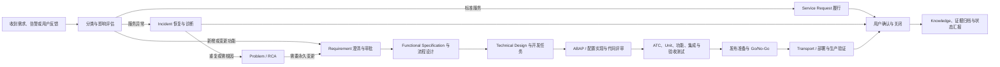

# 中国 SAP 日常运维 Skills：官方方法论与一手资料研究

> 研究日期：2026-08-01
> 范围：面向中国企业内部 SAP 应用运维/AMS 的通用工作流；实施板块仅保留边界，不展开。
> 来源原则：以 SAP Help Portal、SAP 官方产品页、SAP 官方 GitHub 和 SAP 官方公开资料为主。除“PA”术语澄清外，不使用第三方教程作为方法论依据。

## 1. 结论先行

1. 旧工作区里的个人提示词、历史交付物和个人习惯，适合用作“场景样本”和“失败案例库”，不应直接成为内置 Skill 的标准。内置 Skill 的骨架应来自 SAP Activate、SAP Cloud ALM、SAP Solution Manager ITSM/ChaRM、SAP Signavio BPMN、ABAP Test Cockpit、ABAP Unit 和 SAP 官方 ABAP style guides。
2. 产品应明确分成“实施”和“运维”两个板块。当前只做运维；实施板块仅保留导航和未来扩展契约，避免把一次性实施项目的完整六阶段流程强塞给日常运维。
3. 运维不是一个大而全的 Skill。建议拆成 9 个有清楚输入、产物和质量门禁的 Skills，并由一个路由 Skill 先区分 Service Request、Incident、Problem、Change/New Requirement。
4. “需求—规格—开发—测试—发布”必须可追溯；“Incident—Problem—Change—Knowledge”必须可关联。两条链在变更审批处汇合，在验证、关闭和知识沉淀处闭环。
5. 所有默认模板都必须是“官方依据 + 通用工程实践”的基线，而不是某个客户的做法。客户/项目规则应通过配置层覆盖，并标注来源、版本、生效日期和审批人。
6. SAP 官方没有规定所有运维汇报必须采用某一种 PPT 目录或视觉模板。PPT Skill 应把 SAP 官方可追溯数据作为内容基础，把“受众、结论、风险、决策请求、证据附录”作为通用组织原则，并明确这是产品设计规则，不冒充 SAP 强制标准。

## 2. 证据等级

| 等级 | 含义 | 本报告用法 |
|---|---|---|
| A | 当前 SAP 官方产品页、SAP Help Portal、SAP 官方 GitHub 直接支持 | 可作为内置 Skill 的默认规则 |
| B | SAP 官方资料支持相邻事实，本文据此做了有限推导 | 可作为默认建议，但需标注“建议/推导” |
| C | 非 SAP 的正式标准机构资料 | 只能作为补充标准，不能称为 SAP 方法 |
| D | 中国本地实践或产品设计判断 | 必须作为可配置项，不能写成 SAP 官方要求 |

以下链接访问日期均为 **2026-08-01**。

## 3. “PA 资料”到底可能指什么

### 3.1 可以确认的部分

- SAP 中国培训部 2014 年公开资料使用过“PA 认证考试”这一称呼，并将其与 Associate level 及 FI、CO、MM、PP、SD、ABAP 等课程/认证并列，但该文件**没有展开 PA 的全称**。[SAP Education Greater China 2014 资料](https://cdn.training.sap.com/uploads/Education_Greater_China-final_20131030.pdf)（证据 B）
- SAP Community 的历史讨论中有人明确写出“PA = Partner Academy”。这是 SAP 官方社区上的用户内容，不等于当前 SAP 官方术语定义，只能说明该缩写在历史培训语境中的常见用法。[SAP Community：PA = Partner Academy](https://community.sap.com/t5/career-corner-discussions/sap-pa-certification-without-going-through-pa-training/td-p/7307218)（证据 D）
- SAP Activate 当前官方术语是 **accelerator（加速器）**：可为文档、模板、示例、指南或网页链接，用来帮助完成 roadmap 中的 task；Road Map Viewer 是访问 roadmaps、deliverables、tasks 和 accelerators 的官方入口。[SAP Activate 官方产品页](https://www.sap.com/products/erp/activate-methodology.html)、[SAP 官方 Focused Build 文档对 accelerator 的定义](https://help.sap.com/doc/2f7c2fe423154c628c8a84b9370fdda7/290/en-US/ConversiontoSAPS4HANAPCEwithFocusedBuild.pdf)（证据 A）

### 3.2 本项目应采取的解释

用户所说的“PA 资料”很可能指历史上的 SAP Partner Academy 培训教材，也可能泛指 SAP Activate 的模板/accelerator。两者不能混为一谈：

- Partner Academy 教材偏产品功能、课程和认证知识，适合补充模块知识，但不是日常运维流程标准。
- SAP Activate accelerators 偏项目/任务执行方法、模板和检查点，更适合作为工作流和文档模板的依据。
- 不应把来源不明、可能受版权约束的第三方流传 PDF 复制进仓库。产品应优先链接当前 SAP Help、SAP Learning、SAP for Me Road Map Viewer，并允许有合法访问权的用户在自己的 Project 中关联资料。

因此，本报告后续把“PA 资料”作为**需要继续按模块检索的学习资料类别**，把 SAP Activate accelerators 作为**方法论模板类别**。如果用户的 PA 有别的特定含义，需用一份真实样例或课程代码再做校准。

## 4. SAP 官方方法论基线

### 4.1 SAP Activate 的 Run 是运维顶层语境，不是单一工单流程

SAP Activate 将旅程组织为 Discover、Prepare、Explore、Realize、Deploy、Run 六阶段；Run 的目标是运行、支持并持续优化解决方案。Road Map Viewer 提供 roadmaps、deliverables、tasks、质量检查点和 accelerators。[SAP Activate 官方产品页](https://www.sap.com/products/erp/activate-methodology.html)（证据 A）

这意味着运维 Skills 应继承三个原则：

- 交付有阶段、有产物、有检查点；
- 上线后仍持续改进，而不是只“灭火”；
- 需要把需求、变更、测试、发布和运营证据连接起来。

但日常运维工单不应机械套用六阶段。对单个运维事项，更合适的是短生命周期：**受理与分类 → 分析/设计 → 实现/处理 → 验证 → 发布/恢复 → 关闭与知识化**。这是对 SAP 官方生命周期的产品化裁剪（证据 B）。

### 4.2 先区分四种工作对象

| 对象 | SAP 官方含义 | 日常运维中的路由规则 | 主要后续 |
|---|---|---|---|
| Service Request | 用户请求预定义服务或新服务；常规请求通常不需要 Request for Change | 账号/权限申请、标准报表重跑、已定义服务办理等 | 按服务目录和检查清单履行 |
| Incident | 非标准运行事件，导致服务中断或质量下降 | “原来能用、现在异常”，重点是尽快恢复 | 分级、诊断、workaround/solution、确认 |
| Problem | 一个或多个 Incident 的根因，需要预防复发或降低不可避免事件的影响 | 重复发生、影响面广、恢复后仍需 RCA | 根因、已知错误、永久修复、Knowledge/Change |
| Request for Change / Requirement | 对软件或公司系统功能的新增或修改，需要审批后实施 | 新需求、功能增强、配置/代码变化 | 需求、规格、测试、发布与追溯 |

依据：[SAP Service Request Management](https://help.sap.com/docs/SAP_Solution_Manager/8b923a2175be4939816f0981b73856c7/0e734fe329714455b1b0243ac76aee44.html?version=7.2.19)、[SAP Incident 定义](https://help.sap.com/docs/SAP_CUSTOMER_RELATIONSHIP_MANAGEMENT/ccd297fc53c04ef8b3d7abbfc301c40f/063c6bf9eb2c4465801af865d61e948e.html?version=7.0.4.19)、[SAP Problem Management](https://help.sap.com/docs/SAP_Solution_Manager/0611cd2e5d1e403c9ee7b6efad89e81b/1f35fb5cda804e71bfcf5c00326eb1fa.html)、[SAP Request for Change](https://help.sap.com/docs/SAP_Solution_Manager/8b923a2175be4939816f0981b73856c7/4c315d1fdcdd4ff695f350fc984b0647.html)（证据 A）

SAP 官方 Change Request Management 还明确给出 Requester、Service Employee、Change Manager、CAB、Developer、Tester、Administrator 等角色，并要求记录变更来源、实施者、实施时间、影响、范围、审批和测试。[Processing Requests for Change](https://help.sap.com/docs/SAP_Solution_Manager/c458e6a97c6746f2afb2a3d1bf0a630b/9c21caac7f864a1680d7a93b90fbccb6.html?locale=en-US&state=PRODUCTION&version=7.2.06)（证据 A）

### 4.3 新需求要形成从业务需要到发布的追溯链

SAP Cloud ALM 将 requirement 定义为客户视角的业务需要，通常在 fit-to-standard 中收集，可关联 process context、owner、priority、due date、审批等；Requirement 再拆为 user story、sub-task，并通过 feature、test case、transport、release 形成端到端关系。[Requirements](https://help.sap.com/docs/cloud-alm/applicationhelp/486b3301a36f49e38eacd9535ecbd9ff.html?locale=en-US)、[End-to-End Implementation Process](https://help.sap.com/docs/cloud-alm/applicationhelp/implementation-process)、[Requirement Traceability](https://help.sap.com/docs/cloud-alm/applicationhelp/requirement-traceability)（证据 A）

适用于运维新需求的最小追溯关系应为：

```text
业务目标/痛点
  → Requirement（范围、优先级、验收标准、审批）
  → 业务流程步骤 / 受影响对象
  → Functional Specification
  → Technical Design / Technical Specification
  → 开发任务 / ABAP 对象 / 配置项
  → 测试用例与结果 / Defect
  → Transport / Release / 上线窗口
  → 生产验证 / 关闭确认 / Knowledge
```

这条链是产品的默认数据和文档组织原则；不要求客户必须购买或使用 SAP Cloud ALM，但不能丢失等价的 ID 和关联（证据 B）。

### 4.4 Functional Specification 与 Technical Design 应分层

SAP Focused Build 官方文档说明：Functional Specification 和 Test Case 通常关联到业务流程步骤；Technical Design/Technical Specification 关联到 executable（例如 transaction）；文档可以从模板创建，并按状态推进。该文档同时给出开发、unit test、acceptance test、transport 和 release 的衔接。[SAP Focused Build 官方文档，第 33–45 页](https://help.sap.com/doc/2f7c2fe423154c628c8a84b9370fdda7/290/en-US/ConversiontoSAPS4HANAPCEwithFocusedBuild.pdf)（证据 A）

SAP Cloud ALM 文档对象支持 In Progress、In Review、Released，支持 owner/responsible、模板、版本和审批状态。[Creating Documents](https://help.sap.com/docs/cloud-alm/applicationhelp/a1e482a58c504908adb69107de0c19a4.html)（证据 A）

因此，默认开发说明书不能把“业务规则、流程、字段映射、技术对象、代码实现、测试、发布”混成一段。至少分成：

1. 需求与业务背景；
2. As-Is / To-Be 和流程边界；
3. 功能规则、角色、数据、异常和验收；
4. 技术设计、对象清单、接口/增强点、授权、性能和日志；
5. 测试矩阵、发布/回退和追溯关系。

章节名称可由客户模板覆盖，但语义边界不能消失（证据 B）。

### 4.5 流程图采用 BPMN 语义和建模约定

SAP Signavio Process Manager 支持 BPMN 业务流程模型，并区分 pools、lanes、tasks、events、gateways、sequence flows 和 message flows；其语法检查覆盖元素连接、gateway 方向一致性和基础 BPMN 2.0 合规。[Modeling Notations](https://help.sap.com/docs/signavio-process-manager/user-guide/fa88cd406dad1014a4730ff5fb2ca89e.html)、[Model a BPMN Diagram](https://help.sap.com/docs/signavio-process-manager/user-guide/model-bpmn?locale=en-US&version=SHIP)、[Add and Connect Elements](https://help.sap.com/docs/signavio-process-manager/user-guide/add-elements)（证据 A）

SAP Signavio 还提供 SAP best-practice modeling convention，并允许组织自定义 notation、labeling、process structure、layout 和 mandatory attributes 规则。[Managing Modeling Conventions](https://help.sap.com/docs/signavio-process-manager/workspace-admin-guide/manage-modeling-conventions)（证据 A）

因此流程图 Skill 的默认要求应为：

- 明确 diagram purpose、范围、触发条件和结束条件；
- 用 lane 表示角色/责任，用 pool 表示独立参与方或组织边界；
- task 使用“动词 + 对象”，gateway 分支写清条件；
- 区分正常流、异常流、系统交互和人工审批；
- 同时输出节点词典、系统/角色映射和未决问题；
- Mermaid 只是渲染格式，不能自称完整 BPMN 2.0 模型；如需合规交换，应输出/维护 BPMN 工具中的正式模型。

最后一条是对当前产品能力的诚实边界（证据 B）。

### 4.6 ABAP 变更的质量门禁

SAP 将 ATC 描述为 ABAP 质量保证的主要/标准工具，可检查语法、性能、潜在缺陷、编码规范和 ABAP Unit 错误；SAP 也建议开发系统本地检查与集中质量检查结合。[ABAP Test Cockpit](https://help.sap.com/docs/abap-cloud/abap-development-tools-for-visual-studio-code/abap-test-cockpit)、[Central Quality Checking with ATC](https://help.sap.com/docs/ABAP_PLATFORM_NEW/ba879a6e2ea04d9bb94c7ccd7cdac446/3f1a866ced26445cbfb8e1f896f86dfb.html?version=202310.002)（证据 A）

SAP 的 ABAP Unit 文档强调“test early and often”，并支持从对象、测试类和测试方法运行测试。[Launching ABAP Unit Tests](https://help.sap.com/docs/abap-cloud/abap-development-tools-user-guide/launching-abap-unit-tests)（证据 A）

SAP 官方 `SAP/styleguides` 仓库提供 Clean ABAP 和 ABAP Code Reviews，但明确说明这些 style guides 是持续更新、grassroots 且可选的，不是所有客户的强制标准。代码评审指南建议小而自洽的变更、自动检查优先、peer review，并指出很多项目采用 four-eyes principle。[SAP Code Style Guides](https://github.com/SAP/styleguides)、[ABAP Code Reviews](https://github.com/SAP/styleguides/blob/main/abap-code-review/ABAPCodeReview.md)（证据 A，规则的强制性仅为建议）

SAP Transport Organizer 记录开发和 Customizing 变更、对象、人员、原因和日志，管理跨系统传输并降低未协调并行变更；开发不在生产系统中进行。[Transport Organizer - Concept](https://help.sap.com/docs/PRODUCT_ID/4a368c163b08418890a406d413933ba7/5738dd924eb711d182bf0000e829fbfe.html)（证据 A）

因此 ABAP Skill 的默认门禁应包含：

- 变更范围与对象清单；
- 版本/系统基线和可回退点；
- 语法检查、ATC 结果或明确的“未执行”状态；
- 适用时的 ABAP Unit、功能测试和回归范围；
- peer review / four-eyes 作为默认建议，可由客户规则调整；
- Transport 与需求、规格、测试、发布关联；
- 生产变更、激活、释放、导入等写操作必须由授权人员明确确认，AI 默认只读。

最后一条同时是本产品的硬安全边界，不应被客户模板覆盖。

### 4.7 Incident/Problem 必须从“描述现象”升级为可复现证据

SAP Built-In Support 要求填写摘要、症状、错误对象、环境、组件、优先级、业务影响和附件；对 High/Very High 还要求业务影响，并提供复现授权选项。[Getting Support from SAP](https://help.sap.com/docs/built-in-support/user-guide-for-key-users/get-support-from-sap?locale=en-US)（证据 A）

SAP 的 case API 指南把 business impact 与 priority 直接关联，并要求描述 workaround、影响用户数、预期损失、go-live 日期等影响细节。[Implementation Guidance for Case Creation](https://help.sap.com/docs/cloud-alm/apis/implementation-guidance-for-case-creation?locale=en-US&state=PRODUCTION&version=latest)（证据 A）

SAP KBA 3044927 要求按时间顺序给出业务场景、使用的 app、输入和操作步骤、期望结果、实际结果；最好给出可正常工作的对照样本。无上下文的单张截图不构成充分复现步骤。[SAP KBA 3044927](https://userapps.support.sap.com/sap/support/knowledge/en/3044927)（证据 A）

Problem Management 的目标是调查根因、预防复发或减小影响；多个相关 Incident 可挂到同一 Problem，解决后可关联 Knowledge Article 或创建后续 Change。[Problem Management](https://help.sap.com/docs/SAP_Solution_Manager/0611cd2e5d1e403c9ee7b6efad89e81b/1f35fb5cda804e71bfcf5c00326eb1fa.html)、[Knowledge Article](https://help.sap.com/docs/SAP_CUSTOMER_RELATIONSHIP_MANAGEMENT/b90203d3616f482ebd9776775ac722d8/dd3d7602ec894bb9a8ed4c1fe52031de.html)（证据 A）

因此，诊断 Skill 必须区分：

- 已确认事实；
- 从证据推导的判断；
- 待验证假设；
- 用户/系统仍需提供的信息。

这四分法是本产品的质量控制设计（证据 B），不是 SAP 文档中的固定栏目，但直接服务于 SAP 所要求的可复现和可审计信息。

### 4.8 PPT/汇报：官方有数据对象，没有强制目录

SAP Cloud ALM 提供按 phase、deliverable、task/story point 汇总的进度报告，并可监控 requirement、feature、test、defect；Analytics 提供进度、历史图和 traceability matrix。[Project Progress Reporting](https://help.sap.com/docs/cloud-alm/applicationhelp/project-process-reporting)、[Analytics](https://help.sap.com/docs/cloud-alm/applicationhelp/analytics)（证据 A）

SAP 官方资料未发现一个适用于所有客户、所有日常运维 PPT 的强制章节和视觉模板。因此，PPT Skill 只能把以下内容定义为产品默认做法（证据 B/D）：

- 先确定受众和要做的决策；
- 首屏给结论、业务影响、当前状态和请求；
- 用可追溯的工单、测试、发布和监控数据支撑；
- 明确风险、阻塞、owner、截止日期和下一步；
- 技术细节和证据放附录；
- 不编造 KPI、节省金额、完成率或根因；
- 客户品牌、母版、颜色、术语和保密标识通过配置覆盖。

## 5. 建议的运维端到端流程



这张图是对上述 SAP 官方对象和生命周期的运维化编排，不是 SAP 发布的原图（证据 B）。

## 6. 建议的 Skill taxonomy

### 6.1 总体结构

```text
SAP 工作方法
├─ 运维（当前启用）
│  ├─ 01 受理与路由
│  ├─ 02 新需求澄清
│  ├─ 03 解决方案与开发说明书
│  ├─ 04 流程建模
│  ├─ 05 ABAP 安全交付
│  ├─ 06 Incident / Problem 分析
│  ├─ 07 数据核对与差异分析
│  ├─ 08 测试、发布与关闭
│  └─ 09 运维汇报与 PPT
└─ 实施（预留，暂不内置完整流程）
```

原有个人化 Skill 不建议继续作为平级入口。可把仍有价值的内容迁移到上述标准 Skill，再保留一段版本的 alias/deprecation 提示，避免用户已有 Project 引用突然失效。

### 6.2 每个 Skill 的规范

#### 01 `sap-ops-intake-router`：受理、分类与下一步

- **输入**：原始工单/邮件/聊天、系统/SID/Client、时间、现象或业务目标、业务影响、附件。
- **步骤**：去敏检查 → 提取事实 → 判断 Service Request / Incident / Problem / Change → 影响与紧急度 → 缺失信息 → 选择下一 Skill。
- **产物**：`intake-summary.md`、分类理由、优先级建议、缺失信息清单、下一步与 owner。
- **质量门禁**：分类有定义依据；事实和判断分开；高优先级有业务影响；未知项不猜；不把咨询问题伪装成 Incident。
- **可配置项**：工单类型、优先级矩阵、SLA、工作日历、升级路径、支持组、字段映射。

#### 02 `sap-ops-demand-intake`：新需求澄清与范围基线

- **输入**：业务痛点、As-Is、目标、相关流程、用户/角色、现有 workaround、期望日期、约束。
- **步骤**：确认业务需要 → 查标准功能/既有方案 → Fit-to-Standard 讨论 → 明确范围与不做项 → 识别依赖/风险 → 写验收标准 → 审批准备。
- **产物**：`requirement-baseline.md`、问题清单、决策日志、范围与验收清单、初步影响矩阵。
- **质量门禁**：业务目标可验证；范围/不做项明确；acceptance criteria 可测试；未决问题有 owner；不直接跳到代码方案。
- **可配置项**：需求编号规则、模块术语、审批角色、估算方法、模板章节、Fit-to-Standard 检查表。

#### 03 `sap-ops-solution-spec`：Functional / Technical Specification

- **输入**：已批准 requirement、流程、现有配置/代码、接口和数据字典、非功能要求。
- **步骤**：业务规则 → 角色/授权 → 数据与字段映射 → 正常/异常流程 → Functional Specification → Technical Design → 测试/发布/回退 → 追溯校验。
- **产物**：开发说明书、字段映射、对象清单、接口契约、测试矩阵、发布与回退方案。
- **质量门禁**：Functional 与 Technical 分层；每项设计可追溯到 requirement；错误处理、授权、日志、性能、批处理/接口边界已评估；文档状态和 reviewer 明确。
- **可配置项**：公司 Word 模板、章节编号、RICEFW/扩展分类、命名规范、签字页、字段表格式、风险分级。

#### 04 `sap-ops-process-modeling`：流程图与流程说明

- **输入**：As-Is/To-Be、参与方、角色、系统、触发/结束、规则、异常、审批点。
- **步骤**：选视图层级 → 定义 pool/lane → 建主路径 → 加 gateway/异常/消息流 → 节点词典 → 语法与可读性检查 → 与 requirement/spec 对齐。
- **产物**：Mermaid 流程图、BPMN 建模说明、节点与系统词典、As-Is/To-Be 差异表。
- **质量门禁**：有且只有明确的开始/结束语义；每个分支有条件；角色责任清楚；异常流可见；图和文字/编号一致；Mermaid 不冒充可交换 BPMN 模型。
- **可配置项**：组织建模 convention、颜色、横/竖向、层级深度、节点命名、必填属性、导出格式。

#### 05 `sap-ops-abap-change`：ABAP 安全交付

- **输入**：批准的 Technical Design、相关 ABAP 对象/版本、系统基线、客户编码规范、ATC variant、测试范围。
- **步骤**：确认变更边界 → 读取基线 → 设计最小变更 → 代码实现/候选补丁 → 自审 → ATC/ABAP Unit → peer review → Transport manifest → 测试交接。
- **产物**：变更说明、代码/补丁、对象清单、ATC 与 Unit 结果、review findings、transport manifest、回退说明。
- **质量门禁**：无未授权 SAP 写入；兼容目标 ABAP 版本；ATC/Unit 标明“通过/失败/未执行”；性能、授权、SQL、锁、消息、更新任务和接口副作用已检查；至少一名 reviewer 为默认建议。
- **可配置项**：ABAP 版本、Clean ABAP 采纳范围、客户命名规范、ATC variant/豁免流程、reviewer 规则、测试覆盖、Transport 策略。

#### 06 `sap-ops-incident-problem`：日常问题分析、恢复与 RCA

- **输入**：症状、错误文本、时间、系统/Client、业务影响、复现步骤、期望/实际结果、日志/截图、正常对照、最近变更。
- **步骤**：影响与优先级 → 稳定/止损建议 → 时间线 → 证据完整性 → 可复现路径 → 分层假设 → 只读验证 → workaround/solution → 是否升级 Problem/Change → RCA 与知识草稿。
- **产物**：Incident 分析单、证据索引、假设矩阵、RCA、workaround、永久修复建议、Knowledge Article 草稿。
- **质量门禁**：业务场景、期望/实际、复现步骤完整；每个结论有证据；“恢复服务”和“找到根因”分开；相同根因的 Incident 可聚合；关闭前有用户/监控验证。
- **可配置项**：优先级/SLA、监控工具、日志来源、RCA 方法、升级组、值班日历、Knowledge 模板。

#### 07 `sap-ops-data-reconciliation`：数据核对与差异分析

- **输入**：数据源、期间、业务口径、粒度、主键/匹配键、金额/数量容差、排除规则。
- **步骤**：冻结口径 → 校验源数据 → 规范化 → 一对一/一对多匹配 → 分类差异 → 抽样复核 → 找业务/技术原因 → 给出修正与验证方案。
- **产物**：核对报告、差异明细、口径说明、证据表、原因分类、复核清单。
- **质量门禁**：总体数量/金额守恒检查；粒度与主键明确；重复、缺失、时区、币种、单位、舍入和状态过滤已处理；不能从相关性直接下根因结论。
- **可配置项**：业务口径、币种/单位、容差、字段别名、采样规则、Excel 模板、脱敏规则。
- **说明**：SAP 官方没有一个跨模块统一的“数据核对模板”；此 Skill 是高频运维工程能力，必须标注为产品通用实践（证据 D），不宣称 SAP 官方格式。

#### 08 `sap-ops-release-closure`：测试、发布、验证与关闭

- **输入**：Requirement/Change、spec、对象/Transport、测试证据、依赖、上线窗口、回退条件、审批。
- **步骤**：traceability 校验 → readiness gate → 测试与缺陷检查 → 依赖和顺序 → Go/No-Go → 授权人员执行 → 生产验证 → hypercare → 用户确认 → 文档/Knowledge/关闭。
- **产物**：发布检查表、Go/No-Go 包、Transport 清单、生产验证记录、回退卡、关闭报告、知识入库候选。
- **质量门禁**：审批、测试、缺陷、对象和 release 可追溯；生产写入必须人工明确确认；有验证与回退触发条件；未完成项不能被“口头通过”掩盖；知识库仍需用户审核后入库。
- **可配置项**：系统路线、Transport/ChaRM/Cloud ALM 工具、发布窗口、审批人、紧急变更流程、测试类型、hypercare 时长。

#### 09 `sap-ops-status-presentation`：运维汇报与 PPT

- **输入**：受众、会议目的、时间范围、工单/需求/测试/发布/监控数据、必须使用的母版和术语。
- **步骤**：定义一个核心结论 → 选择证据/KPI → 组织“现状—影响—进展—风险—决策—下一步” → 可视化 → 来源台账 → 脱敏和一致性检查。
- **产物**：PPT 结构、逐页内容、讲稿、图表数据、来源台账、附录。
- **质量门禁**：每个数值可回溯；结论与受众匹配；风险和 owner 明确；没有虚构收益或完成率；敏感信息已处理；技术细节不淹没决策信息。
- **可配置项**：母版、品牌色、字体、页数、管理层/技术/复盘三种模式、指标口径、保密标识、中文/双语。

## 7. 所有 Skills 共同的模板与质量契约

### 7.1 统一输入块

每个 Skill 都应先建立同一组基础字段：

- Project / Case / Ticket / Requirement / Change ID；
- 客户、系统、SID、Client、环境、SAP 版本；
- 业务模块、流程、组织范围、用户角色；
- 请求者、owner、reviewer、approver；
- 优先级、业务影响、期望日期、SLA；
- 来源文件与证据；
- 数据敏感等级和脱敏要求；
- 当前状态、下一门禁和未决问题。

不存在的值必须写“待确认”，不能补造。

### 7.2 统一事实标签

所有分析型产物至少区分：

- `已确认`：有系统、文件、日志或用户明确确认；
- `推断`：由证据推导，需写推导依据；
- `假设`：待执行验证；
- `未确认`：缺少信息，列出最小补充材料；
- `决策`：谁在何时基于什么作出；
- `风险`：影响、概率、缓解、owner、期限。

### 7.3 统一 Definition of Done

一个运维事项完成，不只是“代码写完”或“故障暂时不报错”。默认 Done 应满足：

1. 请求类型、范围、owner 和优先级清楚；
2. 需求/Incident 与分析、设计、对象、测试、发布、关闭有 ID 关联；
3. 关键证据和未验证项被如实标注；
4. 必要的 review、ATC、Unit、功能/验收测试有结果；
5. 生产动作有授权、执行人和验证；
6. 用户或业务 owner 确认结果；
7. 需要复用的内容形成 Knowledge 候选，并经过用户审核后才入正式知识库。

## 8. 面向不同用户的可配置机制

建议每个 Project 支持四层配置，优先级从高到低：

1. **平台硬边界**：SAP 默认只读、凭据和敏感数据保护、外部发布/生产写入必须确认；不可覆盖。
2. **组织规范**：工单类型、SLA、角色、审批、文档母版、编码规范、ATC、发布和保密要求。
3. **Project profile**：客户版本、SID/Client、模块范围、术语、系统路线、模板选择、接口和组织结构。
4. **Case override**：当前事项的特殊范围、截止时间、输出格式和已批准例外。

每条自定义规则至少包含：

```yaml
rule_id: stable-id
title: 中文规则名
source_type: sap-official | organization | project | case
source_url_or_file: 可追溯来源
owner: 规则负责人
approved_by: 审批人或待确认
effective_from: 生效日期
version: 版本号
applies_to: 适用 Skill / 模块 / 系统 / 环境
override_level: organization | project | case
```

Skill 输出中应标识关键规则来自“SAP 官方 / 产品默认 / 组织自定义 / 本 Case 决策”，避免未来用户把本地做法误认为 SAP 标准。

## 9. 中国 SAP 运维场景应保留的本地化扩展点

以下是产品必须预留、但不能冒充 SAP 官方统一方法的内容（证据 D）：

- 中文/中英双语术语、公司 Word/PPT 母版、文件编号和签字页；
- 中国法定节假日、工作时间、值班、SLA 暂停与升级规则；
- 企业常用的飞书/Lark、Teams、邮件、企业微信等沟通渠道，以及“聊天不是最终审计记录”的归档规则；
- 本地工单系统与 SAP Solution Manager、SAP Cloud ALM、第三方 ITSM 的字段映射；
- ECC / S/4HANA on-premise / private cloud / public cloud、GUI/ADT/Fiori 的混合场景；
- SAP Logon、VPN、堡垒机、SAProuter 等访问方式，但不得保存密码或把密钥暴露给模型；
- 月结/年结、税务/法定变更、生产计划等业务关键窗口；具体规则按客户模块和法务/财税要求配置；
- 中国个人信息、业务数据和源代码的脱敏、出境和留存要求；产品只提供控制点，不替代法律意见；
- 紧急变更、补传、插单、跨系统依赖、接口重处理等客户特有审批流程。

## 10. 对当前内置 Skills 的重构判断

| 现有方向 | 判断 | 建议去向 |
|---|---|---|
| Evidence-first analysis | 方向正确，但过于通用 | 并入 `sap-ops-incident-problem`，保留事实标签作为所有 Skill 的共同契约 |
| ABAP safe change | 应保留并加强 | 重构为 `sap-ops-abap-change`，增加 ATC、ABAP Unit、review、Transport 和版本兼容 |
| Data reconciliation | 高频且有价值 | 保留为独立 Skill，但明确它是通用工程实践，不声称 SAP 官方统一模板 |
| Development spec | 应保留并分层 | 重构为 `sap-ops-solution-spec`，严格区分 Functional 与 Technical，并关联流程和测试 |
| Incident closure | 与分析 Skill 重叠 | 一部分并入 Incident/Problem，另一部分并入 `sap-ops-release-closure` 和 Knowledge 闭环 |

不建议直接物理删除旧 Skill 目录。先完成内容迁移、建立 alias 和版本说明，确认没有 Project/Case 引用后再删除，避免破坏已有用户数据。

## 11. 边界与后续研究

- SAP Activate Road Map Viewer 的部分最新 roadmaps 和 accelerators 需要 SAP for Me 登录。本研究引用了公开可访问的 SAP 官方说明和 accelerator 示例，但没有绕过登录或复制受限内容。
- SAP Solution Manager 文档仍能提供清楚的 Incident/Problem/Change 对象模型；新产品设计不应因此绑定某一套 ITSM 工具。应以对象和证据链为核心，兼容 SAP Cloud ALM、Solution Manager/ChaRM 及第三方系统。
- 不同模块（FI/CO/MM/SD/PP/EWM/Basis 等）的 PA/课程知识和业务检查表需要下一轮按模块研究，不宜在通用运维 Skill 中一次性硬编码。
- 实施板块未来应基于 SAP Activate 六阶段、Fit-to-Standard、quality gates、cutover 和 hypercare 独立设计；当前仅预留命名空间和配置契约。

## 12. 主要一手来源清单

| 主题 | 来源 | 证据等级 |
|---|---|---|
| SAP Activate 六阶段、Run、Road Map Viewer/accelerators | [SAP Activate](https://www.sap.com/products/erp/activate-methodology.html) | A |
| Activate roadmap 层级和 accelerator 定义 | [SAP Focused Build 官方 PDF](https://help.sap.com/doc/2f7c2fe423154c628c8a84b9370fdda7/290/en-US/ConversiontoSAPS4HANAPCEwithFocusedBuild.pdf) | A |
| Requirement 到 user story/test/feature/release | [SAP Cloud ALM End-to-End Implementation](https://help.sap.com/docs/cloud-alm/applicationhelp/implementation-process) | A |
| 文档模板、状态、审批和版本 | [SAP Cloud ALM Creating Documents](https://help.sap.com/docs/cloud-alm/applicationhelp/a1e482a58c504908adb69107de0c19a4.html) | A |
| Incident/Problem/Service Request/Change | [SAP Solution Manager ITSM](https://help.sap.com/docs/SAP_Solution_Manager/0611cd2e5d1e403c9ee7b6efad89e81b/ac038ce237754d979142e1abf80afa72.html) | A |
| SAP Support case 的信息和业务影响 | [Getting Support from SAP](https://help.sap.com/docs/built-in-support/user-guide-for-key-users/get-support-from-sap?locale=en-US) | A |
| 可复现步骤 | [SAP KBA 3044927](https://userapps.support.sap.com/sap/support/knowledge/en/3044927) | A |
| BPMN 与建模约定 | [SAP Signavio BPMN](https://help.sap.com/docs/signavio-process-manager/user-guide/model-bpmn?locale=en-US&version=SHIP) | A |
| ATC | [SAP ABAP Test Cockpit](https://help.sap.com/docs/ABAP_PLATFORM_NEW/a24970c68fcf4770a64bf9a78e3719e2/62c41ad841554516bb06fb3620540e47.html?locale=en-US&state=PRODUCTION&version=202210.latest) | A |
| ABAP Unit | [Launching ABAP Unit Tests](https://help.sap.com/docs/abap-cloud/abap-development-tools-user-guide/launching-abap-unit-tests) | A |
| Clean ABAP / code review | [SAP/styleguides](https://github.com/SAP/styleguides) | A（但内容明确为可选 style guide） |
| CTS/Transport | [Transport Organizer - Concept](https://help.sap.com/docs/PRODUCT_ID/4a368c163b08418890a406d413933ba7/5738dd924eb711d182bf0000e829fbfe.html) | A |
| 报告与可追溯分析 | [SAP Cloud ALM Project Progress Reporting](https://help.sap.com/docs/cloud-alm/applicationhelp/project-process-reporting) | A |
