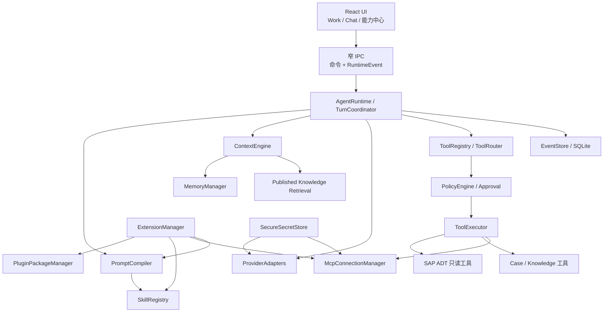
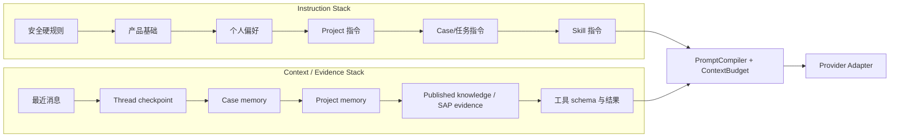
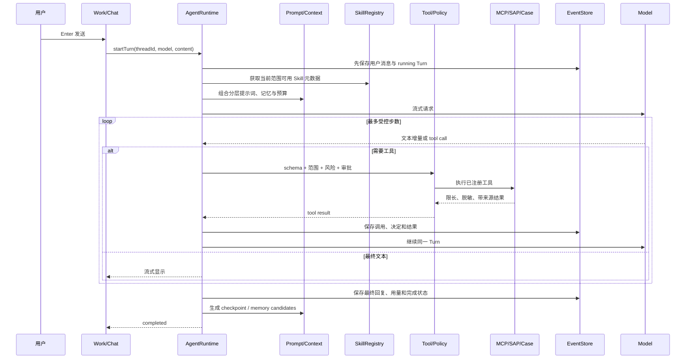
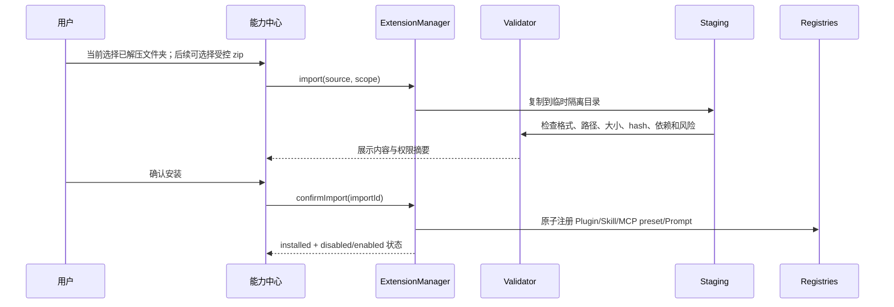

# 能力中心、Skills、MCP、提示词与分层记忆完整设计

日期：2026-07-15
状态：Phase 50-56 稳定子集已实施；zip 导入、动作绑定、外部 MCP 执行与子 Agent 等内容仍为后续设计
前置依赖：[独立 Agent Runtime 总体架构](../../architecture/INDEPENDENT_AGENT_RUNTIME.md)、[Phase 50 基础设计](2026-07-15-phase-50-independent-agent-runtime-foundation-design.md)

## 1. 结论先行

本项目有必要独立开发 Skills、MCP、系统提示词编排和分层记忆，但没有必要照搬 Codex App 的全部插件体系，也不应把 Codex CLI、Codex SDK 或 Codex app-server 作为中转依赖。

推荐采用“稳定运行时 + 受控能力中心”的轻量方案：

1. 先完成本项目自己的事件账本、工具循环、权限策略、上下文预算和恢复机制。
2. 再增加一个独立的「能力中心」，使用横向页签管理 `插件 | Skills | MCP | 提示词 | 记忆`。
3. Plugin 第一版只是声明式能力包，可以组合 Skills、MCP 预设、提示词片段、模板和图标，不能携带任意前端代码或绕过宿主执行脚本。
4. Skills 兼容 Agent Skills 的 `SKILL.md` 目录格式，但第一版不自动执行导入包里的任意脚本。
5. MCP 只实现 Client；稳定版先开放 HTTPS Streamable HTTP 的连接、测试和能力发现。外部工具执行先整体关闭，待独立安全门禁和真实服务回测完成后再开放。
6. 提示词与记忆分开：提示词决定“应该怎样工作”，记忆提供“过去有哪些可复用事实”。记忆不能覆盖系统安全规则。
7. 正式知识仍由知识库人工审核，不能因为进入 Memory 就自动成为知识。

这套能力开发难度中高，但可实现。现有项目已经有真实模型流、Project/Case、SQLite 搜索、安全存储和窄 IPC，能够作为迁移基础。最大风险集中在运行时恢复、工具权限、MCP 生命周期和记忆质量，而不是 UI。

### 1.1 2026-07-16 实施状态

- 已完成能力中心五个横向页签，以及 Skill、声明式 Plugin、提示词、记忆和 MCP 的 main process 服务与窄 IPC。
- 已完成 Skill/Plugin 渐进式上下文贡献、Work/Chat 分层提示词与已确认记忆、自动 Thread checkpoint 和显式记忆候选。
- 已完成 OpenAI/Anthropic Compatible 的 Work 本地内置只读工具循环；MCP 已完成连接、测试和能力发现，但没有接入模型工具执行链。
- 尚未开放外部 MCP 工具执行、STDIO MCP、导入包任意脚本、第三方 UI 代码和产品内子 Agent。这些未完成项不得在界面中伪装成可用能力。

## 2. 第一性原理判断

用户真正需要的不是“安装很多扩展”，而是让工作台在保持稳定的前提下具备四种能力：

| 根需求 | 对应能力 | 是否必须独立开发 |
|---|---|---|
| 长任务能恢复，不因窗口刷新或外部工具失败丢失状态 | Thread/Turn/Item 事件账本、取消、重放、恢复 | 必须 |
| 同一个模型能按 SAP 顾问流程完成不同任务 | Prompt Compiler + Skills | 必须 |
| 能安全连接本机或外部数据/工具 | Tool Runtime + MCP Client | 必须，但分阶段 |
| 能记住项目约定和案件进度，又不串客户数据 | Context Engine + 分层 Memory | 必须 |
| 把一组能力安装、启停和版本化 | 声明式 Plugin 包 | 有价值，但不是运行时前提 |
| 像通用平台一样运行任意第三方代码 | 任意代码插件沙箱 | 不做首发 |
| 建立公开插件市场、评分、付费和自动更新 | Marketplace | 不需要 |
| 同时派出大量 Agent 自主执行 | 递归多 Agent | 暂缓 |

核心判断：**Agent Runtime 是地基，Skills/MCP/Plugin 是装到地基上的能力。先做扩展页面、后补运行时，会形成“看起来可以配置，实际不能稳定执行”的 Demo。**

## 3. 难度与可行性

| 模块 | 难度 | 当前基础 | 主要难点 | 可行性判断 |
|---|---|---|---|---|
| EventStore + TurnCoordinator | 高 | 已有 Work/Chat 会话与模型流 | 幂等、断线、重启恢复、并发 Turn | 可实现，必须优先 |
| Provider-neutral Tool Loop | 高 | 已有 OpenAI/Anthropic Compatible 流 | 不同协议的工具事件、循环熔断、错误恢复 | 可实现 |
| Prompt Compiler | 中 | 已有安全上下文和项目规范 | 层级冲突、预算、可解释预览 | 可实现 |
| Context/Compaction | 中高 | 已有 Case 安全摘要 | Token 估算、摘要保真、跨模型可移植 | 可实现，需强回归 |
| 分层 Memory | 中高 | 已有知识候选和 SQLite 搜索 | 来源、冲突、时效、误记、跨 Project 隔离 | 可实现，先人工确认 |
| Skills | 中 | 已有案件动作与 Skill 文档设计 | 导入校验、渐进加载、资源边界 | 可实现 |
| MCP Client | 高 | 已有 main process 连接器模式 | 子进程、认证、超时、重连、工具污染 | 可实现，使用官方 SDK |
| 声明式 Plugin | 中 | 可复用 Skills/MCP/Prompt 注册表 | 包格式、依赖、版本、原子安装/回滚 | 可实现 |
| 任意代码 Plugin | 很高 | 无安全沙箱 | 供应链、权限逃逸、崩溃隔离、升级兼容 | 首发不做 |
| 受限子 Agent | 高 | 只有架构规划 | 预算、上下文隔离、取消、结果合并 | 核心稳定后再做 |

对开发能力的判断：可以完成，但不能作为一次大改直接替换现有系统。必须采用双写、功能开关、逐阶段门禁和故障注入测试，让每一阶段都保留现有 Chat/Work 的可用回退路径。

## 4. 产品范围

### 4.1 本方案包含

- 独立 Agent Runtime 的扩展接口。
- 一个简洁的「能力中心」页面。
- Plugin、Skills、MCP、提示词、记忆五个横向页签。
- 本地文件夹/zip 导入 Skill 和 Plugin 包。
- MCP HTTPS Streamable HTTP 配置、连接测试、能力发现和执行硬阻断。
- 全局、Project、Case 分层提示词。
- Personal、Project、Case、Thread checkpoint、候选记忆的分层管理。
- 安全存储、权限门禁、审计、停用、版本固定和回滚。
- 中文错误、空白处关闭弹层、键盘操作和可恢复状态。

### 4.2 首发明确不包含

- 插件市场、评分、付费、账号同步和云端分发。
- 第三方 Plugin 自定义 React 页面或注入 renderer 代码。
- 导入 Skill 后默认执行 `scripts/` 中的任意 Python、PowerShell、Bash 或 JavaScript。
- 产品对外充当通用 MCP Server。
- 自动信任远程 MCP Server 返回的 instructions、tool descriptions 或 resources。
- 自动扫描所有聊天并生成不可见的长期记忆。
- 无限制、递归式子 Agent。
- 任何 SAP 写入、激活、传输、过账或批量修改能力。

### 4.3 稳定后形成的产品亮点

亮点不依赖“装得多”，而来自五项可感知的可靠能力：

1. **模型可替换**：对话、工具、记忆和案件不绑定某一家模型渠道。
2. **SAP Project 隔离**：同一顾问可管理多个客户和 landscape，Memory、MCP、知识和连接不会串项目。
3. **结论可追溯**：AI 回复能指回 Case item、SAP 只读 evidence、Published knowledge 或工具结果。
4. **工作方法可安装**：开发说明书、流程图、代码审查等流程可以用 Skill/Plugin 包复用，但不因此获得额外权限。
5. **扩展故障可降级**：某个 MCP、Skill 或 Plugin 失效时，用户仍能继续普通模型对话和本地案件工作。

## 5. 统一领域语言

| 名称 | 准确定义 | 不是什么 |
|---|---|---|
| 能力中心 | 管理扩展能力的产品页面，包含五个页签 | 不是新的运行时 |
| Plugin / 插件包 | 本产品的声明式扩展包，组合 Skills、MCP 预设、提示词、模板和元数据 | 不是任意代码容器 |
| Skill | 可复用的工作说明和资源目录，以 `SKILL.md` 为入口 | 不是权限，也不是工具进程 |
| MCP connection | 一个外部 MCP Server 的连接配置和发现结果 | 不是 Plugin，也不是 Memory |
| Tool | Runtime 可执行的最小能力，有 schema、风险级别和策略 | 不是按钮文案 |
| Prompt Profile | 用户可管理的一组分层提示词配置 | 不是聊天记录 |
| Memory Item | 带来源、范围、状态和时效的可复用事实或偏好 | 不是完整历史，也不是知识库文章 |
| Memory Candidate | 系统建议保存、但尚未被用户确认的记忆 | 不能自动注入跨会话上下文 |
| Published knowledge | 已经过现有知识审核流程的正式知识 | 不等于 Memory |

## 6. 总体架构



架构约束：

- AgentRuntime、ExtensionManager、MCP、文件、密钥和 SAP 逻辑全部留在 Electron main process。
- Renderer 只得到脱敏后的视图模型，不直接读取绝对路径、密钥、进程参数或 MCP token。
- ExtensionManager 只负责导入、校验、注册、启停和版本；真正执行必须进入 Tool Registry。
- Skill 和 Plugin 不能自行调用系统能力，只能向 Runtime 提供声明和说明。
- MCP Server 是不受信边界，其输出与网页内容、用户文件一样要经过净化和上下文标记。

## 7. 页面信息架构

### 7.1 导航

左侧主导航新增一个入口：`能力中心`。

不把五类能力全部堆进现有配置中心，也不新增五个左侧入口。进入后使用固定横向页签：

```text
能力中心
插件    Skills    MCP    提示词    记忆
```

页面保持当前 Codex 风格的克制布局：单层列表、分隔线、少量状态标签、顶部搜索和右上角主操作。避免卡片 Dashboard、左右双栏表单和过多说明文字。

### 7.2 通用页面规则

- 页签切换不丢失未保存草稿；离开前只在确有修改时提醒。
- 弹出菜单、模型选择器和更多菜单点击空白处或按 `Esc` 关闭。
- 主列表可搜索、筛选启用状态和范围。
- 行点击进入详情抽屉；编辑表单独占中间内容区，采用上下分栏。
- 启用开关只改变是否可被 Runtime 发现，不等于授权高风险操作。
- 配置失败只影响该能力，不能让普通 Chat/Work 无法发送消息。
- 所有错误以中文解释，保留必要的 `MCP`、`STDIO`、`HTTP`、`SKILL.md` 等关键词。

### 7.3 插件页签

列表字段：名称、版本、来源、包含能力、范围、状态、最近校验。

主操作：`导入插件包`。

详情包含：

- 插件说明和来源。
- 包含的 Skills、MCP 预设、提示词片段和模板。
- 请求的能力及风险摘要。
- 版本、hash、安装时间和兼容版本。
- 启用/停用、固定版本、回滚、移除。

第一版 Plugin 包使用声明式 `extension.json`，不得包含 renderer bundle 或自动执行入口。

### 7.4 Skills 页签

列表字段：名称、说明、来源、范围、脚本状态、启用状态、校验状态。

主操作：`导入 Skill`，支持：

1. 选择本地 Skill 文件夹。
2. 选择 zip。
3. 选择安装范围：全局或某个 Project。
4. 在安装前预览 `SKILL.md` 摘要、资源清单、依赖和脚本风险。
5. 通过校验后原子安装；失败时不留下半个目录。

首发执行规则：

- `SKILL.md`、`references/` 和 `assets/` 可按需读取。
- `scripts/` 只展示并标为“未启用执行”。
- `allowed-tools` 属于外部格式中的实验字段，只作参考，不能覆盖本产品 PolicyEngine。
- 全部 Skill 只在匹配到当前任务或用户明确选择后加载全文，避免占满上下文。

### 7.5 MCP 页签

主操作：`添加连接`。当前稳定版只接受 HTTPS Streamable HTTP：名称、URL、Project/全局范围和安全凭据引用。STDIO 与 JSON 批量导入待独立沙箱、迁移和回滚门禁完成后再开放。

连接测试分为四步展示：

1. 配置校验。
2. 建立连接。
3. 获取 Server 信息。
4. 发现 tools/resources/prompts。

发现后按工具显示：名称、用途、输入摘要、只读声明、外部副作用和当前策略。Server 声明只读不等于授权；当前稳定版所有外部工具都显示为“仅发现”，不能启用或进入 Work 自动工具目录。

稳定性决策：截至 2026-07-15，官方 MCP TypeScript SDK 的 v2 仍为 beta，官方明确建议生产继续使用 v1.x。因此首个生产版本固定 v1.x；开始实施或升级前重新核对官方稳定状态，不直接跟随 `main`。

### 7.6 提示词页签

该页不是一个超大文本框，而是分层配置：

| 层级 | 用户是否可编辑 | 作用范围 |
|---|---|---|
| 产品安全规则 | 否 | 全局，SAP 只读、密钥、Project 隔离等硬边界 |
| 产品基础提示词 | 仅查看摘要 | 全局，定义工作台角色和输出原则 |
| 个人偏好 | 是 | 全局，例如语言、表达、格式习惯 |
| Project 指令 | 是 | 当前 Project 的业务约定、术语、交付格式 |
| Case 指令 | 是 | 当前案件目标、边界和验收标准 |
| Skill 指令 | 由 Skill 提供 | 仅激活 Skill 的当前 Turn |

页面能力：

- 编辑、启用、恢复默认、版本历史。
- 预览当前 Project/Case 最终组合顺序。
- 显示估算 token、冲突和被高优先级规则覆盖的内容。
- 不显示内部密钥、隐式安全实现或原始 provider 请求。

优先级固定为：安全规则 > 产品基础 > 个人偏好 > Project > Case > 当前任务 > Skill。低层不能覆盖高层。

### 7.7 记忆页签

记忆页面按范围筛选，不做花哨知识图谱：

```text
全部 | 个人 | Project | Case | Thread 摘要 | 待确认
```

每条记忆显示：内容摘要、类型、来源、范围、状态、更新时间、最近使用、有效期。支持查看来源、编辑、确认、拒绝、停用、删除和导出。

记忆分层：

| 层级 | 示例 | 产生方式 | 默认注入 |
|---|---|---|---|
| Working memory | 当前目标、计划、进行中工具 | Runtime 确定性维护 | 当前 Turn |
| Thread checkpoint | 已完成、未决、下一步 | 自动生成，可重建 | 当前 Thread |
| Case memory | 本案件已确认事实和约束 | 候选后确认 | 当前 Case |
| Project memory | 项目术语、约定、稳定背景 | 用户明确保存/确认 | 当前 Project Top-K |
| Personal preference | 中文、表达风格、常用格式 | 用户显式设置 | 最小化跨 Project |
| Memory candidate | 系统建议保存的事实 | 自动建议 | 不自动跨会话注入 |

记忆和知识的边界：Memory 用于恢复工作和个性化；Published knowledge 用于复用经过审核的专业结论。任何 Memory candidate 都不能绕过知识审核直接发布。

## 8. 提示词、上下文与记忆的组合原理

指令栈和事实栈必须分开构建：



关键规则：

- Memory 永远作为带来源的事实候选，不作为 system instruction。
- Tool/MCP/网页/SAP 返回内容不得声称自己是系统规则。
- 上下文预算不足时，先裁剪重复历史和大工具结果，再生成可追溯 checkpoint；不能删除原始事件。
- 注入 Project/Case memory 时必须记录 `memoryId` 和来源，便于解释和撤回。
- 同一事实冲突时不静默覆盖，标记冲突并优先使用更新且已确认的来源。

## 9. 用户发送消息后的交互



任何 Plugin、Skill 或 MCP 失败时：

- 当前 Turn 保存为明确状态。
- 已产生文本不丢失。
- 可选择停用故障能力后继续。
- 不导致整个应用自动退出或无限重启。
- 普通模型对话继续可用。

## 10. 扩展导入与启用流程



导入安全要求：

- 防 zip slip、路径穿越、符号链接逃逸和超大压缩包。
- 限制文件总数、单文件大小、总解压大小和嵌套深度。
- 保存来源、版本、hash、安装时间和校验结果。
- 校验或注册失败时完整回滚临时目录和数据库事务。
- 外部导入默认停用；用户看完风险摘要后再启用。

## 11. 数据模型

第一版建议新增以下 SQLite 表，所有表都带 `schema_version`、时间戳和必要索引：

| 表 | 关键字段 | 作用 |
|---|---|---|
| `extension_packages` | id, name, version, source, hash, scope, enabled, manifest_json | 声明式 Plugin 包 |
| `skill_packages` | id, name, description, source, scope, root_ref, hash, enabled, validation_status | Skill 目录元数据 |
| `skill_resources` | skill_id, relative_path, kind, size, hash | 受控资源索引 |
| `mcp_connections` | id, name, transport, config_json, secret_ref, scope, enabled, status | MCP 连接；不存明文 secret |
| `mcp_capabilities` | connection_id, kind, remote_name, schema_json, risk, enabled | 发现的 tools/resources/prompts |
| `prompt_profiles` | id, scope_type, scope_id, layer, content, version, enabled | 分层提示词 |
| `memory_items` | id, scope_type, scope_id, type, content, status, provenance_json, valid_until | 记忆与候选 |
| `memory_links` | memory_id, source_item_id, source_file_ref, source_knowledge_id | 来源关系 |
| `context_audits` | turn_id, selected_refs, excluded_refs, token_estimate, reason_json | 上下文选择审计 |

绝对路径和密钥采用 main process 本机绑定/安全引用，不进入 renderer 可迁移状态。用户绑定的外部文件夹也不能被 Plugin 或 Skill 默认全量扫描。

## 12. 核心模块接口边界

| 模块 | 只负责 | 明确不负责 |
|---|---|---|
| `ExtensionManager` | 导入、校验、安装、启停、版本和回滚 | 不执行工具 |
| `PluginPackageManager` | 解析本产品 `extension.json` | 不加载第三方 UI 代码 |
| `SkillRegistry` | 发现、解析、分层目录、按需激活 | 不授予权限 |
| `McpConnectionManager` | 当前负责连接、发现、健康检查和执行硬阻断；为后续调用适配预留边界 | 不根据 Server 自报信息授予执行权 |
| `PromptCompiler` | 按优先级组合指令并报告冲突 | 不检索历史事实 |
| `ContextEngine` | 预算、检索、裁剪、压缩、来源审计 | 不修改正式知识 |
| `MemoryManager` | 候选、确认、冲突、时效、检索 | 不把候选自动发布为知识 |
| `ToolRegistry/PolicyEngine` | schema、范围、风险、审批、幂等 | 不直接展示 UI |
| `SecureSecretStore` | 加密保存和按受控连接取用 secret | 不把明文交给 renderer/model |

## 13. 稳定性与安全设计

### 13.1 稳定性原则

- 能力默认可停用，停用后不影响核心 Chat/Work。
- 每个 Turn 保存所用 provider、model、prompt profile、Skill/MCP 版本快照，避免运行中配置改变导致不可重放。
- 外部进程都有启动超时、调用超时、取消、退出码、有限重启和熔断。
- MCP 断开后采用退避重连，不在渲染层制造无限 loading。
- 工具调用使用稳定 `callId` 和幂等记录；未知副作用调用不自动重试。
- 数据库迁移可回滚，旧 WorkspaceStore 在迁移阶段保留兼容投影。
- 导入和升级使用 staging + 原子替换，失败保留上一可用版本。
- 所有错误进入结构化 Runtime item，并转换为中文用户提示。

### 13.2 安全原则

- SAP 写入、外部发布、批量删除、权限策略变更继续属于硬确认或禁止范围。
- Plugin、Skill、MCP instructions、工具返回和用户文件都视为不受信输入。
- Skill 的 `allowed-tools` 不等于授权。
- MCP 的 tool schema 只描述参数，不决定权限。
- 工具结果先脱敏、限长、标注来源，再进入模型上下文。
- 不允许扩展读取 API Key、SAP password、Feishu token 或 secure store 原文。
- 不允许跨 Project 静默检索 Memory、Knowledge、Case files 或 MCP 连接。
- 日志、SQLite 投影、Markdown、截图和 Git 不保存明文密钥。

## 14. 分阶段开发路线

### Phase 50：独立 Runtime 基础

范围保持不变：事件账本、TurnCoordinator、统一 Provider events、最小只读 Tool Runtime、ContextBudget、恢复和窄 IPC。能力中心不在本阶段展示空入口。

发布门禁：真实模型流、取消、重启恢复、断流、重复 Enter、未知工具、跨 Project 和密钥回显测试全部通过。

### Phase 51：Prompt、压缩与 Memory 基础

- PromptCompiler 和分层优先级。
- ContextAudit 与可移植 Thread checkpoint。
- Personal/Project/Case/Thread memory 数据模型。
- 只生成 Memory candidate；Project memory 需要人工确认。
- 提示词与记忆页签先以最小管理 UI 开放。

发布门禁：长对话不会无限增长；摘要可追溯和重建；冲突、撤回、过期与跨 Project 隔离通过。

### Phase 52：能力中心外壳与 Skills

- 新增能力中心入口，先开放已经完成的 `Skills`、`提示词` 和 `记忆` 页签；不展示空白或伪可用入口。
- Agent Skills 兼容解析、已解压目录导入、全局/Project 范围；受控 zip 解压后置。
- 已实现渐进式披露；动作绑定后置。
- `scripts/` 只展示，不执行。

当前发布门禁：路径逃逸、重复名称、损坏 YAML、超大包、停用和卸载回归通过；zip 在安全解压组件落地前明确拒绝。

### Phase 53：MCP Client（稳定子集已完成）

- 通过本阶段发布门禁后再显示 `MCP` 页签。
- 固定官方 TypeScript SDK 的生产稳定版本；2026-07-15 规划基线为 v1.x。
- HTTPS Streamable HTTP、能力发现和健康检查；STDIO 与配置批量导入后置。
- 每工具启停、风险标记、超时、取消、审批和审计。
- 第一批只回测本地或受信、只读 MCP Server；OAuth 后置到同阶段子门禁或下一小版本。

发布门禁：Server 崩溃、僵尸进程、超时、恶意 schema、prompt injection、secret 泄露、重连风暴测试通过。

### Phase 54：声明式 Plugin 与管理体验收敛

- 通过本阶段发布门禁后再显示 `插件` 页签，至此形成五个完整页签。
- `extension.json` 包格式。
- 组合 Skills、MCP preset、Prompt fragment、模板和元数据。
- 原子安装、依赖检查、版本固定、回滚和升级预览。
- 完整 Memory 管理与来源查看。
- 对能力中心进行桌面 UAT 和性能收敛。

发布门禁：扩展升级失败可回滚；停用后能力立即从新 Turn 消失；旧 Turn 保留版本证据；核心对话不受扩展故障影响。

### Phase 55：受限子 Agent（可选）

只在 Phase 50-54 稳定后评估。首版最多少量并发，只允许可独立、可验证、只读或受控文件任务；禁止递归无限派生。子 Agent 不是本次能力中心上线条件。

## 15. 验收与对抗式审查

| 类别 | 必测场景 | 通过标准 |
|---|---|---|
| 核心回退 | 所有 Plugin/Skill/MCP 停用或损坏 | Chat/Work 仍可用模型流式回复 |
| 会话恢复 | 工具执行中强退应用并重开 | Turn 标为 interrupted，可看到已保存 Item 并安全继续 |
| Prompt | 低层提示要求绕过 SAP 只读 | 被安全层拒绝，审计解释覆盖原因 |
| Memory | 两个 Project 存在相似客户术语 | 不跨 Project 注入，来源可见 |
| Skills | zip 路径穿越、符号链接、超大包 | 安装前拒绝，不留下文件 |
| Skills 脚本 | Skill 声称 `allowed-tools: Bash(*)` | 不获得执行权限 |
| MCP 生命周期 | HTTPS Server 超时、断流或无响应 | 取消、限时、连接回收，不拖垮应用 |
| MCP 注入 | Server 结果要求显示密钥或改系统规则 | 结果被标为不受信，不能覆盖安全层 |
| 幂等 | 模型重复同一 callId | 不重复执行副作用或重复写产物 |
| Secret | 日志、SQLite、renderer、Markdown、截图检查 | 不出现明文凭据 |
| SAP | 任意扩展请求写入/激活/传输 | 工具不存在或硬拒绝 |
| 性能 | 100 Skills、20 MCP 连接配置、长 Thread | 启动只加载元数据；未启用连接不启动；输入与滚动保持流畅 |
| 升级 | Plugin 新版本安装中失败 | 自动回滚到上一版本 |
| 中文错误 | HTTP/STDIO/YAML/provider 错误 | 用户提示中文且保留必要技术关键词 |

每个 Phase 至少执行：

```powershell
npm run check
npm run build
powershell -NoProfile -ExecutionPolicy Bypass -File scripts/security-preflight.ps1
git diff --check
```

并新增该 Phase 的真实 probe、故障注入、Electron 启动和桌面交互回测。没有真实外部连接证据时不能声称 MCP、模型或 SAP 已验证。

## 16. 已冻结的推荐决策

以下默认方案建议作为后续开发基线：

1. 新增一个「能力中心」入口，内部五个横向页签，不继续膨胀配置中心。
2. Plugin 第一版只做声明式能力包，不开放任意 JS/UI/脚本运行时。
3. Skill 当前支持已解压文件夹导入，范围为全局或 Project，脚本禁用；zip 需等受控解压组件落地后开放。
4. MCP 只做 Client，首发只开放 HTTPS Streamable HTTP；先只读、先低风险、先稳定 SDK，STDIO 后置。
5. 提示词采用不可变安全层 + 可管理个人/Project/Case 层，并提供组合预览。
6. Memory 采用候选 -> 人工确认 -> 受范围检索；Knowledge 继续走独立审核发布。
7. 扩展故障永远不能成为 Chat/Work 的前置条件。
8. 子 Agent 延后到 Phase 55，不作为能力中心首发亮点。

## 17. 官方依据

- [OpenAI：Plugins in ChatGPT and Codex](https://help.openai.com/en/articles/20001256-plugins-in-codex/)：Plugin 可以只包含 Skills，也可以组合外部 App；外部系统权限仍然有效，首版应优先只读并单独审查动作边界。
- [Agent Skills Specification](https://agentskills.io/specification)：定义 `SKILL.md`、可选 `scripts/`、`references/`、`assets/` 和渐进式披露；`allowed-tools` 仍是实验字段。
- [Agent Skills Client Implementation](https://agentskills.io/client-implementation/adding-skills-support)：建议只在会话开始加载名称/描述，激活后加载完整指令，资源按需读取。
- [MCP TypeScript SDK](https://github.com/modelcontextprotocol/typescript-sdk)：官方 SDK 提供 Client、STDIO、Streamable HTTP 和认证辅助；截至 2026-07-15，v2 为 beta，生产仍建议 v1.x。
- [Codex Runtime 官方源码研究](../../research/2026-07-15-codex-runtime-primary-source-study.md)：说明本项目只参考公开 Agent 模式，不依赖 Codex 作为核心中转。

## 18. 方案确认后的第一批开发工作

Phase 50-56 的稳定子集已经落地。后续工作应先完成全量构建、桌面 UAT 和对抗式审查，再评估 Skill 动作绑定、受控 zip、受限子 Agent、STDIO MCP 或脚本执行，不能为了扩展数量降低稳定性门槛。
